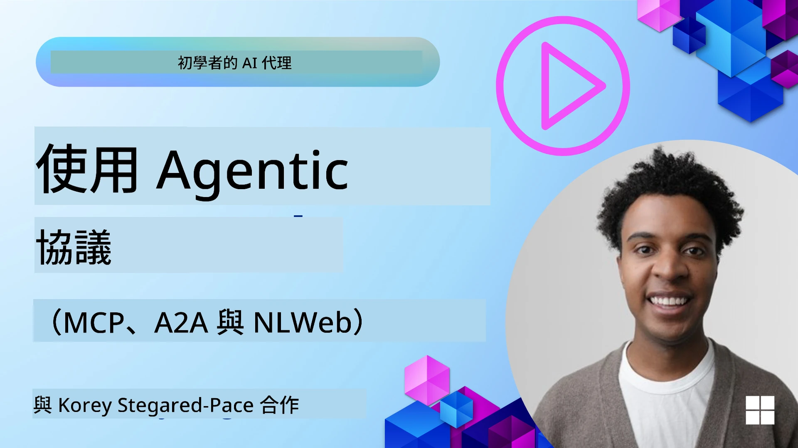
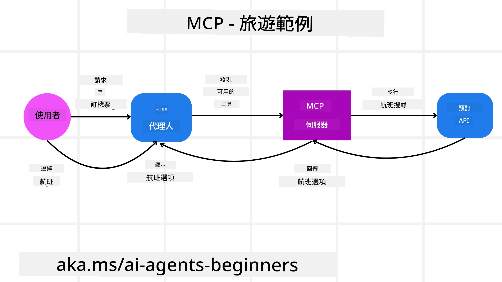
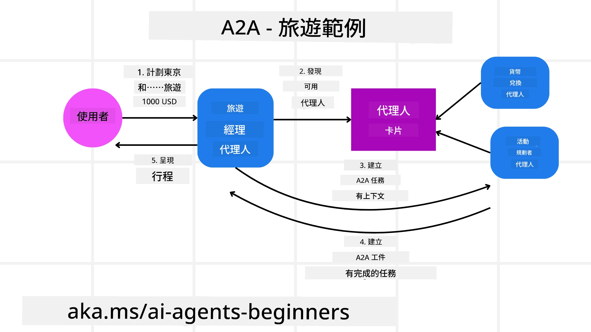
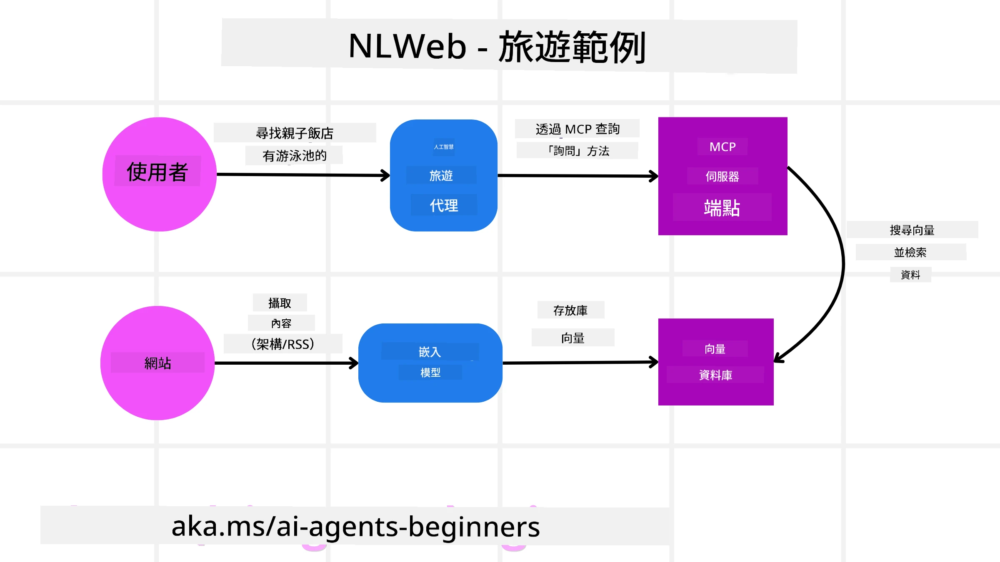

# 使用 Agentic 協議（MCP、A2A 與 NLWeb）

> _(點擊上方圖片以觀看本課程的影片)_

隨著 AI 代理的使用日益增加，也越來越需要能確保標準化、安全性並促進開放創新的協議。在本課中，我們將探討三個旨在滿足此需求的協議 —— Model Context Protocol（MCP）、Agent to Agent（A2A）以及 Natural Language Web（NLWeb）。

## 介紹

在本課中，我們將涵蓋：

• 如何 **MCP** 允許 AI 代理存取外部工具與資料以完成使用者任務。

• 如何 **A2A** 使不同 AI 代理之間能夠溝通與協作。

• 如何 **NLWeb** 將自然語言介面帶到任何網站，使 AI 代理能夠發現並與內容互動。

## 學習目標

• **識別** MCP、A2A 與 NLWeb 在 AI 代理情境中的核心目的與好處。

• **說明** 每個協議如何促進 LLM、工具與其他代理之間的通訊與互動。

• **辨認** 每個協議在構建複雜代理系統時所扮演的不同角色。

## 模型上下文協議

The **Model Context Protocol (MCP)** 是一個開放標準，提供應用程式向 LLM 提供上下文與工具的標準化方式。這使得 AI 代理能夠以一致的方式連接到不同的資料來源與工具，形成一個「通用接頭」。

讓我們看看 MCP 的組成元件、與直接使用 API 相比的好處，以及 AI 代理可能如何使用 MCP 伺服器的範例。

### MCP 核心組件

MCP 採用 **client-server 架構**，核心元件包括：

• **Hosts** 是啟動與 MCP Server 連線的 LLM 應用程式（例如像 VSCode 這樣的程式碼編輯器）。

• **Clients** 是位於 host 應用程式內、與伺服器維持一對一連線的元件。

• **Servers** 是揭露特定能力的輕量程式。

協議中包含三個核心原語，這些即為 MCP Server 的能力：

• **Tools**：這些是 AI 代理可以呼叫以執行動作的離散操作或功能。例如，氣象服務可能會揭露一個 "get weather" 工具，或一個電子商務伺服器可能會揭露一個 "purchase product" 工具。MCP 伺服器會在其能力列表中廣告每個工具的名稱、描述與輸入/輸出 schema。

• **Resources**：這些是 MCP 伺服器可以提供的唯讀資料項目或文件，客戶端可按需擷取。範例包括檔案內容、資料庫記錄或日誌檔案。Resources 可以是文字（如程式碼或 JSON）或二進位（如影像或 PDF）。

• **Prompts**：這些是預定義的範本，提供建議的提示，允許更複雜的工作流程。

### MCP 的好處

MCP 為 AI 代理帶來顯著優勢：

• **動態工具發現**：代理可以從伺服器動態接收可用工具的清單以及它們的描述。這與傳統 API 需要為整合進行靜態編碼不同，傳統 API 的任何變更通常都需要更新程式碼。MCP 提供「整合一次」的方式，帶來更高的適應性。

• **跨 LLM 的互操作性**：MCP 可在不同的 LLM 之間運作，提供切換核心模型以評估更好效能的彈性。

• **標準化的安全性**：MCP 包含標準的驗證方法，當新增對其他 MCP 伺服器的存取時可提升可擴展性。這比管理不同傳統 API 的金鑰與驗證類型來得更簡單。

### MCP 範例

想像一個使用 MCP 的 AI 助手幫使用者訂機票的情境。

1. **Connection**: AI 助手（MCP client）連線到一家航空公司提供的 MCP server。

2. **Tool Discovery**: 客戶端詢問該航空公司的 MCP server：「你有哪些可用的工具？」伺服器回應有像 "search flights" 與 "book flights" 之類的工具。

3. **Tool Invocation**: 接著你請求 AI 助手：「請幫我搜尋從 Portland 到 Honolulu 的航班。」AI 助手使用其 LLM 判斷需要呼叫 "search flights" 工具，並將相關參數（出發地、目的地）傳給 MCP server。

4. **Execution and Response**: MCP server 作為包裝器，實際呼叫航空公司的內部訂位 API，接著接收航班資訊（例如 JSON 資料）並回傳給 AI 助手。

5. **Further Interaction**: AI 助手呈現航班選項。一旦你選擇航班，助理可能會在同一個 MCP server 上呼叫 "book flight" 工具，完成訂位。

## Agent-to-Agent 協議（A2A）

當 MCP 專注於將 LLM 連接到工具時，**Agent-to-Agent（A2A）協議** 更進一步，使不同 AI 代理之間能夠溝通與協作。A2A 將來自不同組織、環境與技術棧的 AI 代理連接起來，以完成共同的任務。

我們將檢視 A2A 的組件與好處，並以旅遊應用程式為例說明其可能的應用方式。

### A2A 核心組件

A2A 專注於使代理之間能夠溝通並協同完成使用者的子任務。協議的每個元件都為此做出貢獻：

#### Agent Card

類似於 MCP server 共用工具清單的方式，Agent Card 包含：
- The Name of the Agent .
- 一段 **說明它所完成的一般任務**。
- 一份 **具體技能清單**，附上描述以協助其他代理（或甚至人類使用者）了解何時及為何會呼叫該代理。
- 代理的 **目前 Endpoint URL**
- 代理的 **版本**與 **能力**，例如串流回應與推播通知。

#### Agent Executor

Agent Executor 負責 **將使用者聊天的上下文傳遞給遠端代理**，遠端代理需要這些上下文來理解需要完成的任務。在 A2A 伺服器中，代理會使用其自己的大型語言模型（LLM）來解析傳入請求並使用其內部工具執行任務。

#### Artifact

當遠端代理完成請求的任務後，其工作成果會以 artifact 形式建立。artifact **包含代理工作結果**、**完成事項的描述** 以及透過協議傳遞的 **文字上下文**。在 artifact 傳送後，與遠端代理的連線會關閉，直到再次需要為止。

#### Event Queue

此元件用於 **處理更新與傳遞訊息**。在生產環境中對於代理系統尤其重要，以防止在任務尚未完成前代理之間的連線被關閉，特別是任務完成時間可能較長時。

### A2A 的好處

• **增強協作**：它允許來自不同供應商與平台的代理互動、共享上下文並協同工作，促進跨越傳統上彼此獨立系統的無縫自動化。

• **模型選擇彈性**：每個 A2A 代理可以決定使用哪個 LLM 來處理其請求，允許每個代理使用最佳化或微調的模型，而非某些 MCP 場景下的單一 LLM 連線。

• **內建驗證**：驗證直接整合進 A2A 協議中，為代理互動提供強健的安全框架。

### A2A 範例

讓我們擴展前述的旅遊訂位情境，但這次使用 A2A。

1. **User Request to Multi-Agent**: 使用者與一個「旅遊代理」A2A client/agent 互動，可能說：「請為下週幫我訂一趟前往 Honolulu 的完整行程，包括機票、飯店與租車」。

2. **Orchestration by Travel Agent**: 旅遊代理接收到這個複雜請求。它使用其 LLM 推理任務，並判斷需要與其他專門代理互動。

3. **Inter-Agent Communication**: 接著旅遊代理使用 A2A 協議連接到下游代理，例如由不同公司建立的「航空代理」、「飯店代理」與「租車代理」。

4. **Delegated Task Execution**: 旅遊代理將特定任務委派給這些專門代理（例如：「查找前往 Honolulu 的航班」、「訂飯店」、「租車」）。這些專門代理各自運行自己的 LLM 並使用自己的工具（這些工具本身也可能是 MCP 伺服器），執行其訂位的各自部分。

5. **Consolidated Response**: 一旦所有下游代理完成任務，旅遊代理會彙整結果（航班細節、飯店確認、租車預訂），並以綜合的聊天式回應發回給使用者。

## 自然語言網頁（NLWeb）

網站長久以來一直是使用者存取網際網路上資訊與資料的主要方式。

讓我們看看 NLWeb 的不同組件、NLWeb 的好處，以及透過旅遊應用程式範例說明我們的 NLWeb 如何運作。

### NLWeb 的組件

- **NLWeb Application (Core Service Code)**：處理自然語言問題的系統。它連接平台的不同部分以建立回應。你可以把它視為**驅動網站自然語言功能的引擎**。

- **NLWeb Protocol**：這是一套**用於與網站進行自然語言互動的基本規則**。它以 JSON 格式（通常使用 Schema.org）回傳回應。其目的是為「AI 網路」建立一個簡單的基礎，就像 HTML 讓線上文件共享成為可能一樣。

- **MCP Server (Model Context Protocol Endpoint)**：每個 NLWeb 設定同時也作為一個 **MCP 伺服器**。這表示它可以 **與其他 AI 系統分享工具（像是 “ask” 方法）與資料**。在實務上，這使得該網站的內容與能力可被 AI 代理使用，讓網站成為更廣泛「代理生態系」的一部分。

- **Embedding Models**：這些模型用來**將網站內容轉換成數值表徵，稱為向量**（embeddings）。這些向量以能讓電腦進行比較與搜尋的方式捕捉語意。它們會被儲存在特殊的資料庫中，使用者可以選擇想要使用哪個嵌入模型。

- **Vector Database (Retrieval Mechanism)**：這個資料庫**儲存網站內容的 embeddings 向量**。當有人提出問題時，NLWeb 會檢查向量資料庫以快速找到最相關的資訊，並依相似度給出一個快速排序的可能答案清單。NLWeb 可與不同的向量儲存系統合作，例如 Qdrant、Snowflake、Milvus、Azure AI Search 與 Elasticsearch。

### NLWeb 範例

再考量我們的旅遊訂位網站，但這次它由 NLWeb 提供動力。

1. **Data Ingestion**：旅遊網站現有的產品目錄（例如航班清單、飯店描述、旅遊套裝行程）會使用 Schema.org 格式化或透過 RSS feed 載入。NLWeb 的工具會擷取這些結構化資料，建立 embeddings，並將它們儲存在本地或遠端的向量資料庫中。

2. **Natural Language Query (Human)**：使用者造訪網站，並非透過瀏覽選單，而是在聊天介面輸入：「幫我找下週在 Honolulu 有游泳池、適合家庭入住的飯店」。

3. **NLWeb Processing**：NLWeb 應用收到此查詢。它會將查詢傳給 LLM 以理解查詢意圖，同時在其向量資料庫中搜尋相關的飯店清單。

4. **Accurate Results**：LLM 協助詮釋資料庫的搜尋結果，根據「適合家庭」、「有游泳池」與「Honolulu」等條件識別最佳匹配，然後格式化為自然語言回應。關鍵在於，回應會參照網站目錄中的實際飯店，避免虛構資訊。

5. **AI Agent Interaction**：由於 NLWeb 同時作為 MCP 伺服器，外部的 AI 旅遊代理也可以連接到該網站的 NLWeb 實例。該 AI 代理可以使用 `ask("Are there any vegan-friendly restaurants in the Honolulu area recommended by the hotel?")` 的 MCP 方法直接查詢網站。NLWeb 實例會處理此查詢，利用其餐廳資訊資料庫（如果已載入），並回傳結構化的 JSON 回應。

### 想進一步瞭解 MCP/A2A/NLWeb 嗎？

加入 [Microsoft Foundry Discord](https://aka.ms/ai-agents/discord) 與其他學習者交流、參加辦公時間並讓你的 AI 代理問題獲得解答。

## 資源

- [MCP for Beginners](https://aka.ms/mcp-for-beginners)  
- [MCP Documentation](https://learn.microsoft.com/python/api/overview/azure/ai-projects-readme)
- [NLWeb Repo](https://github.com/nlweb-ai/NLWeb)
- [Microsoft Agent Framework](https://aka.ms/ai-agents-beginners/agent-framewrok)

---

<!-- CO-OP TRANSLATOR DISCLAIMER START -->
**免責聲明**：
本文件已使用 AI 翻譯服務 [Co-op Translator](https://github.com/Azure/co-op-translator) 進行翻譯。儘管我們力求準確，但自動翻譯可能包含錯誤或不準確之處，敬請注意。以原語言撰寫的原文應視為權威來源。若為關鍵資訊，建議採用專業人工翻譯。對於因使用本翻譯而產生的任何誤解或曲解，我們概不負責。
<!-- CO-OP TRANSLATOR DISCLAIMER END -->