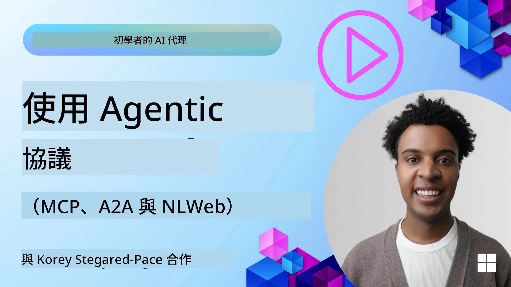
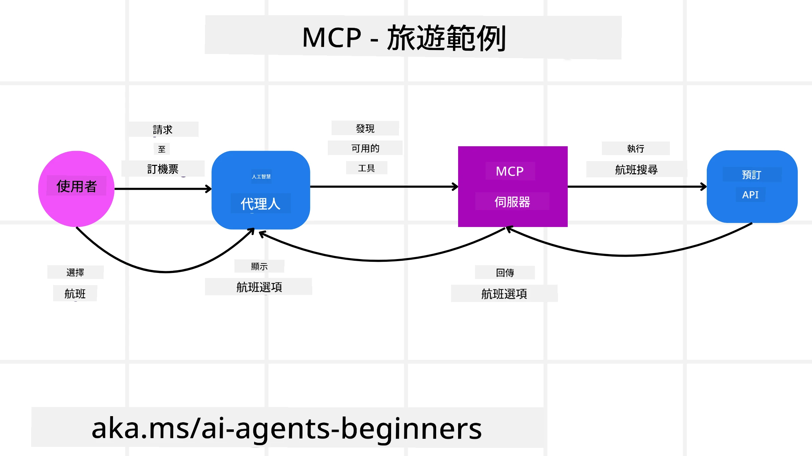
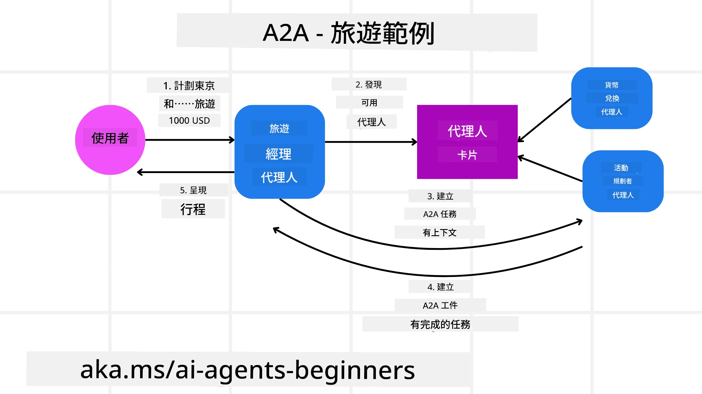
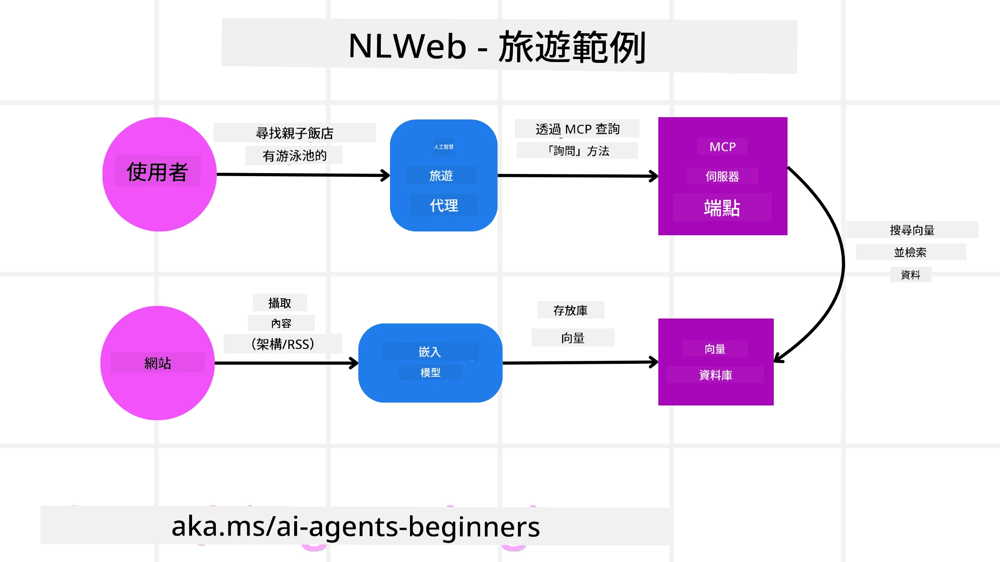

# 使用智能代理協議 (MCP、A2A 和 NLWeb)

> _(點擊上方圖片觀看本課程影片)_

隨著 AI 代理的使用日益普及，確保標準化、安全性與支持開放創新的協議需求也隨之增加。在本課程中，我們將介紹三種旨在滿足此需求的協議——模型上下文協議（Model Context Protocol, MCP）、代理對代理（Agent to Agent, A2A）以及自然語言網路（Natural Language Web, NLWeb）。

## 介紹

本課程中，我們將涵蓋：

• **MCP** 如何允許 AI 代理存取外部工具與數據，以完成使用者任務。

• **A2A** 如何實現不同 AI 代理之間的通訊與協作。

• **NLWeb** 如何為任何網站帶來自然語言介面，使 AI 代理能發現並與內容互動。

## 學習目標

• <strong>識別</strong> MCP、A2A 與 NLWeb 在 AI 代理領域中的核心目的與效益。

• <strong>解釋</strong> 各協議如何促進大型語言模型、工具與其他代理間的通訊與互動。

• <strong>了解</strong> 各協議在構建複雜代理系統中所扮演的獨特角色。

## 模型上下文協議

**模型上下文協議（Model Context Protocol, MCP）** 是一個開放標準，提供應用程式以標準化方式為大型語言模型（LLM）提供上下文與工具。此協議得以成為 AI 代理能以一致方式連結不同資料來源與工具的「萬用接頭」。

接下來讓我們探討 MCP 的組成元件、相較直接 API 使用的好處，以及 AI 代理如何使用 MCP 伺服器的範例。

### MCP 核心組件

MCP 採用<strong>客戶端-伺服器架構</strong>，核心組件包括：

• **主機（Hosts）**：為開啟與 MCP 伺服器連線的大型語言模型應用程式（例如像 VSCode 這樣的程式編輯器）。

• **客戶端（Clients）**：主機應用程式內的元件，與伺服器保持一對一連線。

• **伺服器（Servers）**：輕量級程式，對外提供特定功能。

協議中包含三個核心原語，這些即是 MCP 伺服器的功能：

• **工具（Tools）**：AI 代理可呼叫執行的離散行動或功能。例如，天氣服務可能提供「獲取天氣」工具，電子商務伺服器則可能提供「購買商品」工具。MCP 伺服器會在其功能清單中公布每項工具的名稱、描述及輸入輸出結構。

• **資源（Resources）**：MCP 伺服器可提供的唯讀資料項目或文件，客戶端可按需擷取。例子包括檔案內容、資料庫記錄或日誌檔。資源可以是文字（如程式碼或 JSON），也可以是二進位檔（如圖片或 PDF）。

• **提示（Prompts）**：預先定義的模板，提供建議提示，允許更複雜的工作流程。

### MCP 的優點

MCP 對 AI 代理帶來重大優勢：

• <strong>動態工具探索</strong>：代理能動態接收伺服器提供的可用工具清單及其功能描述。這不同於傳統 API，往往需靜態編碼整合，API 一有變更即須更新程式碼。MCP 採用「一次整合」方式，帶來更大適應性。

• **跨 LLM 的互操作性**：MCP 支援不同大型語言模型，允許在評估更佳效能時自由切換核心模型。

• <strong>標準化安全性</strong>：MCP 包含標準認證方法，擴充 MCP 伺服器存取時更具可擴展性，簡化多個傳統 API 不同金鑰與認證類型的管理。

### MCP 範例

想像一位使用者想利用由 MCP 支援的 AI 助理預訂航班。

1. <strong>連接</strong>：AI 助理（MCP 客戶端）與航空公司提供的 MCP 伺服器建立連接。

2. <strong>工具探索</strong>：客戶端詢問航空公司 MCP 伺服器「你們有哪些工具？」伺服器回傳「搜尋航班」、「預訂航班」等工具。

3. <strong>工具呼叫</strong>：您請 AI 助理「幫我搜尋從波特蘭飛往檀香山的航班。」AI 助理透過其大型語言模型判斷需呼叫「搜尋航班」工具，並將出發地、目的地等參數傳給 MCP 伺服器。

4. <strong>執行與回應</strong>：MCP 伺服器作為包裝器，實際呼叫航空公司內部預訂 API，取得航班資訊（如 JSON 格式資料），並回傳給 AI 助理。

5. <strong>後續互動</strong>：AI 助理展示航班選項。當您選定航班後，助理可能呼叫同一 MCP 伺服器上的「預訂航班」工具，完成訂票程序。

## 代理對代理協議（A2A）

MCP 著重於連結大型語言模型與工具，<strong>代理對代理（Agent-to-Agent，A2A）協議</strong>則更進一步，實現不同 AI 代理之間的通訊與協作。A2A 將跨組織、跨環境與跨技術堆疊的 AI 代理連結起來，共同完成使用者的複雜任務。

我們將探索 A2A 的組成與優勢，並以旅遊應用的範例說明其應用方式。

### A2A 核心組件

A2A 專注於促進代理間通訊及協作完成使用者任務的子任務。協議各部分分別扮演以下角色：

#### 代理卡（Agent Card）

類似 MCP 伺服器共享工具清單，代理卡具備：
- 代理名稱。
- 完成任務的一般描述。
- 具體技能清單與描述，方便其他代理（或人類使用者）理解何時及為何要呼叫該代理。
- 代理當前的端點 URL。
- 代理版本及功能，如串流回應與推播通知。

#### 代理執行器（Agent Executor）

負責<strong>將使用者對話上下文傳遞給遠端代理</strong>，以便遠端代理理解需完成的任務。在 A2A 伺服器中，代理利用自身的 LLM 分析傳入請求並運用自身內部工具執行任務。

#### 產物（Artifact）

遠端代理完成請求任務後，會產生一個產物。產物<strong>包含代理工作的結果</strong>、<strong>完成內容的描述</strong>以及透過協議傳遞的<strong>文本上下文</strong>。產物傳送後，遠端代理的連線會被關閉，直到再次需要為止。

#### 事件佇列（Event Queue）

用於<strong>處理更新與傳遞訊息</strong>。在生產環境中對代理系統尤為重要，以防任務完成前代理間連線被關閉，尤其當任務完成時間較長時。

### A2A 的優點

• <strong>強化協作</strong>：促使不同廠商與平台的代理可以交流、共享上下文並協同作業，實現傳統不連接系統間的無縫自動化。

• <strong>模型選擇彈性</strong>：每個 A2A 代理可自訂其使用的 LLM，允許依代理最佳化或微調模型，相較某些 MCP 場景中只連接單一 LLM 更具彈性。

• <strong>內建認證</strong>：A2A 協議內建認證機制，為代理互動提供穩健安全框架。

### A2A 範例

讓我們再次拓展旅遊預訂情境，但此次使用 A2A。

1. <strong>使用者請求給多代理</strong>：使用者透過「旅遊代理」A2A 用戶端/代理互動，可能說「請幫我預訂下週整趟前往檀香山的行程，包括航班、飯店及租車」。

2. <strong>旅遊代理協調</strong>：旅遊代理接收此複雜請求，透過自身 LLM 思考任務，決定需與其他專業代理互動。

3. <strong>代理間通訊</strong>：旅遊代理使用 A2A 協議，連結下游代理，例如由不同公司建立的「航空公司代理」、「飯店代理」及「租車代理」。

4. <strong>委派任務執行</strong>：旅遊代理將具體任務交由專業代理（如「尋找前往檀香山的航班」、「預訂飯店」、「租車」）。這些專業代理運行各自 LLM 並利用自有工具（可能本身即 MCP 伺服器）執行預訂工作。

5. <strong>整合回應</strong>：當所有下游代理任務完成後，旅遊代理整合結果（航班明細、飯店確認、租車預訂），並以聊天形式提供完整回應給使用者。

## 自然語言網路（NLWeb）

網站長期以來是使用者存取網際網路資訊與數據的主要管道。

讓我們探討 NLWeb 的不同組件、NLWeb 的優勢，並以旅遊應用範例說明 NLWeb 如何運作。

### NLWeb 組件

- **NLWeb 應用（核心服務程式碼）**：處理自然語言問題的系統。連接平台不同部分以產生回應。您可以將它視為<strong>驅動網站自然語言功能的引擎</strong>。

- **NLWeb 協議**：與網站進行自然語言互動的<strong>基本規則集合</strong>。以 JSON 格式（通常使用 Schema.org）回傳回應。此協議旨在為「AI 網路」建立簡單基礎，類似 HTML 讓線上文件分享成為可能。

- **MCP 伺服器（模型上下文協議端點）**：每個 NLWeb 設置同時也是一個 **MCP 伺服器**，意味著可與其他 AI 系統共享工具（如「ask」方法）與數據。實務上，這使網站內容與功能可被 AI 代理利用，使網站成為更廣泛「代理生態系」的一環。

- <strong>嵌入模型</strong>：用於<strong>將網站內容轉換成數值表示的向量（embedding）</strong>。這些向量以電腦可比較與檢索的方式捕捉語義。向量將儲存在特別的資料庫，使用者可選擇想用的嵌入模型。

- **向量資料庫（檢索機制）**：此資料庫<strong>儲存網站內容的嵌入向量</strong>。有人提問時，NLWeb 將檢視向量資料庫，快速尋找最相關資訊。會列出可能答案並依相似度排序。NLWeb 支援各種向量儲存系統，如 Qdrant、Snowflake、Milvus、Azure AI Search 與 Elasticsearch。

### NLWeb 範例

再次考量我們的旅遊預訂網站，不過這次由 NLWeb 技術驅動。

1. <strong>資料匯入</strong>：旅遊網站現有產品目錄（例如航班清單、飯店描述、旅遊套裝）以 Schema.org 格式或透過 RSS 載入。NLWeb 工具擷取此結構化資料，建立嵌入向量並存入本地或遠端向量資料庫。

2. **自然語言查詢（人類）**：使用者造訪網站，不必瀏覽選單，而是在聊天介面輸入：「幫我找下週檀香山有游泳池的親子飯店」。

3. **NLWeb 處理**：NLWeb 應用接收查詢，送出給 LLM 進行理解，並同時搜尋向量資料庫中的相關飯店名單。

4. <strong>精準結果</strong>：LLM 幫助解析資料庫搜尋結果，根據「親子」、「游泳池」與「檀香山」條件篩選最佳匹配，並將答覆格式化為自然語言。關鍵是回應基於網站實際飯店目錄，避免捏造資訊。

5. **AI 代理互動**：因為 NLWeb 同時是 MCP 伺服器，外部 AI 旅遊代理亦可連線該網站的 NLWeb 實例，使用 `ask` MCP 方法直接查詢網站：`ask("飯店推薦區域內有無素食友善餐廳？")`。NLWeb 實例將處理該請求，利用（若已載入）餐廳資料庫，回傳結構化 JSON 回應。

### 還有更多 MCP/A2A/NLWeb 問題嗎？

加入 [Microsoft Foundry Discord](https://discord.com/invite/ATgtXmAS5D) 與其他學習者交流，參加答疑時間，解決您的 AI 代理相關疑問。

## 資源

- [MCP 新手指南](https://aka.ms/mcp-for-beginners)  
- [MCP 文件](https://learn.microsoft.com/python/api/overview/azure/ai-projects-readme)
- [NLWeb 開源庫](https://github.com/nlweb-ai/NLWeb)
- [Microsoft 代理框架](https://learn.microsoft.com/en-us/agent-framework/overview/?wt.mc_id=youtube_26688_organicsocial_reactor&pivots=programming-language-python)

## 前一課

[生產環境中的 AI 代理](../10-ai-agents-production/README.md)

## 下一課

[AI 代理的上下文工程](../12-context-engineering/README.md)

---

<!-- CO-OP TRANSLATOR DISCLAIMER START -->
**免責聲明**：
此文件已使用 AI 翻譯服務 [Co-op Translator](https://github.com/Azure/co-op-translator) 進行翻譯。雖然我們努力追求準確性，但請注意自動翻譯可能包含錯誤或不準確之處。原始文件的母語版本應視為權威來源。對於關鍵資訊，建議採用專業人工翻譯。我們不對因使用此翻譯所產生的任何誤解或誤譯承擔責任。
<!-- CO-OP TRANSLATOR DISCLAIMER END -->