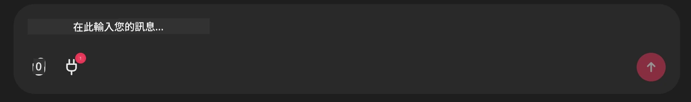

# Github MCP Server 範例

## 說明

這是為 Microsoft Reactor 主辦的 AI Agents Hackathon 所建立的示範。

此工具用於根據使用者的 Github 倉庫推薦黑客松專案。其作法如下：

1. **Github Agent** - 使用 Github MCP Server 來擷取倉庫及其相關資訊。
2. **Hackathon Agent** - 取得來自 Github Agent 的資料，並根據專案、使用者使用的程式語言與 AI Agents hackathon 的賽道提出創意的黑客松專案想法。
3. **Events Agent** - 根據 Hackathon Agent 的建議，Events Agent 會從 AI Agent Hackathon 系列中推薦相關活動。

## 執行程式碼 

### 環境變數

此示範使用 Microsoft Agent Framework、Azure OpenAI Service、Github MCP Server 與 Azure AI Search。

請確認您已設定正確的環境變數以使用這些工具：

```python
AZURE_AI_PROJECT_ENDPOINT=""
AZURE_AI_MODEL_DEPLOYMENT_NAME=""
AZURE_SEARCH_SERVICE_ENDPOINT=""
AZURE_SEARCH_API_KEY=""
``` 

## 執行 Chainlit 伺服器

此示範使用 Chainlit 作為與 MCP server 連線的聊天介面。 

要啟動伺服器，請在終端機中使用下列指令：

```bash
chainlit run app.py -w
```

這應會在 `localhost:8000` 啟動您的 Chainlit 伺服器，並將 `event-descriptions.md` 的內容填入您的 Azure AI Search 索引。 

## 連線到 MCP Server

要連線到 Github MCP Server，請在 "Type your message here.." 聊天框下方選取 "plug" 圖示：



接著您可以點擊 "Connect an MCP" 來新增指令以連線到 Github MCP Server：

```bash
npx -y @modelcontextprotocol/server-github --env GITHUB_PERSONAL_ACCESS_TOKEN=[YOUR PERSONAL ACCESS TOKEN]
```

將 "[YOUR PERSONAL ACCESS TOKEN]" 替換為您實際的 Personal Access Token。 

連線後，您應該會在 plug 圖示旁看到一個 (1) 以確認已連線。如果沒有，請嘗試使用 `chainlit run app.py -w` 重新啟動 chainlit 伺服器。

## 使用示範 

要開始建議黑客松專案的代理工作流程，您可以輸入類似的訊息： 

"建議適合 Github 使用者 koreyspace 的黑客松專案"

Router Agent 會分析您的請求並決定由哪種代理組合（GitHub、Hackathon，以及 Events）最適合處理您的查詢。這些代理協同合作，根據 GitHub 倉庫分析、專案構想與相關技術活動提供完整的建議。

---

<!-- CO-OP TRANSLATOR DISCLAIMER START -->
**免責聲明**：
本文件已使用 AI 翻譯服務 [Co-op Translator](https://github.com/Azure/co-op-translator) 進行翻譯。雖然我們力求準確，但請注意，自動翻譯可能包含錯誤或不準確之處。原始文件的母語版本應被視為具權威性的來源。對於關鍵資訊，建議採用專業人工翻譯。我們對因使用本翻譯而產生的任何誤解或錯誤詮釋不承擔任何責任。
<!-- CO-OP TRANSLATOR DISCLAIMER END -->