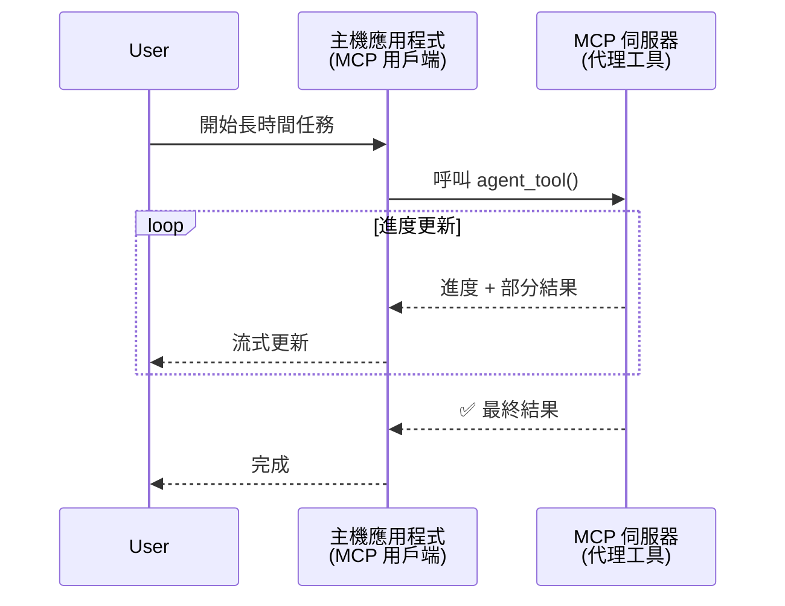
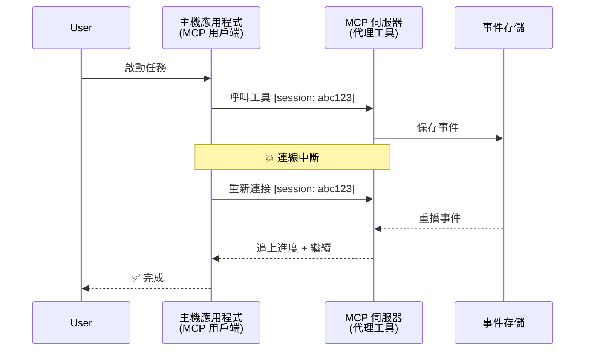
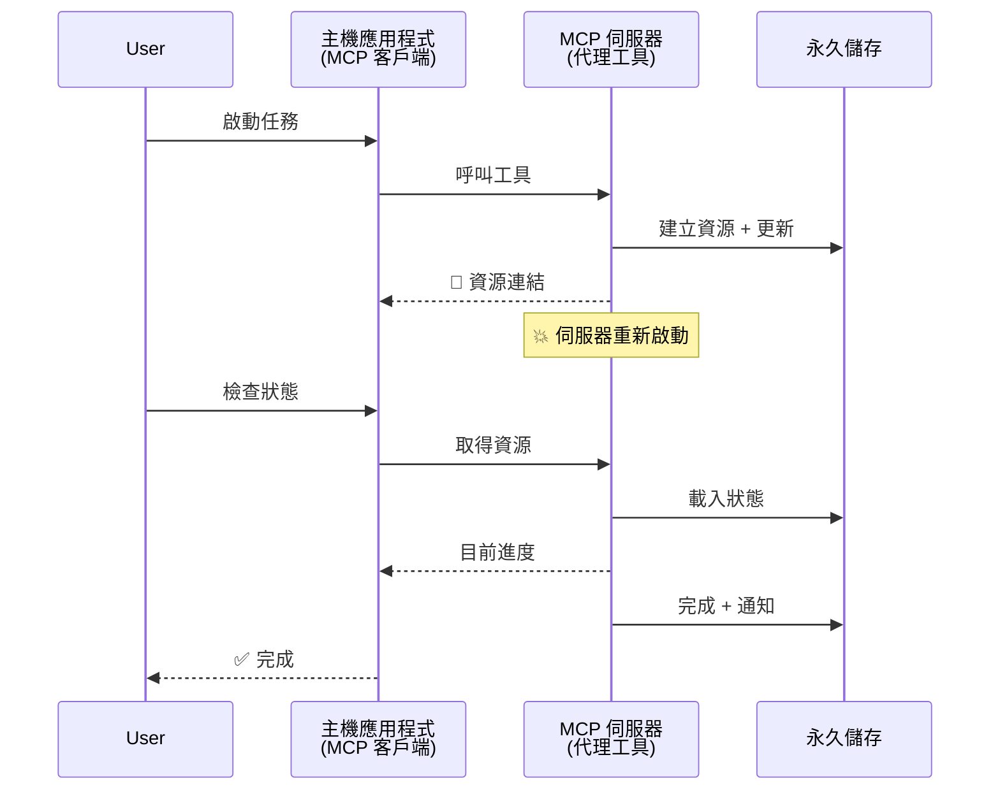
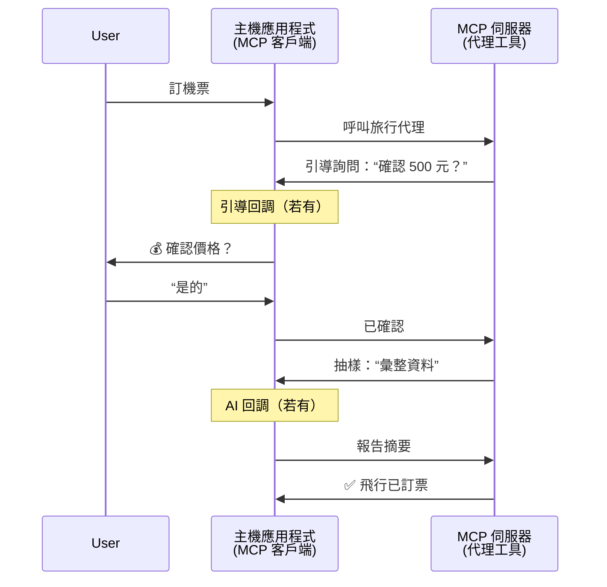
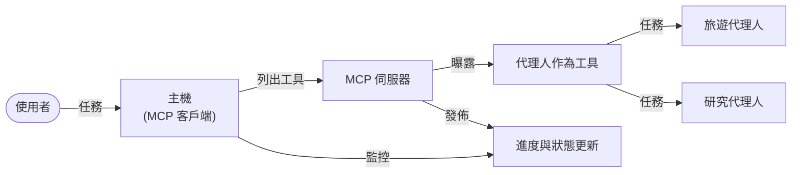

# 使用 MCP 建立代理間通訊系統

> 摘要 - 你可以在 MCP 上建立 Agent2Agent 通訊嗎？答案是可以！

MCP 不再只是「為大型語言模型提供上下文」的初衷。隨著近期新增了 [可續接的串流](https://modelcontextprotocol.io/docs/concepts/transports#resumability-and-redelivery)、[引導](https://modelcontextprotocol.io/specification/2025-06-18/client/elicitation)、[取樣](https://modelcontextprotocol.io/specification/2025-06-18/client/sampling)，以及通知功能（[進度](https://modelcontextprotocol.io/specification/2025-06-18/basic/utilities/progress) 和 [資源](https://modelcontextprotocol.io/specification/2025-06-18/schema#resourceupdatednotification)），MCP 現在提供了一個強大的基礎，可用來構建複雜的代理間通訊系統。

## 代理/工具的誤解

隨著越來越多開發者探索具代理行為的工具（長時間運行、可能運行中需要額外輸入等），一個常見誤解是 MCP 不適合此用途，主要因為早期示例中的工具較簡單，只聚焦於請求-回應模式。

這種看法已不合時宜。過去幾個月 MCP 規範大幅增強了能力，填補了構建長時間運行代理行為的缺口：

- <strong>串流與部分結果</strong>：執行期間的即時進度更新
- <strong>可續接性</strong>：用戶可重新連線並從中斷點繼續
- <strong>持久性</strong>：結果可在伺服器重新啟動後保留（例如通過資源鏈結）
- <strong>多回合</strong>：透過引導和取樣在執行中間進行互動輸入

這些功能可以組合起來，使得能在 MCP 協議上部署複雜的代理及多代理應用。

作為參考，本文中我們將代理稱為 MCP 伺服器上的「工具」。這表示存在一個主機應用，實作 MCP 用戶端，與 MCP 伺服器建立會話並能呼叫該代理。

## 什麼讓 MCP 工具成為「代理」？

在深入實作前，先來釐清支持長時間運行代理需具備哪些基礎設施功能。

> 我們定義代理是可以自主運作、持續相當長時間的實體，能處理複雜任務，且可能需多次互動或根據即時反饋調整。

### 1. 串流與部分結果

傳統請求-回應模式不適用於長時間任務。代理需提供：

- 即時進度更新
- 中間結果

**MCP 支援**：資源更新通知使串流部分結果成為可能，但必須小心設計以避免與 JSON-RPC 的一對一請求/回應模型衝突。

| 功能                      | 使用案例                                                                                                                                                                  | MCP 支援                                                                                   |
| ------------------------- | ------------------------------------------------------------------------------------------------------------------------------------------------------------------------- | ------------------------------------------------------------------------------------------ |
| 即時進度更新              | 使用者請求程式碼庫遷移任務。代理串流進度："10% - 分析依賴... 25% - 轉換 TypeScript 檔案... 50% - 更新匯入..."                                                               | ✅ 進度通知                                                                                 |
| 部分結果                  | 「生成書籍」任務串流部分結果，例如 1) 故事大綱、2) 章節列表、3) 完成的各章節。主機可於任意階段檢視、取消或改向。                                                                | ✅ 通知可「擴展」以包含部分結果，參見 PR 383、776 提案                                      |

<div align="center" style="font-style: italic; font-size: 0.95em; margin-bottom: 0.5em;">
<strong>圖 1：</strong> 此圖說明 MCP 代理如何在長時間任務中串流即時進度更新與部分結果給主機應用，使使用者能即時監控執行狀態。
</div>



### 2. 可續接性

代理必須妥善應對網路中斷：

- 斷線後重新連線（客戶端）
- 從中斷點繼續（訊息重送）

**MCP 支援**：目前 StreamableHTTP 傳輸支援會話續接與訊息重送，使用會話 ID 和最後事件 ID。注意伺服器需實作事件存儲以供客戶端重新連線時重播事件。  
社群中已有一個提案（PR #975）探討無關傳輸層的可續接串流。

| 功能          | 使用案例                                                                                                                                                        | MCP 支援                                                              |
| ------------ | --------------------------------------------------------------------------------------------------------------------------------------------------------------- | -------------------------------------------------------------------- |
| 可續接性      | 客戶端於長任務中斷線，重連後以重播缺失事件恢復會話，無縫續接先前進度。                                                                                       | ✅ StreamableHTTP 傳輸，具會話 ID、事件重播及事件存儲                 |

<div align="center" style="font-style: italic; font-size: 0.95em; margin-bottom: 0.5em;">
<strong>圖 2：</strong> 此圖說明 MCP 的 StreamableHTTP 傳輸及事件存儲如何實現無縫續接：客戶端斷線後可重連並重播缺失事件，繼續任務而不丟失進度。
</div>



### 3. 持久性

長時間運作的代理需要持久化狀態：

- 結果能於伺服器重啟後存活
- 可離線檢索狀態
- 跨會話追蹤進度

**MCP 支援**：MCP 現具備用於工具呼叫的資源鏈結返回類型。常見模式是在建立資源後立即返回其鏈結。工具可在背景處理任務並持續更新資源；客戶端則可選擇輪詢該資源狀態以獲取部分或完整結果（視伺服器提供的更新而定），或訂閱資源以接收更新通知。

一項限制是輪詢資源或訂閱更新可能造成資源消耗，對大規模應用有影響。社群有開放提案（含 #992）探討加入 webhook 或觸發器，由伺服器主動通知客戶端/主機應用更新情況的可能性。

| 功能        | 使用案例                                                                                                                                                     | MCP 支援                                                            |
| ---------- | ------------------------------------------------------------------------------------------------------------------------------------------------------------ | ------------------------------------------------------------------ |
| 持久性      | 伺服器於資料遷移任務期間崩潰。結果與進度在重啟後仍保留，客戶端可查詢狀態並從持久化資源繼續。                                                                  | ✅ 具持久存儲與狀態通知的資源鏈結                                  |

目前常見模式為工具建立資源後立即回傳資源鏈結。工具可在背景處理任務，發出用於進度更新的資源通知或包含部分結果，並按需更新資源內容。

<div align="center" style="font-style: italic; font-size: 0.95em; margin-bottom: 0.5em;">
<strong>圖 3：</strong> 此圖示範 MCP 代理如何利用持久資源與狀態通知確保長時間任務能在伺服器重啟後存活，允許客戶端查詢進度和取回結果，即使發生故障。
</div>



### 4. 多回合互動

代理常需在執行中期取得額外輸入：

- 人類釐清或批准
- AI 協助複雜決策
- 動態參數調整

**MCP 支援**：完全支援透過取樣（AI 輸入）與引導（人類輸入）。

| 功能                  | 使用案例                                                                                                                                                  | MCP 支援                                              |
| --------------------- | --------------------------------------------------------------------------------------------------------------------------------------------------------- | ---------------------------------------------------- |
| 多回合互動            | 旅遊代理要求使用者確認價格，接著向 AI 請求旅行資料摘要，再完成訂票交易。                                                                               | ✅ 引導用於人類輸入，取樣用於 AI 輸入                |

<div align="center" style="font-style: italic; font-size: 0.95em; margin-bottom: 0.5em;">
<strong>圖 4：</strong> 此圖顯示 MCP 代理如何在執行中期互動方式引導人類輸入或請求 AI 協助，支援確認與動態決策等複雜多回合工作流程。
</div>



## 在 MCP 上實作長時間運行代理 - 程式碼概覽

本文附帶一個 [程式碼倉庫](https://github.com/victordibia/ai-tutorials/tree/main/MCP%20Agents)，包含使用 MCP Python SDK 與 StreamableHTTP 傳輸實作的長時間運行代理完整實作，支援會話續接與訊息重送。此實作展示了如何組合 MCP 能力實現複雜代理般行為。

我們實作了兩個主要代理工具的伺服器：

- <strong>旅遊代理</strong> - 模擬旅遊訂票服務，透過引導進行價格確認
- <strong>研究代理</strong> - 執行研究任務，使用取樣進行 AI 輔助摘要

兩個代理都展示了即時進度更新、互動確認和完整會話續接功能。

### 主要實作概念

以下章節展示各功能的伺服端代理實作及客戶端主機處理：

#### 串流與進度更新 - 任務即時狀態

串流讓代理於長時間任務中提供即時進度更新，保持使用者掌握任務狀態與中間結果。

**伺服器實作（代理發送進度通知）：**

```python
# 從 server/server.py - 旅行代理發送進度更新
for i, step in enumerate(steps):
    await ctx.session.send_progress_notification(
        progress_token=ctx.request_id,
        progress=i * 25,
        total=100,
        message=step,
        related_request_id=str(ctx.request_id)
    )
    await anyio.sleep(2)  # 模擬工作

# 替代方案：記錄訊息以獲得詳細的逐步更新
await ctx.session.send_log_message(
    level="info",
    data=f"Processing step {current_step}/{steps} ({progress_percent}%)",
    logger="long_running_agent",
    related_request_id=ctx.request_id,
)
```

**客戶端實作（主機接收進度更新）：**

```python
# 從 client/client.py - 處理即時通知的客戶端
async def message_handler(message) -> None:
    if isinstance(message, types.ServerNotification):
        if isinstance(message.root, types.LoggingMessageNotification):
            console.print(f"📡 [dim]{message.root.params.data}[/dim]")
        elif isinstance(message.root, types.ProgressNotification):
            progress = message.root.params
            console.print(f"🔄 [yellow]{progress.message} ({progress.progress}/{progress.total})[/yellow]")

# 在建立會話時註冊訊息處理器
async with ClientSession(
    read_stream, write_stream,
    message_handler=message_handler
) as session:
```

#### 引導 - 取得使用者輸入

引導讓代理於執行中請求使用者輸入。對於長時間任務中的確認、釐清或批准相當重要。

**伺服器實作（代理請求確認）：**

```python
# 從 server/server.py - 旅行社請求價格確認
elicit_result = await ctx.session.elicit(
    message=f"Please confirm the estimated price of $1200 for your trip to {destination}",
    requestedSchema=PriceConfirmationSchema.model_json_schema(),
    related_request_id=ctx.request_id,
)

if elicit_result and elicit_result.action == "accept":
    # 繼續預訂
    logger.info(f"User confirmed price: {elicit_result.content}")
elif elicit_result and elicit_result.action == "decline":
    # 取消預訂
    booking_cancelled = True
```

**客戶端實作（主機提供引導回呼）：**

```python
# 從 client/client.py - 用戶端處理引導請求
async def elicitation_callback(context, params):
    console.print(f"💬 Server is asking for confirmation:")
    console.print(f"   {params.message}")

    response = console.input("Do you accept? (y/n): ").strip().lower()

    if response in ['y', 'yes']:
        return types.ElicitResult(
            action="accept",
            content={"confirm": True, "notes": "Confirmed by user"}
        )
    else:
        return types.ElicitResult(
            action="decline",
            content={"confirm": False, "notes": "Declined by user"}
        )

# 創建會話時註冊回呼函數
async with ClientSession(
    read_stream, write_stream,
    elicitation_callback=elicitation_callback
) as session:
```

#### 取樣 - 請求 AI 協助

取樣允許代理在執行期間請求大型語言模型協助，用於複雜決定或內容生成，支援人類與 AI 混合工作流程。

**伺服器實作（代理請求 AI 協助）：**

```python
# 來自 server/server.py - 研究代理請求 AI 摘要
sampling_result = await ctx.session.create_message(
    messages=[
        SamplingMessage(
            role="user",
            content=TextContent(type="text", text=f"Please summarize the key findings for research on: {topic}")
        )
    ],
    max_tokens=100,
    related_request_id=ctx.request_id,
)

if sampling_result and sampling_result.content:
    if sampling_result.content.type == "text":
        sampling_summary = sampling_result.content.text
        logger.info(f"Received sampling summary: {sampling_summary}")
```

**客戶端實作（主機提供取樣回呼）：**

```python
# 來自 client/client.py - 客戶端處理取樣請求
async def sampling_callback(context, params):
    message_text = params.messages[0].content.text if params.messages else 'No message'
    console.print(f"🧠 Server requested sampling: {message_text}")

    # 在真實應用中，這可以呼叫大型語言模型的 API
    # 為了演示目的，我們提供了一個模擬回應
    mock_response = "Based on current research, MCP has evolved significantly..."

    return types.CreateMessageResult(
        role="assistant",
        content=types.TextContent(type="text", text=mock_response),
        model="interactive-client",
        stopReason="endTurn"
    )

# 建立會話時註冊回調函數
async with ClientSession(
    read_stream, write_stream,
    sampling_callback=sampling_callback,
    elicitation_callback=elicitation_callback
) as session:
```

#### 可續接性 - 跨斷線的會話連續性

可續接性保證長時間代理任務能存活於客戶端斷線後，重連時無縫繼續。透過事件存儲與續接令牌實作。

**事件存儲實作（伺服器持有會話狀態）：**

```python
# 來自 server/event_store.py - 簡單的記憶體內事件存儲
class SimpleEventStore(EventStore):
    def __init__(self):
        self._events: list[tuple[StreamId, EventId, JSONRPCMessage]] = []
        self._event_id_counter = 0

    async def store_event(self, stream_id: StreamId, message: JSONRPCMessage) -> EventId:
        """Store an event and return its ID."""
        self._event_id_counter += 1
        event_id = str(self._event_id_counter)
        self._events.append((stream_id, event_id, message))
        return event_id

    async def replay_events_after(self, last_event_id: EventId, send_callback: EventCallback) -> StreamId | None:
        """Replay events after the specified ID for resumption."""
        start_index = None
        stream_id = None
        for index, (event_stream_id, event_id, _) in enumerate(self._events):
            if event_id == last_event_id:
                start_index = index + 1
                stream_id = event_stream_id
                break

        if start_index is None:
            return None

        # 僅重放該會話原始串流中較晚的事件。
        for event_stream_id, event_id, message in self._events[start_index:]:
            if event_stream_id != stream_id:
                continue
            await send_callback(EventMessage(message, event_id))

        return stream_id

# 來自 server/server.py - 將事件存儲傳遞給會話管理器
def create_server_app(event_store: Optional[EventStore] = None) -> Starlette:
    server = ResumableServer()

    # 使用事件存儲建立會話管理器以便恢復
    session_manager = StreamableHTTPSessionManager(
        app=server,
        event_store=event_store,  # 事件存儲使會話恢復成為可能
        json_response=False,
        security_settings=security_settings,
    )

    return Starlette(routes=[Mount("/mcp", app=session_manager.handle_request)])

# 用法：使用事件存儲初始化
event_store = SimpleEventStore()
app = create_server_app(event_store)
```

**帶續接令牌的客戶端元資料（客戶端用已存狀態重連）：**

```python
# 來自 client/client.py - 帶有元資料的客戶端恢復
if existing_tokens and existing_tokens.get("resumption_token"):
    # 使用現有的恢復令牌繼續之前中斷的地方
    metadata = ClientMessageMetadata(
        resumption_token=existing_tokens["resumption_token"],
    )
else:
    # 創建回呼以在收到時保存恢復令牌
    def enhanced_callback(token: str):
        protocol_version = getattr(session, 'protocol_version', None)
        token_manager.save_tokens(session_id, token, protocol_version, command, args)

    metadata = ClientMessageMetadata(
        on_resumption_token_update=enhanced_callback,
    )

# 發送含有恢復元資料的請求
result = await session.send_request(
    types.ClientRequest(
        types.CallToolRequest(
            method="tools/call",
            params=types.CallToolRequestParams(name=command, arguments=args)
        )
    ),
    types.CallToolResult,
    metadata=metadata,
)
```

主機應用本地維護會話 ID 與續接令牌，以便重連至既有會話而不失進度或狀態。

### 程式碼組織

<div align="center" style="font-style: italic; font-size: 0.95em; margin-bottom: 0.5em;">
<strong>圖 5：</strong> 基於 MCP 的代理系統架構
</div>



**主要檔案：**

- **`server/server.py`** - 支援續接的 MCP 伺服器，內含旅遊與研究代理，展示引導、取樣及進度更新
- **`client/client.py`** - 互動式主機應用，支援續接、回呼處理與令牌管理
- **`server/event_store.py`** - 實作事件存儲，支援會話續接與訊息重送

## 擴展至 MCP 的多代理通訊

以上實作可透過提升主機應用的智慧與範圍，擴展至多代理系統：

- <strong>智能任務分解</strong>：主機分析複雜使用者請求，將其拆解成多個子任務，分發給不同專門代理
- <strong>多伺服器協調</strong>：主機管理多個 MCP 伺服器連線，各自暴露不同代理能力
- <strong>任務狀態管理</strong>：主機追蹤多代理任務進度，處理依賴與排序
- <strong>彈性與重試</strong>：主機管理失敗，實施重試邏輯，任務代理不可用時重新路由
- <strong>結果綜合</strong>：主機將多代理輸出整合為一致的最終結果

主機從簡單客戶端轉變為智能協調者，協調分散的代理能力，同時保持 MCP 協議基礎不變。

## 結論

MCP 的增強能力——資源通知、引導/取樣、可續接串流與持久資源——讓複雜的代理間互動成為可能，且維持協議的簡潔性。

## 開始使用

準備好建立你自己的 agent2agent 系統了嗎？請依照以下步驟：

### 1. 運行示範程式

```bash
# 啟動帶有事件存儲以恢復的伺服器
python -m server.server --port 8006

# 在另一個終端機中執行互動式客戶端
python -m client.client --url http://127.0.0.1:8006/mcp
```

**互動模式可用指令：**

- `travel_agent` - 使用引導確認價格進行旅遊預訂
- `research_agent` - 透過取樣 AI 協助摘要研究主題
- `list` - 顯示所有可用工具
- `clean-tokens` - 清除續接令牌
- `help` - 顯示詳細指令說明
- `quit` - 離開客戶端

### 2. 測試續接能力

- 啟動長時間運行代理（如 `travel_agent`）
- 執行中中斷客戶端（Ctrl+C）
- 重啟客戶端，會自動從中斷點續接

### 3. 探索與擴展

- <strong>探索範例</strong>：查看此 [mcp-agents](https://github.com/victordibia/ai-tutorials/tree/main/MCP%20Agents)
- <strong>加入社群</strong>：參與 MCP 在 GitHub 的討論
- <strong>實驗</strong>：從簡單長時間任務開始，逐步加入串流、續接與多代理協調

這展示了 MCP 如何在保持工具簡易性的同時，實現智能代理行為。

總體來說，MCP 協議規範正快速演進；建議讀者查閱官方文件網站獲得最新資訊 - https://modelcontextprotocol.io/introduction

---

<!-- CO-OP TRANSLATOR DISCLAIMER START -->
**免責聲明**：
此文件已使用 AI 翻譯服務 [Co-op Translator](https://github.com/Azure/co-op-translator) 進行翻譯。雖然我們努力追求準確性，但請注意自動翻譯可能包含錯誤或不準確之處。原始文件的母語版本應視為權威來源。對於關鍵資訊，建議採用專業人工翻譯。我們不對因使用此翻譯所產生的任何誤解或誤譯承擔責任。
<!-- CO-OP TRANSLATOR DISCLAIMER END -->