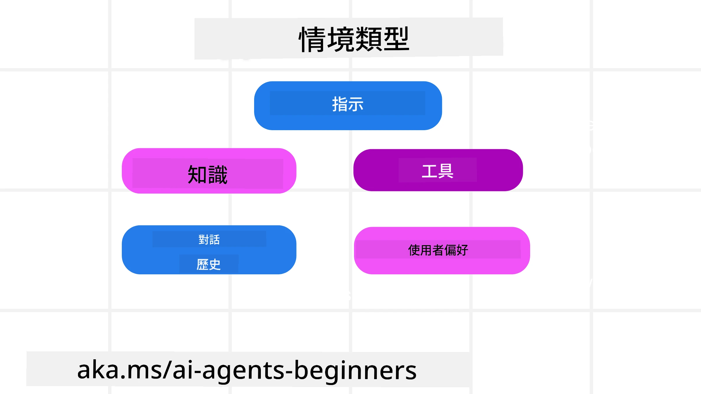
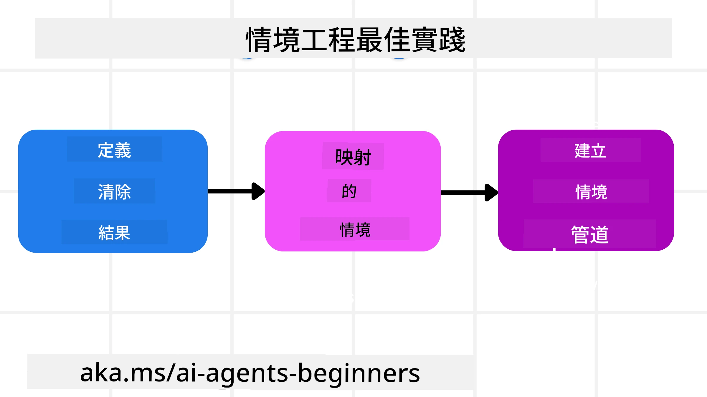

# AI 代理的上下文工程

> _(點擊上方圖片以觀看本課程影片)_

了解您正在為其構建 AI 代理的應用程式的複雜性，對於打造可靠的代理非常重要。我們需要建立能有效管理資訊的 AI 代理，以解決超越提示工程的複雜需求。

本課程將探討什麼是上下文工程以及其在構建 AI 代理中的作用。

## 介紹

本課程將涵蓋：

• <strong>什麼是上下文工程</strong> 以及為何它與提示工程不同。

• <strong>有效上下文工程的策略</strong>，包括如何編寫、選擇、壓縮及隔離資訊。

• <strong>常見的上下文失敗</strong>，如何影響您的 AI 代理及修正方法。

## 學習目標

完成本課程後，您將了解如何：

• <strong>定義上下文工程</strong> 並將其與提示工程區別開來。

• **識別大型語言模型（LLM）應用中上下文的關鍵組成部分。**

• **應用編寫、選擇、壓縮及隔離上下文的策略**，以提升代理的效能。

• <strong>辨識常見的上下文失敗</strong>，如污染、分心、混淆與衝突，並實施緩解技巧。

## 什麼是上下文工程？

對於 AI 代理，上下文驅動 AI 代理規劃採取特定行動。上下文工程指確保 AI 代理擁有完成任務下一步所需正確資訊的實務。上下文視窗大小有限，代理開發者需建立系統與流程，管理上下文視窗中資訊的新增、移除與濃縮。

### 提示工程 vs 上下文工程

提示工程聚焦於一組靜態的指令，有效引導 AI 代理執行規則。上下文工程則是管理包含初始提示在內的動態資訊組合，確保 AI 代理隨時間擁有所需資訊。上下文工程的核心理念是使流程可重複且可靠。

### 上下文類型

重要的是要記住，上下文不僅是單一事物。AI 代理所需資訊可來自多種來源，而確保代理能存取這些來源是我們的責任：

AI 代理可能需要管理的上下文類型包括：

• **指令：** 如代理的「規則」——提示、系統訊息、少量範例（示範 AI 如何操作）及其可使用工具的描述。這是提示工程與上下文工程的交匯處。

• **知識：** 涵蓋事實、從資料庫檢索而來的資訊，或代理累積的長期記憶。如果代理需要存取不同的知識庫和資料庫，亦包含整合檢索增強生成（RAG）系統。

• **工具：** 定義代理可呼叫的外部功能、API 與 MCP 伺服器，以及使用後獲得的反饋（結果）。

• **對話歷史：** 與使用者的持續對話。隨著時間推移，對話變得更長且更複雜，佔據上下文視窗空間。

• **使用者偏好：** 隨時間學習到的使用者喜好或不喜好。這些資訊可被儲存並在做重要決策時調用，協助使用者。

## 有效上下文工程的策略

### 規劃策略

優秀的上下文工程始於良好的規劃。以下是一種有助於您開始思考如何應用上下文工程概念的方法：

1. <strong>定義明確目標</strong> - 指派給 AI 代理的任務結果應清晰明確。回答問題：「當 AI 代理完成任務後，世界會是什麼樣子？」換言之，使用者與 AI 代理互動後，應該獲得哪些變化、資訊或回應。

2. <strong>繪製上下文地圖</strong> - 定義 AI 代理目標後，需回答「AI 代理完成任務需要哪些資訊？」從而開始繪製該資訊可能的來源與分布上下文。

3. <strong>建立上下文管線</strong> - 知道資訊來源後，接著回答「代理將如何取得這些資訊？」這有多種方式，例如 RAG、使用 MCP 伺服器及其他工具。

### 實務策略

規劃很重要，但一旦資訊開始匯入代理的上下文視窗，我們需要實務策略來管理它：

#### 管理上下文

部分資訊會自動加入上下文視窗，但上下文工程更側重對此資訊採取更積極管理，以下幾種策略可行：

 1. <strong>代理草稿板</strong>  
 允許 AI 代理在單次會話期間記錄與當前任務及使用者互動相關的資訊。該資料應存於上下文視窗外，例如檔案或執行時物件，代理若有需要可於會話期間取回。

 2. <strong>記憶系統</strong>  
 草稿板適用於管理單次會話上下文視窗外的資訊。記憶使代理能跨多次會話儲存並檢索重要資訊，如摘要、使用者偏好，以及將來改進的回饋。

 3. <strong>壓縮上下文</strong>  
 一旦上下文視窗成長且接近極限，可採用摘要與修剪技巧。這包括只保留最相關資訊或移除較舊的訊息。
  
 4. <strong>多代理系統</strong>  
 建構多代理系統是一種上下文工程，因為每個代理擁有自己的上下文視窗。共享及傳遞上下文給不同代理的方式也需規劃。
  
 5. <strong>沙盒環境</strong>  
 若代理需要執行程式碼或處理大量文件資訊，處理結果可能消耗大量 tokens。代理可使用沙盒環境執行代碼，再讀取結果及相關資訊，而非全數存於上下文視窗。
  
 6. <strong>執行時狀態物件</strong>  
 透過建立資訊容器，管理代理在複雜任務需存取特定資訊的情況。此方式允許代理逐步儲存每個子任務的結果，讓上下文僅與該子任務相關聯。

#### 檢視上下文

採用其中一種策略後，值得檢查下一次模型調用實際接收了什麼。有效的除錯問題是：

> 代理是否載入了過多上下文、錯誤上下文，或錯過必要上下文？

您不需記錄原始提示、工具輸出或記憶內容即可回答此問題。正式環境中，優先使用小型上下文檢查紀錄，捕捉計數、ID、雜湊值與政策標籤：

- **選擇:** 跟蹤考慮了多少候選切片、工具或記憶，選擇了多少，以及何種規則或分數導致其他被過濾。
- **壓縮:** 記錄來源範圍或追蹤 ID、摘要 ID、壓縮前後的估計 token 數，以及原始內容是否從下一次調用排除。
- **隔離:** 註明哪個子任務在獨立代理、會話或沙盒中執行，返回了什麼限定摘要，以及大型工具輸出是否保留在父代理上下文外。
- **記憶與 RAG:** 儲存檢索文件 ID、記憶 ID、分數、選擇 ID 與編輯狀態，而非完整檢索文本。
- **安全與隱私:** 優先使用雜湊、ID、token 桶和政策標籤，避免暴露敏感提示文本、工具參數、結果或使用者記憶主體。

目標不是保留更多上下文，而是留下足夠證據讓開發者判斷哪種上下文策略運行及其是否按預期改變下一次模型調用。

### 上下文工程範例

假設我們想要一個 AI 代理 **「替我預訂去巴黎的行程。」**

• 單純使用提示工程的代理可能僅回應：**「好的，您想什麼時候去巴黎？」** 只處理使用者當下提出的直接問題。

• 採用本課程所述上下文工程策略的代理會執行更多動作。回應前系統可能：

  ◦ <strong>檢查您的行事曆</strong> 以查找可用日期（檢索即時資料）。

 ◦ <strong>回憶過去的旅行偏好</strong>（從長期記憶）如您偏好的航空公司、預算，或是否偏好直飛班機。

 ◦ <strong>辨識可用的訂票與住宿工具</strong>。

- 接著，範例回應可能是： "嗨 [您的名字]！我看到您十月的第一週有空。要不要我幫您尋找[偏好航空]的直飛巴黎航班，並符合您的預算[預算]？" 這更豐富且具上下文感知的回應展示了上下文工程的威力。

## 常見上下文失敗

### 上下文污染

**意義：** 當幻覺（LLM 生成的虛假資訊）或錯誤進入上下文且反覆被引用，導致代理追求不可能達成的目標或發展荒謬策略。

**處理方式：** 實施 <strong>上下文驗證</strong> 與 <strong>隔離</strong>。在加入長期記憶前驗證資訊。若偵測可能污染，則從新的上下文線程開始，防止錯誤信息蔓延。

**旅行預訂範例：** 代理幻覺出<strong>從小型地方機場飛往遙遠國際城市的直航班機</strong>，但該機場實際不提供國際航班。此不存在的航班資料被儲存於上下文。後續叫代理訂票時，不斷嘗試尋找這條不可能路線的機票，導致重複錯誤。

**解決方案：** 實施一個步驟，**在加入航班細節至代理工作上下文前，使用即時 API 驗證航班存在與路線**。驗證失敗時，錯誤資訊被「隔離」且不再使用。

### 上下文分心

**意義：** 當上下文過大，模型過度關注累積歷史，而非訓練所得，導致動作重複或無效。模型甚至未滿足上下文視窗容量前便開始出錯。

**處理方式：** 使用 <strong>上下文摘要化</strong>。定期將累積資訊壓縮成較短的摘要，保留重要細節，移除冗餘歷史，幫助「重設」焦點。

**旅行預訂範例：** 您長時間討論各夢想旅遊地點，甚至包含兩年前背包旅行的詳細敘述。您終於問「找我下個月的廉價機票」，代理卻被舊而無關細節拖累，不斷問您背包裝備或過去行程，忽視目前請求。

**解決方案：** 於一定交談回合後或上下文過大時，代理應<strong>摘要對話近期且相關部分</strong>，聚焦當前旅遊日期與目的地，並在下次 LLM 調用使用該濃縮摘要，捨棄無關歷史對話。

### 上下文混淆

**意義：** 當存在過多可用工具等不必要上下文，模型產生不良回應或調用不相關工具。小型模型尤為易受影響。

**處理方式：** 實施 <strong>工具負載管理</strong>，利用 RAG 技術。將工具描述存入向量資料庫，僅選擇最相關的工具用於特定任務。研究顯示，將工具數量限制在 30 以下較佳。

**旅行預訂範例：** 代理能存取數十個工具：`book_flight`、`book_hotel`、`rent_car`、`find_tours`、`currency_converter`、`weather_forecast`、`restaurant_reservations` 等等。您問「在巴黎怎麼出行最好？」因工具太多，代理混淆，嘗試呼叫 `book_flight` 在巴黎內部，或 `rent_car`，即使您偏好公共交通，因工具描述可能重疊，或模型無法判斷最佳。

**解決方案：** 對工具描述使用 **RAG**。當您詢問巴黎出行，系統動態檢索僅最相關的工具，如 `rent_car` 或 `public_transport_info`，向 LLM 提供專注的工具「負載」。

### 上下文衝突

**意義：** 當上下文中存在衝突資訊，導致推理不一致或最終回應不良。常出現在資訊分階段抵達且早期錯誤假設仍留存上下文。

**處理方式：** 採用 <strong>上下文修剪</strong> 與 <strong>卸載</strong>。修剪指刪除過時或衝突資訊，隨新信息抵達更新。卸載則給模型獨立的「草稿板」工作區，處理資訊而不干擾主上下文。
**旅遊訂票範例：** 你一開始告訴你的代理人，**「我想搭經濟艙。」** 後來在談話中，你改變主意說，**「其實這次旅行，我們改搭商務艙。」** 如果兩個指令都保留在上下文中，代理人可能會收到相互矛盾的搜尋結果，或搞不清楚要優先考慮哪個偏好。

**解決方案：** 實作<strong>上下文修剪</strong>。當新指令與舊指令矛盾時，較舊的指令會被移除或在上下文中明確覆蓋。或者，代理人可以使用<strong>草稿板</strong>來調和衝突的偏好，再做決定，確保只有最終且一致的指令來引導其行動。

## 對上下文工程有更多疑問嗎？

加入 [Microsoft Foundry Discord](https://aka.ms/ai-agents/discord) ，與其他學習者見面，參加辦公時間並取得你的 AI 代理人問題解答。

---

<!-- CO-OP TRANSLATOR DISCLAIMER START -->
**免責聲明**：
此文件已使用 AI 翻譯服務 [Co-op Translator](https://github.com/Azure/co-op-translator) 進行翻譯。雖然我們努力追求準確性，但請注意自動翻譯可能包含錯誤或不準確之處。原始文件的母語版本應視為權威來源。對於關鍵資訊，建議採用專業人工翻譯。我們不對因使用此翻譯所產生的任何誤解或誤譯承擔責任。
<!-- CO-OP TRANSLATOR DISCLAIMER END -->