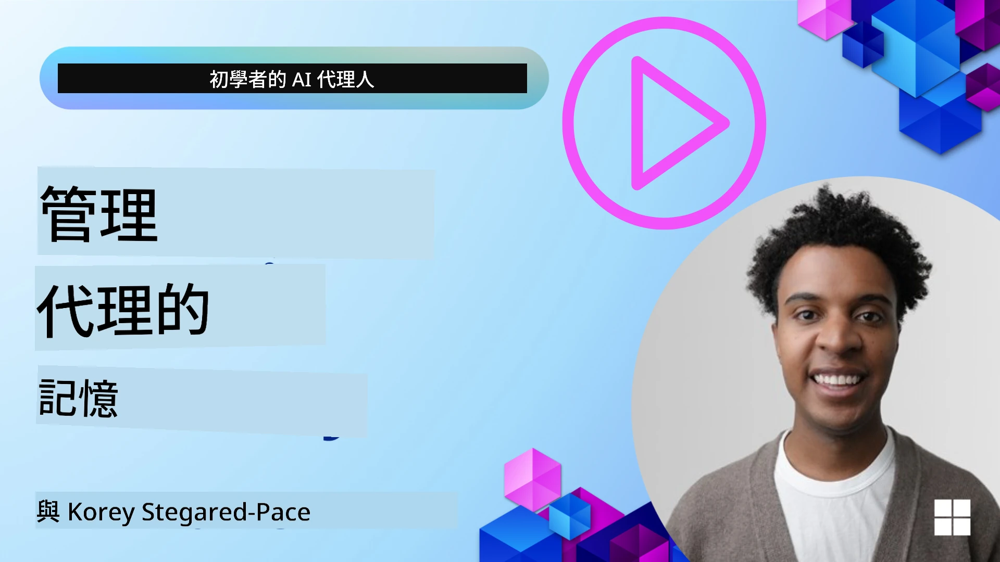

# AI 代理的記憶 

在討論建立 AI 代理的獨特好處時，主要會談到兩件事：呼叫工具以完成任務的能力，以及隨時間改進的能力。記憶是建立能自我改進、並為使用者創造更佳體驗的代理的基礎。

在本課程中，我們將探討 AI 代理的記憶是什麼，以及我們如何管理並利用它來強化應用程式。

## 介紹

本課程將涵蓋：

• **理解 AI 代理的記憶**：記憶是什麼，以及為何對代理來說至關重要。

• **實作與儲存記憶**：為你的 AI 代理新增記憶功能的實務方法，重點放在短期與長期記憶。

• **讓 AI 代理自我改進**：記憶如何讓代理從過去互動中學習並隨時間改進。

## 可用的實作範例

本課程包含兩個完整的 notebook 教學：

• **[13-agent-memory.ipynb](./13-agent-memory.ipynb)**：使用 Mem0 與 Azure AI Search 並搭配 Microsoft Agent Framework 實作記憶

• **[13-agent-memory-cognee.ipynb](./13-agent-memory-cognee.ipynb)**：使用 Cognee 實作結構化記憶，自動建立由 embeddings 支援的知識圖、視覺化圖譜並進行智慧檢索

## 學習目標

完成本課程後，你將知道如何：

• **區分各種 AI 代理記憶類型**，包括工作記憶、短期與長期記憶，以及像是人格記憶與情節記憶等專門形式。

• **為 AI 代理實作並管理短期與長期記憶**，使用 Microsoft Agent Framework，並利用 Mem0、Cognee、Whiteboard 記憶，及整合 Azure AI Search 等工具。

• **理解自我改進 AI 代理背後的原則**，以及健全的記憶管理系統如何促成持續學習與適應能力。

## 理解 AI 代理的記憶

本質上，**AI 代理的記憶指的是讓它們能保留與回憶資訊的機制**。這些資訊可以是對話的具體細節、使用者偏好、過去的行為，甚至是學到的模式。

沒有記憶的 AI 應用通常是無狀態的，也就是每次互動都從頭開始。這會導致重複且令人沮喪的使用者體驗，代理會「忘記」先前的上下文或偏好。

### 為什麼記憶重要？

代理的智慧與其回憶並利用過去資訊的能力有著密切關聯。記憶讓代理能夠：

• **反思**：從過去的行動與結果中學習。

• **互動性**：在持續對話中維持上下文。

• **前瞻與回應**：根據歷史資料預測需求或做出適當回應。

• **自主性**：藉由調用所存知識更獨立地運作。

實作記憶的目標是讓代理更「可靠且更有能力」。

### 記憶類型

#### 工作記憶

將其想像成代理在單一正在進行的任務或思考過程中使用的一張草稿紙。它保存計算下一步所需的即時資訊。

對 AI 代理而言，工作記憶常會擷取對話中最相關的資訊，即使完整的聊天記錄很長或被截斷。它注重抽取關鍵要素，例如需求、提案、決策與行動。

**工作記憶範例**

在旅遊訂票代理中，工作記憶可能會擷取使用者當前的請求，例如「我想預訂一趟去巴黎的行程」。這項特定需求會保存在代理的即時上下文中，指引當前互動。

#### 短期記憶

此類記憶會在單一對話或會話期間保留資訊。它是當前聊天的上下文，讓代理能參照對話中的先前回合。

**短期記憶範例**

如果使用者問「飛往巴黎的機票要多少錢？」然後接著問「那在那裡的住宿呢？」，短期記憶確保代理知道「那裡」指的是同一對話中的「巴黎」。

#### 長期記憶

這是跨越多次對話或會話持續存在的資訊。它讓代理能記住使用者偏好、歷史互動或長期的通用知識。這對個人化非常重要。

**長期記憶範例**

長期記憶可能會儲存「Ben 喜歡滑雪與戶外活動、喜歡有山景的咖啡，並且因為過去受過傷而想避免高難度的滑雪坡道」。從先前互動中學到的這些資訊會影響未來的旅遊規劃建議，讓它們高度個人化。

#### 人格記憶

這種專門的記憶類型幫助代理建立穩定的一致「人格」或「角色」。它讓代理記住自身或其應扮演角色的細節，讓互動更流暢且有焦點。

**人格記憶範例**
如果旅遊代理被設計為「資深滑雪規劃專家」，人格記憶可能會強化這個角色，使其回應符合專家的語氣與知識。

#### 工作流程／情節記憶

這類記憶儲存代理在執行複雜任務時所採取的步驟序列，包括成功與失敗。它就像記住特定的「情節」或過去經驗以便從中學習。

**情節記憶範例**

如果代理嘗試預訂特定航班但因無座而失敗，情節記憶可以記錄這次失敗，讓代理在後續的嘗試中採取替代航班或向使用者更有資訊地說明問題。

#### 實體記憶

這涉及從對話中擷取並記住特定實體（例如人、地點或物品）與事件。它讓代理建立對討論關鍵元素的結構化理解。

**實體記憶範例**

從討論過去旅行的對話中，代理可能擷取到「巴黎」、「艾菲爾鐵塔」和「在 Le Chat Noir 餐廳用餐」作為實體。在未來互動中，代理可以回想起「Le Chat Noir」並主動提出幫忙重新預訂那裡的座位。

#### 結構化 RAG (Retrieval Augmented Generation)

雖然 RAG 是一個較廣泛的技術，「結構化 RAG」被強調為一種強大的記憶技術。它從各種來源（對話、電子郵件、影像）中擷取密集且結構化的資訊，並用以提升回應的精確度、召回率與速度。與僅仰賴語意相似度的傳統 RAG 不同，結構化 RAG 可與資訊的內在結構協同運作。

**結構化 RAG 範例**

結構化 RAG 不只是匹配關鍵字，它可以從電子郵件解析航班細節（目的地、日期、時間、航空公司）並以結構化方式儲存。這樣就能進行精準查詢，例如「我星期二訂了哪一班去巴黎的航班？」

## 實作與儲存記憶

為 AI 代理實作記憶涉及一個系統化的流程 —— **記憶管理**，包含產生、儲存、檢索、整合、更新，甚至「遺忘」(或刪除) 資訊。檢索是一個特別關鍵的面向。

### 專門的記憶工具

#### Mem0

一種儲存與管理代理記憶的方法是使用像 Mem0 這樣的專門工具。Mem0 作為持久化記憶層運作，允許代理回憶相關互動、儲存使用者偏好與事實性上下文，並從成功與失敗中學習。其核心概念是讓無狀態的代理轉變為有狀態的代理。

它透過一個 **兩階段記憶流程：擷取與更新** 來運作。首先，加入代理線程的訊息會被送到 Mem0 服務，該服務使用大型語言模型 (LLM) 來總結對話歷史並擷取新記憶。接著，一個由 LLM 驅動的更新階段決定是否要新增、修改或刪除這些記憶，並將它們儲存在可以包含向量、圖形與鍵值資料庫的混合資料存儲中。此系統也支援各種記憶類型，並能納入圖譜記憶以管理實體間的關係。

#### Cognee

另一個強大的方法是使用 **Cognee**，一個開源的 AI 代理語意記憶系統，它將結構化與非結構化資料轉換為以 embeddings 支援且可查詢的知識圖。Cognee 提供一個 **雙存儲架構**，結合向量相似度搜尋與圖形關係，讓代理不僅能理解資訊之間的相似性，還能理解概念之間的關聯。

它在 **混合檢索** 上表現出色，融合向量相似度、圖結構與 LLM 推理 —— 從原始分段查找到考慮圖結構的問答。系統維持一個不斷演化與成長的「活記憶」，同時以一個連結的圖形形式保持可查詢狀態，支援短期會話上下文與長期持久記憶。

Cognee 的 notebook 教學（[13-agent-memory-cognee.ipynb](./13-agent-memory-cognee.ipynb)）示範了建構這個統一記憶層的過程，包含實際範例：攝取多樣資料來源、視覺化知識圖，並依代理需求使用不同的搜尋策略來進行查詢。

### 使用 RAG 儲存記憶

除了像 mem0 這類專門的記憶工具外，你也可以利用像 **Azure AI Search** 這樣強大的搜尋服務作為儲存與檢索記憶的後端，特別是對於結構化 RAG。

這讓你能以自有資料來根植代理的回應，確保更相關且更準確的答案。Azure AI Search 可以用來儲存使用者特定的旅行記憶、產品目錄或其他任何領域專屬知識。

Azure AI Search 支援像 **Structured RAG** 之類的能力，擅長從大型資料集（例如對話歷史、電子郵件或影像）中擷取與檢索密集且結構化的資訊。與傳統的文本分段與 embeddings 方法相比，這能提供「超越人類的精確度與召回率」。

## 讓 AI 代理自我改進

讓代理自我改進的一個常見模式是引入一個 **「知識代理」**。這個獨立的代理會觀察使用者與主要代理之間的主要對話。其角色包括：

1. **辨識有價值的資訊**：判斷對話中的哪些部分值得保存為通用知識或特定使用者偏好。

2. **擷取與摘要**：從對話中提煉出核心學習內容或偏好。

3. **儲存到知識庫**：將擷取出的資訊持久化，通常儲存在向量資料庫中，以便日後檢索。

4. **強化未來查詢**：當使用者啟動新查詢時，知識代理檢索相關儲存資訊並將其附加到使用者的提示中，為主要代理提供關鍵上下文（類似 RAG）。

### 記憶的優化方法

• **延遲管理**：為避免拖慢使用者互動，可以先使用較便宜且較快的模型快速檢查資訊是否值得儲存或檢索，僅在必要時才呼叫更複雜的擷取/檢索流程。

• **知識庫維護**：對於不斷成長的知識庫，可以將較少使用的資訊移至「冷儲存」以控管成本。

## 還有更多關於代理記憶的問題嗎？

Join the [Microsoft Foundry Discord](https://aka.ms/ai-agents/discord) to meet with other learners, attend office hours and get your AI Agents questions answered.

---

<!-- CO-OP TRANSLATOR DISCLAIMER START -->
免責聲明：
本文件已由 AI 翻譯服務 Co-op Translator (https://github.com/Azure/co-op-translator) 進行翻譯。儘管我們力求準確，但請注意，自動翻譯可能包含錯誤或不準確之處。原始語言版本的文件應被視為具權威性的來源。對於重要資訊，建議採用專業人工翻譯。我們不對因使用本翻譯所導致的任何誤解或誤譯負責。
<!-- CO-OP TRANSLATOR DISCLAIMER END -->