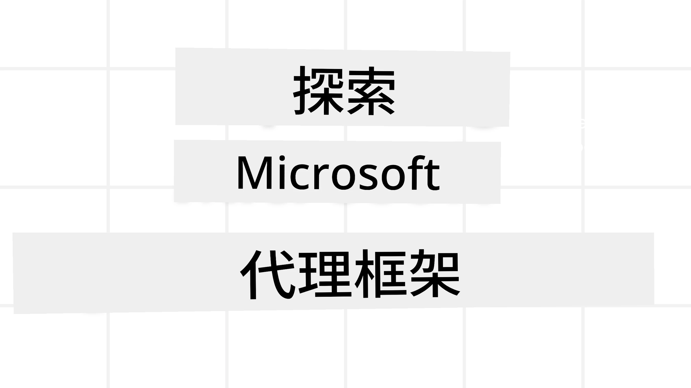
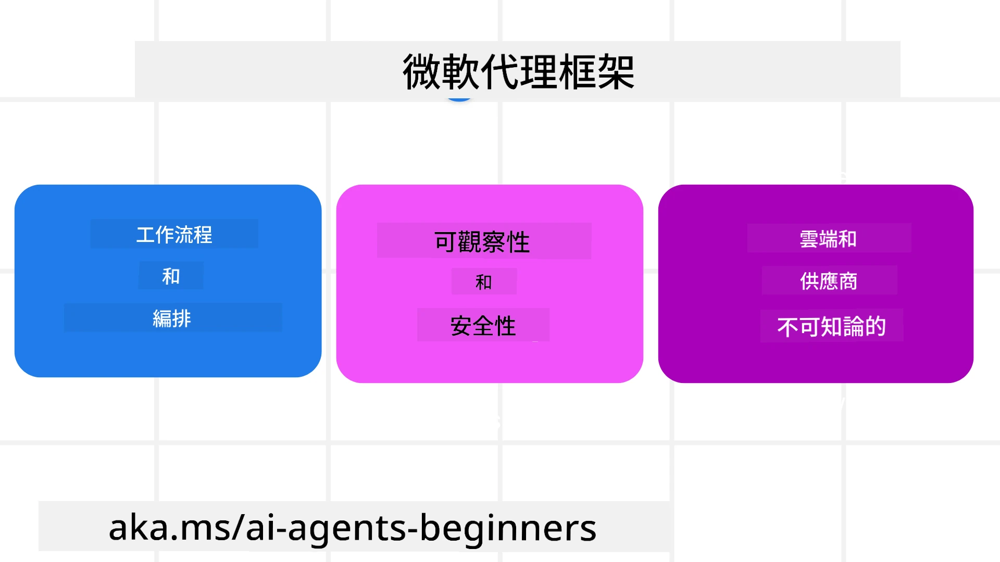

# 探索 Microsoft Agent Framework



### 介紹

本課程將涵蓋：

- 了解 Microsoft Agent Framework：主要功能與價值  
- 探索 Microsoft Agent Framework 的核心概念
- 進階 MAF 模式：工作流程、中介軟體與記憶體

## 學習目標

完成本課程後，您將了解如何：

- 使用 Microsoft Agent Framework 建立生產環境就緒的 AI 代理
- 將 Microsoft Agent Framework 的核心功能應用於您的代理使用案例
- 使用包含工作流程、中介軟體與可觀察性的進階模式

## 範例程式碼 

[Microsoft Agent Framework (MAF)](https://aka.ms/ai-agents-beginners/agent-framewrok) 的範例程式碼可在此資料庫的 `xx-python-agent-framework` 及 `xx-dotnet-agent-framework` 檔案中找到。

## 了解 Microsoft Agent Framework



[Microsoft Agent Framework (MAF)](https://aka.ms/ai-agents-beginners/agent-framewrok) 是微軟所提供用於構建 AI 代理的統一框架。它具備靈活性，可處理生產和研究環境中各種代理使用案例，包括：

- **序列代理編排**：適用於需要逐步工作流程的場景。
- **並行編排**：適用於代理需同時完成任務的場景。
- **群組聊天編排**：適用於代理可協同處理同一任務的場景。
- **交接編排**：適用於代理隨子任務完成而相互交接任務的場景。
- **磁性編排**：適用於管理代理創建並修改任務清單並協調子代理完成任務的場景。

為了交付生產環境的 AI 代理，MAF 還包含了以下功能：

- **可觀察性**：透過 OpenTelemetry，讓 AI 代理的每個動作包括工具調用、編排步驟、推理流程及透過 Microsoft Foundry 儀表板進行性能監控都被記錄。
- **安全性**：代理原生托管於 Microsoft Foundry，提供角色基礎存取、私有資料處理和內建內容安全性等安全控管。
- **持久性**：代理線程和工作流程可暫停、恢復並從錯誤中復原，支援較長時間運行的流程。
- **控制**：支援人機介入的工作流程，任務可標記為需要人工核准。

Microsoft Agent Framework 亦注重互操作性：

- **雲端無關**：代理可在容器、內部部署及多種不同雲端環境中執行。
- **提供者無關**：代理可透過您偏好的 SDK（包括 Azure OpenAI 和 OpenAI）建立。
- **整合開放標準**：代理可使用代理間通訊(A2A)與模型上下文協議(MCP)等協定來發現並使用其他代理和工具。
- **插件與連接器**：可連接 Microsoft Fabric、SharePoint、Pinecone 和 Qdrant 等資料和記憶服務。

接著讓我們看看這些功能如何應用於 Microsoft Agent Framework 的一些核心概念。

## Microsoft Agent Framework 的核心概念

### 代理 (Agents)


**建立代理**

代理的建立是透過定義推理服務（LLM 提供者）、一組供代理遵循的指示，以及指定的 `name`：

```python
agent = AzureOpenAIChatClient(credential=AzureCliCredential()).create_agent( instructions="You are good at recommending trips to customers based on their preferences.", name="TripRecommender" )
```

上例使用 `Azure OpenAI`，但代理也可使用多種服務建立，包括 `Microsoft Foundry Agent Service`：

```python
AzureAIAgentClient(async_credential=credential).create_agent( name="HelperAgent", instructions="You are a helpful assistant." ) as agent
```

OpenAI 的 `Responses`、`ChatCompletion` API

```python
agent = OpenAIResponsesClient().create_agent( name="WeatherBot", instructions="You are a helpful weather assistant.", )
```

```python
agent = OpenAIChatClient().create_agent( name="HelpfulAssistant", instructions="You are a helpful assistant.", )
```

或使用 A2A 協定的遠端代理：

```python
agent = A2AAgent( name=agent_card.name, description=agent_card.description, agent_card=agent_card, url="https://your-a2a-agent-host" )
```

**執行代理**

代理透過 `.run` 或 `.run_stream` 方法執行，分別用於非串流或串流回應。

```python
result = await agent.run("What are good places to visit in Amsterdam?")
print(result.text)
```

```python
async for update in agent.run_stream("What are the good places to visit in Amsterdam?"):
    if update.text:
        print(update.text, end="", flush=True)

```

每次代理執行還可以設定選項以自訂參數，例如代理使用的 `max_tokens`、代理能呼叫的 `tools`，甚至代理所使用的 `model`。

在需要使用特定模型或工具完成使用者任務的情況下，這非常有用。

**工具（Tools）**

工具可在定義代理時設定：

```python
def get_attractions( location: Annotated[str, Field(description="The location to get the top tourist attractions for")], ) -> str: """Get the top tourist attractions for a given location.""" return f"The top attractions for {location} are." 


# 當直接建立一個 ChatAgent 時

agent = ChatAgent( chat_client=OpenAIChatClient(), instructions="You are a helpful assistant", tools=[get_attractions]

```

也可在執行代理時指定：

```python

result1 = await agent.run( "What's the best place to visit in Seattle?", tools=[get_attractions] # 僅為此次運行提供的工具 )
```

**代理線程 (Agent Threads)**

代理線程用於處理多輪對話。線程可由以下方式建立：

- 使用 `get_new_thread()`，使線程可隨時間保存
- 在執行代理時自動建立線程，且線程只在當前執行期間有效。

建立線程的程式碼如下：

```python
# 建立一個新的執行緒。
thread = agent.get_new_thread() # 使用該執行緒運行代理。
response = await agent.run("Hello, I am here to help you book travel. Where would you like to go?", thread=thread)

```

然後您可以序列化線程以供稍後存取：

```python
# 建立一個新的執行緒。
thread = agent.get_new_thread() 

# 用該執行緒執行代理。

response = await agent.run("Hello, how are you?", thread=thread) 

# 將執行緒序列化以便儲存。

serialized_thread = await thread.serialize() 

# 從儲存中載入後反序列化執行緒狀態。

resumed_thread = await agent.deserialize_thread(serialized_thread)
```

**代理中介軟體 (Agent Middleware)**

代理與工具及 LLM 互動以完成使用者任務。在某些場景下，我們希望在互動過程中執行或追蹤動作。代理中介軟體讓我們能做到這一點，包含：

*函式中介軟體*

此中介軟體允許我們在代理與它將呼叫的函式／工具之間執行動作。例如，您可能想要在函式呼叫時做些記錄。

下方程式碼中，`next` 決定是否呼叫下一個中介軟體或實際函式。

```python
async def logging_function_middleware(
    context: FunctionInvocationContext,
    next: Callable[[FunctionInvocationContext], Awaitable[None]],
) -> None:
    """Function middleware that logs function execution."""
    # 預處理：函數執行前記錄日誌
    print(f"[Function] Calling {context.function.name}")

    # 繼續執行下一個中介軟體或函數
    await next(context)

    # 後處理：函數執行後記錄日誌
    print(f"[Function] {context.function.name} completed")
```

*聊天中介軟體*

此中介軟體允許我們在代理與 LLM 之間請求交流時執行或記錄動作。

此處包含重要資訊，如送往 AI 服務的 `messages`。

```python
async def logging_chat_middleware(
    context: ChatContext,
    next: Callable[[ChatContext], Awaitable[None]],
) -> None:
    """Chat middleware that logs AI interactions."""
    # 預處理：AI 呼叫前記錄日誌
    print(f"[Chat] Sending {len(context.messages)} messages to AI")

    # 繼續執行下一個中介軟體或 AI 服務
    await next(context)

    # 後處理：AI 回應後記錄日誌
    print("[Chat] AI response received")

```

**代理記憶 (Agent Memory)**

如 `Agentic Memory` 課程中所述，記憶是讓代理能跨不同情境運作的重要元素。MAF 提供數種不同類型的記憶：

*記憶體內存儲*

此記憶儲存在應用程式執行期間的線程中。

```python
# 建立一個新的執行緒。
thread = agent.get_new_thread() # 使用該執行緒執行代理。
response = await agent.run("Hello, I am here to help you book travel. Where would you like to go?", thread=thread)
```

*持久訊息*

此記憶用於跨不同會話存儲對話歷史。透過 `chat_message_store_factory` 來定義：

```python
from agent_framework import ChatMessageStore

# 建立自訂訊息存放區
def create_message_store():
    return ChatMessageStore()

agent = ChatAgent(
    chat_client=OpenAIChatClient(),
    instructions="You are a Travel assistant.",
    chat_message_store_factory=create_message_store
)

```

*動態記憶*

此記憶會在代理執行前加入上下文。可存於如 mem0 等外部服務中：

```python
from agent_framework.mem0 import Mem0Provider

# 使用 Mem0 來實現進階記憶體功能
memory_provider = Mem0Provider(
    api_key="your-mem0-api-key",
    user_id="user_123",
    application_id="my_app"
)

agent = ChatAgent(
    chat_client=OpenAIChatClient(),
    instructions="You are a helpful assistant with memory.",
    context_providers=memory_provider
)

```

**代理可觀察性 (Agent Observability)**

可觀察性是建立可靠且可維護代理系統的重要元素。MAF 整合 OpenTelemetry 提供追蹤與計量功能，以提升可觀察性。

```python
from agent_framework.observability import get_tracer, get_meter

tracer = get_tracer()
meter = get_meter()
with tracer.start_as_current_span("my_custom_span"):
    # 做某事
    pass
counter = meter.create_counter("my_custom_counter")
counter.add(1, {"key": "value"})
```

### 工作流程 (Workflows)

MAF 提供工作流程，這是完成任務的預定義步驟，並包含 AI 代理作為步驟中的組件。

工作流程由不同組件組成，可更好地控制流程。工作流程也支援 **多代理編排** 及 **檢查點** 以保存工作流程狀態。

工作流程的核心組件為：

**執行器 (Executors)**

執行器接收輸入訊息，執行指派任務，並產生輸出訊息，推進工作流程完成較大任務。執行器可為 AI 代理或自訂邏輯。

**邊 (Edges)**

邊用於定義工作流程中訊息的流程。類型包括：

*直接邊*：在執行器間建立簡單一對一連結：

```python
from agent_framework import WorkflowBuilder

builder = WorkflowBuilder()
builder.add_edge(source_executor, target_executor)
builder.set_start_executor(source_executor)
workflow = builder.build()
```

*條件邊*：當條件達成後啟動。例如，當無法預訂飯店房間時，執行器建議其他選項。

*分支條件邊*：依據定義的條件將訊息導向不同執行器。例如，當旅遊顧客享有優先權時，他們的任務會經由另一工作流程處理。

*發散邊*：將一則訊息發送到多個目標。

*彙集邊*：收集多則來自不同執行器的訊息，發送至一個目標。

**事件 (Events)**

為了提供更佳的工作流程可觀察性，MAF 提供包含執行事件的內建事件類型：

- `WorkflowStartedEvent`  - 工作流程開始執行
- `WorkflowOutputEvent` - 工作流程產生輸出
- `WorkflowErrorEvent` - 工作流程發生錯誤
- `ExecutorInvokeEvent`  - 執行器開始處理
- `ExecutorCompleteEvent`  - 執行器完成處理
- `RequestInfoEvent` - 發出請求

## 進階 MAF 模式

上述章節涵蓋了 Microsoft Agent Framework 的核心概念。當您建立更複雜的代理時，可以考慮以下進階模式：

- **中介軟體組合**：連鎖多個中介軟體處理程序（例如記錄、授權、速率限制），使用函式與聊天中介軟體對代理行為進行細緻控制。
- **工作流程檢查點**：使用工作流程事件與序列化保存與恢復長時間運行的代理流程。
- **動態工具選擇**：結合基於內容檢索的工具描述和 MAF 工具註冊，只顯示針對每個查詢相關的工具。
- **多代理交接**：利用工作流程邊及條件路由協調專門代理間的任務交接。

## 範例程式碼 

Microsoft Agent Framework 的範例程式碼可在此資料庫的 `xx-python-agent-framework` 及 `xx-dotnet-agent-framework` 檔案中找到。

## 對 Microsoft Agent Framework 有更多問題？

加入 [Microsoft Foundry Discord](https://aka.ms/ai-agents/discord)，與其他學習者交流，參加專家問答時間，並獲得您的 AI 代理問題的解答。

---

<!-- CO-OP TRANSLATOR DISCLAIMER START -->
**免責聲明**：  
本文件係使用 AI 翻譯服務 [Co-op Translator](https://github.com/Azure/co-op-translator) 進行翻譯。雖然我們努力追求準確性，但請注意，自動翻譯可能包含錯誤或不準確之處。原始文件之母語版本應視為權威來源。對於重要資訊，建議採用專業人工翻譯。我們對因使用本翻譯所產生的任何誤解或誤釋不負任何責任。
<!-- CO-OP TRANSLATOR DISCLAIMER END -->