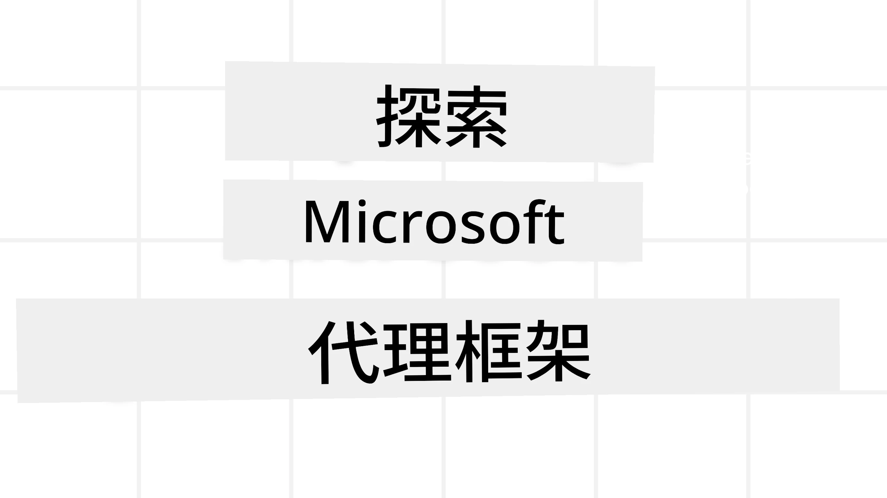
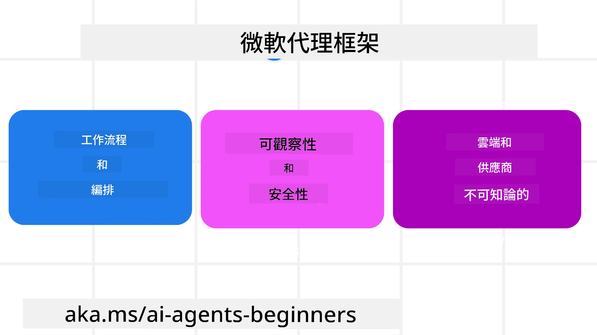
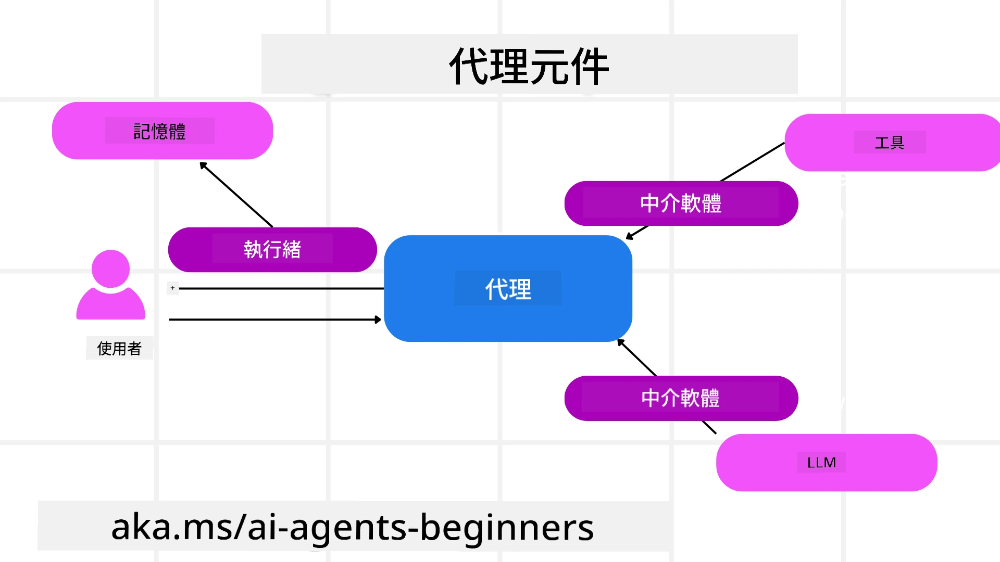

# 探索 Microsoft Agent Framework



### 介紹

本課程將涵蓋：

- 了解 Microsoft Agent Framework：主要功能與價值  
- 探索 Microsoft Agent Framework 的核心概念
- 進階 MAF 模式：工作流程、中介軟體與記憶體

## 學習目標

完成本課程後，您將會知道如何：

- 使用 Microsoft Agent Framework 建立產品級的 AI 代理人
- 將 Microsoft Agent Framework 的核心功能套用於您的代理人用例
- 使用包括工作流程、中介軟體及可觀察性的進階模式

## 程式碼範例

有關 [Microsoft Agent Framework (MAF)](https://learn.microsoft.com/en-us/agent-framework/overview/?wt.mc_id=youtube_26688_organicsocial_reactor&pivots=programming-language-python) 的程式碼範例，可在本儲存庫中的 `xx-python-agent-framework` 和 `xx-dotnet-agent-framework` 中找到。

## 了解 Microsoft Agent Framework



[Microsoft Agent Framework (MAF)](https://learn.microsoft.com/en-us/agent-framework/overview/?wt.mc_id=youtube_26688_organicsocial_reactor&pivots=programming-language-python) 是微軟用於建構 AI 代理人的統一框架。它提供靈活性，能夠解決在生產與研究環境中看到的各種代理人用例，包括：

- <strong>順序式代理人協調</strong>，適用於需要逐步工作流程的場景。
- <strong>並行協調</strong>，適用於需要代理人同時完成任務的場景。
- <strong>群組聊天協調</strong>，適用於代理人可共同協作完成一項任務的場景。
- <strong>轉接協調</strong>，適用於代理人按子任務完成狀況相互轉接任務的場景。
- <strong>磁性協調</strong>，適用於管理代理人建立及修改任務清單，並負責協調子代理人完成任務的場景。

為了在生產環境中部署 AI 代理人，MAF 還包括以下功能：

- <strong>可觀察性</strong>，透過 OpenTelemetry 以追蹤 AI 代理人的每一個動作，包括工具呼叫、協調步驟、推理流程，以及透過 Microsoft Foundry 儀表板進行效能監控。
- <strong>安全性</strong>，代理人在 Microsoft Foundry 上本地託管，包含角色基礎存取控制、私人資料處理及內建內容安全等安全控管。
- <strong>耐久性</strong>，代理人執行緒與工作流程能夠暫停、恢復並從錯誤中復原，使得能夠執行較長時間的流程。
- <strong>控制權</strong>，支持包含人工審核的工作流程，任務標記為需要人工核准。

Microsoft Agent Framework 亦著重於互通性：

- <strong>雲端無關性</strong> - 代理人能在容器、內部部署以及多雲環境中運行。
- <strong>供應商無關性</strong> - 代理人可以透過您偏好的 SDK 建立，包括 Azure OpenAI 與 OpenAI。
- <strong>整合開放標準</strong> - 代理人能利用 Agent-to-Agent (A2A) 與 Model Context Protocol (MCP) 等協定來發現及使用其他代理人與工具。
- <strong>外掛與連接器</strong> - 可連接至 Microsoft Fabric、SharePoint、Pinecone 和 Qdrant 等資料及記憶服務。

讓我們看看這些功能如何應用於 Microsoft Agent Framework 的一些核心概念。

## Microsoft Agent Framework 的核心概念

### 代理人




<strong>建立代理</strong>

代理的建立是透過定義推理服務（LLM 提供者）、一組 AI 代理需遵循的指令，及指定的 `name` 來完成：


```python
agent = AzureOpenAIChatClient(credential=AzureCliCredential()).create_agent( instructions="You are good at recommending trips to customers based on their preferences.", name="TripRecommender" )
```

以上使用的是 `Azure OpenAI`，但代理也可以使用多種服務來建立，包括 `Microsoft Foundry Agent Service`：

```python
AzureAIAgentClient(async_credential=credential).create_agent( name="HelperAgent", instructions="You are a helpful assistant." ) as agent
```

OpenAI 的 `Responses`、`ChatCompletion` API

```python
agent = OpenAIResponsesClient().create_agent( name="WeatherBot", instructions="You are a helpful weather assistant.", )
```

```python
agent = OpenAIChatClient().create_agent( name="HelpfulAssistant", instructions="You are a helpful assistant.", )
```

或 [MiniMax](https://platform.minimaxi.com/)，它提供具備大型上下文視窗（最高可達 204K 令牌）的 OpenAI 兼容 API：

```python
agent = OpenAIChatClient(base_url="https://api.minimax.io/v1", api_key=os.environ["MINIMAX_API_KEY"], model_id="MiniMax-M3").create_agent( name="HelpfulAssistant", instructions="You are a helpful assistant.", )
```

或使用 A2A 協定的遠端代理：

```python
agent = A2AAgent( name=agent_card.name, description=agent_card.description, agent_card=agent_card, url="https://your-a2a-agent-host" )
```

<strong>運行代理</strong>

代理可利用 `.run` 或 `.run_stream` 方法分別以非串流或串流方式執行。

```python
result = await agent.run("What are good places to visit in Amsterdam?")
print(result.text)
```

```python
async for update in agent.run_stream("What are the good places to visit in Amsterdam?"):
    if update.text:
        print(update.text, end="", flush=True)

```

每次代理執行也可設定選項，如代理使用的 `max_tokens`、代理能呼叫的 `tools`，甚至代理所用的 `model`。

當完成使用者任務時，需要特定模型或工具，這點非常實用。

<strong>工具</strong>

工具可以在定義代理時設定：

```python
def get_attractions( location: Annotated[str, Field(description="The location to get the top tourist attractions for")], ) -> str: """Get the top tourist attractions for a given location.""" return f"The top attractions for {location} are." 


# 當直接建立 ChatAgent 時

agent = ChatAgent( chat_client=OpenAIChatClient(), instructions="You are a helpful assistant", tools=[get_attractions]

```

也可以在執行代理時設定：

```python

result1 = await agent.run( "What's the best place to visit in Seattle?", tools=[get_attractions] # 僅為此次運行提供的工具 )
```

<strong>代理對話線程</strong>

代理對話線程用於處理多輪對話。線程可透過以下方式建立：

- 使用 `get_new_thread()`，該方法允許線程被長期保存
- 執行代理時自動創建線程，但該線程只在當前執行期間有效

建立線程的程式碼如下：

```python
# 建立一個新的執行緒。
thread = agent.get_new_thread() # 使用該執行緒執行代理程式。
response = await agent.run("Hello, I am here to help you book travel. Where would you like to go?", thread=thread)

```

之後您可以序列化此線程，將其存儲以供後續使用：

```python
# 建立一個新執行緒。
thread = agent.get_new_thread() 

# 使用該執行緒執行代理。

response = await agent.run("Hello, how are you?", thread=thread) 

# 將執行緒序列化以便儲存。

serialized_thread = await thread.serialize() 

# 從儲存中載入後反序列化執行緒狀態。

resumed_thread = await agent.deserialize_thread(serialized_thread)
```

<strong>代理中介軟體</strong>

代理與工具和 LLM 互動以完成使用者任務。在某些情況下，我們希望執行或追蹤這些互動過程中的操作。代理中介軟體允許我們通過以下方式做到這點：

<em>函數中介軟體</em>

此中介軟體允許我們在代理與其呼叫的函數／工具之間執行某個動作。一個應用案例是您可能想要在函數呼叫時做一些記錄。

以下程式碼中的 `next` 決定是否呼叫下一個中介軟體或是實際的函數。

```python
async def logging_function_middleware(
    context: FunctionInvocationContext,
    next: Callable[[FunctionInvocationContext], Awaitable[None]],
) -> None:
    """Function middleware that logs function execution."""
    # 前置處理：函式執行前記錄日誌
    print(f"[Function] Calling {context.function.name}")

    # 繼續下一個中介軟體或函式執行
    await next(context)

    # 後置處理：函式執行後記錄日誌
    print(f"[Function] {context.function.name} completed")
```

<em>聊天中介軟體</em>

該中介軟體允許我們在代理和 LLM 請求間執行或記錄動作。

它包含重要資訊，例如傳送至 AI 服務的 `messages`。

```python
async def logging_chat_middleware(
    context: ChatContext,
    next: Callable[[ChatContext], Awaitable[None]],
) -> None:
    """Chat middleware that logs AI interactions."""
    # 前置處理：在呼叫 AI 之前記錄日誌
    print(f"[Chat] Sending {len(context.messages)} messages to AI")

    # 繼續到下一個中介軟體或 AI 服務
    await next(context)

    # 後置處理：在 AI 回應之後記錄日誌
    print("[Chat] AI response received")

```

<strong>代理記憶</strong>

正如在 `Agentic Memory` 課程中所述，記憶是讓代理能在不同情境操作的重要元素。MAF 提供了多種記憶類型：

<em>記憶體內儲存</em>

這是於應用程式運行時，在線程中儲存的記憶。

```python
# 建立一個新的執行緒。
thread = agent.get_new_thread() # 使用該執行緒運行代理。
response = await agent.run("Hello, I am here to help you book travel. Where would you like to go?", thread=thread)
```

<em>持久訊息</em>

此記憶用於跨不同工作階段儲存對話歷史。它是使用 `chat_message_store_factory` 定義的：

```python
from agent_framework import ChatMessageStore

# 創建自訂訊息儲存庫
def create_message_store():
    return ChatMessageStore()

agent = ChatAgent(
    chat_client=OpenAIChatClient(),
    instructions="You are a Travel assistant.",
    chat_message_store_factory=create_message_store
)

```

<em>動態記憶</em>


這些記憶會在代理運行之前加入到上下文中。這些記憶可以儲存在外部服務中，例如 mem0：

```python
from agent_framework.mem0 import Mem0Provider

# 使用 Mem0 來實現進階記憶體功能
memory_provider = Mem0Provider(
    api_key="your-mem0-api-key",
    user_id="user_123",
    application_id="my_app"
)

agent = ChatAgent(
    chat_client=OpenAIChatClient(),
    instructions="You are a helpful assistant with memory.",
    context_providers=memory_provider
)

```

<strong>代理可觀察性</strong>

可觀察性對於建立可靠且可維護的代理系統非常重要。MAF 透過整合 OpenTelemetry，提供追蹤和計量工具以提升可觀察性。

```python
from agent_framework.observability import get_tracer, get_meter

tracer = get_tracer()
meter = get_meter()
with tracer.start_as_current_span("my_custom_span"):
    # 做某事
    pass
counter = meter.create_counter("my_custom_counter")
counter.add(1, {"key": "value"})
```

### 工作流程

MAF 提供預先定義的工作流程步驟來完成任務，並包含在這些步驟中的 AI 代理元件。

工作流程由不同元件組成，允許更好的控制流程。工作流程還支援<strong>多代理編排</strong>及<strong>檢查點</strong>，用以儲存工作流程狀態。

工作流程的核心元件包括：

**執行者（Executors）**

執行者接收輸入訊息，執行分配任務，然後產生輸出訊息。這使工作流程朝著完成更大任務的目標推進。執行者可以是 AI 代理或自訂邏輯。

**連結（Edges）**

連結用以定義工作流程中訊息的流向。這些連結可包括：

<em>直接連結</em> - 執行者之間簡單一對一的連結：

```python
from agent_framework import WorkflowBuilder

builder = WorkflowBuilder()
builder.add_edge(source_executor, target_executor)
builder.set_start_executor(source_executor)
workflow = builder.build()
```

<em>條件連結</em> - 當特定條件符合時啟動。例如，當旅館房間無法提供時，執行者可以建議其他選擇。

<em>分支條件連結</em> - 根據定義的條件將訊息導向不同執行者。例如，若旅遊客戶有優先權限，其任務會透過另一工作流程處理。

<em>分散連結</em> - 將一個訊息發送給多個目標。

<em>匯集連結</em> - 收集來自不同執行者的多個訊息，並發送給一個目標。

<strong>事件</strong>

為了提供工作流程更好的可觀察性，MAF 提供內建的執行事件，包括：

- `WorkflowStartedEvent`  - 工作流程開始執行
- `WorkflowOutputEvent` - 工作流程產生輸出
- `WorkflowErrorEvent` - 工作流程遇到錯誤
- `ExecutorInvokeEvent`  - 執行者開始處理
- `ExecutorCompleteEvent`  - 執行者完成處理
- `RequestInfoEvent` - 發出請求

## 進階 MAF 模式

上述章節介紹了 Microsoft Agent Framework 的關鍵概念。當您構建更複雜的代理時，這裡有一些進階模式值得參考：

- <strong>中介軟體組合</strong>：鏈結多個中介軟體處理程序（如記錄、驗證、速率限制），使用函數及聊天中介軟體，以細緻控制代理行為。
- <strong>工作流程檢查點</strong>：利用工作流程事件和序列化功能，儲存並恢復長時間執行的代理過程。
- <strong>動態工具選擇</strong>：結合基於工具描述的 RAG 與 MAF 的工具註冊機制，僅顯示每個查詢相關工具。
- <strong>多代理交接</strong>：使用工作流程連結及條件路由，協調專門代理之間的任務交接。

## 在 Microsoft Foundry 上部署 LangChain / LangGraph 代理

Microsoft Agent Framework 是<strong>框架互通的</strong> — 您不必限於使用 MAF 編寫的代理。如果您已經建立了以 **LangChain** 或 **LangGraph** 編寫的代理，可以將其作為<strong>Microsoft Foundry 托管代理</strong>執行，讓 Foundry 管理執行時、會話、擴展、身份與協議端點，您的代理邏輯則保持在 LangGraph 中。

這是透過 `langchain_azure_ai.agents.hosting` 套件完成的，該套件會在 Foundry 托管代理使用的相同協議上公開編譯好的 LangGraph 圖形。

**1. 安裝 hosting 额外套件：**

```bash
pip install -U "langchain-azure-ai[hosting]>=1.2.4" azure-identity
```

`hosting` 額外套件會安裝 Foundry 協議庫：`azure-ai-agentserver-responses`（兼容 OpenAI 的 `/responses` 端點）及 `azure-ai-agentserver-invocations`（通用的 `/invocations` 端點）。

**2. 選擇一個 hosting 協議：**

| 協議 | 主機類別 | 端點 | 適用情況 |
|----------|-----------|----------|----------|
| **Responses** | `ResponsesHostServer` | `/responses` | 想要 OpenAI 兼容的聊天、串流、回應歷史與對話串接 — 大多數對話式代理推薦的預設選擇。 |
| **Invocations** | `InvocationsHostServer` | `/invocations` | 需要自訂 JSON 格式、Webhook 型端點或非對話式處理。 |

因為 **Responses API 是 Foundry 代理式開發的主要 API**，大多數代理可從 `ResponsesHostServer` 開始。

**3. 設定環境變數**（先執行 `az login` 以讓 `DefaultAzureCredential` 功能認證）：

```bash
export FOUNDRY_PROJECT_ENDPOINT="https://<resource>.services.ai.azure.com/api/projects/<project>"
export FOUNDRY_MODEL_NAME="gpt-5-mini"
```

代理之後當作 Foundry 托管代理運行時，平台會自動注入 `FOUNDRY_PROJECT_ENDPOINT`。

**4. 使用 Responses 協議公開 LangGraph 代理：**

```python
import os

from azure.ai.projects import AIProjectClient
from azure.identity import DefaultAzureCredential, get_bearer_token_provider
from langchain.agents import create_agent
from langchain_openai import ChatOpenAI
from langchain_azure_ai.agents.hosting import ResponsesHostServer

_AZURE_AI_SCOPE = "https://ai.azure.com/.default"


def build_chat_model() -> ChatOpenAI:
    project_endpoint = os.environ["FOUNDRY_PROJECT_ENDPOINT"].rstrip("/")
    deployment = os.environ.get("FOUNDRY_MODEL_NAME", "gpt-5-mini")
    credential = DefaultAzureCredential()
    project = AIProjectClient(endpoint=project_endpoint, credential=credential)
    openai_client = project.get_openai_client()
    token_provider = get_bearer_token_provider(credential, _AZURE_AI_SCOPE)

    # 這裡的 ChatOpenAI 針對 Foundry 專案的 OpenAI 相容（Responses）端點。
    return ChatOpenAI(
        model=deployment,
        base_url=str(openai_client.base_url),
        api_key=token_provider,
    )


def main() -> None:
    graph = create_agent(build_chat_model(), tools=[])
    port = int(os.environ.get("PORT", "8088"))
    ResponsesHostServer(graph).run(port=port)


if __name__ == "__main__":
    main()
```

本地執行 `python main.py`，然後發送 Responses 請求到 `http://localhost:8088/responses`。

**主要行為：**

- <strong>對話</strong>：客戶端可透過傳送 `previous_response_id` 或 `conversation` ID 繼續對話。若圖形是以 LangGraph 檢查點編譯，Foundry 會將對話狀態與檢查點綁定（生產環境使用耐久檢查點；本地測試使用 `MemorySaver` 即可）。
- <strong>人機介入循環</strong>：如果圖形使用 LangGraph `interrupt()`，`ResponsesHostServer` 會將待處理中斷呈現為 Responses 的 `function_call` / `mcp_approval_request` 項目，客戶端以匹配的 `function_call_output` / `mcp_approval_response` 繼續。
- **部署到 Foundry**：使用 Azure Developer CLI — `azd ext install azure.ai.agents`、`azd ai agent init -m <manifest>`、`azd ai agent run`（本地，需 Docker），再以 `azd provision` 和 `azd deploy` 部署。托管代理部署需要 **Foundry Project Manager** 角色。

此範例可執行版本位於 [code-samples/14-langchain-hosted-agent.py](../../../14-microsoft-agent-framework/code-samples/14-langchain-hosted-agent.py)。完整說明（Invocations 協議、自訂請求結構及除錯）請參閱[將 LangGraph 代理作為 Foundry 托管代理](https://learn.microsoft.com/azure/foundry/how-to/develop/langchain-hosted-agents)。

## 範例程式碼

Microsoft Agent Framework 的範例程式碼可在本儲存庫中 `xx-python-agent-framework` 和 `xx-dotnet-agent-framework` 檔案中找到。

## 對 Microsoft Agent Framework 還有更多疑問嗎？

加入 [Microsoft Foundry Discord](https://discord.com/invite/ATgtXmAS5D)，與其他學習者交流，參加辦公室時段，並獲得您的 AI 代理問題的解答。
## 上一課

[AI 代理的記憶](../13-agent-memory/README.md)

## 下一課


[建立電腦使用代理 (CUA)](../15-browser-use/README.md)

---

<!-- CO-OP TRANSLATOR DISCLAIMER START -->
**免責聲明**：
此文件已使用 AI 翻譯服務 [Co-op Translator](https://github.com/Azure/co-op-translator) 進行翻譯。雖然我們努力追求準確性，但請注意自動翻譯可能包含錯誤或不準確之處。原始文件的母語版本應視為權威來源。對於關鍵資訊，建議採用專業人工翻譯。我們不對因使用此翻譯所產生的任何誤解或誤譯承擔責任。
<!-- CO-OP TRANSLATOR DISCLAIMER END -->