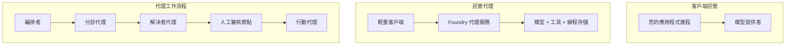
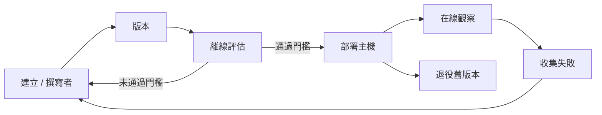
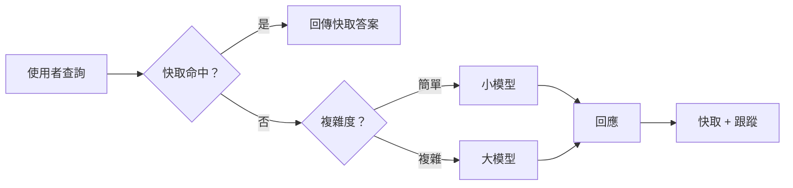
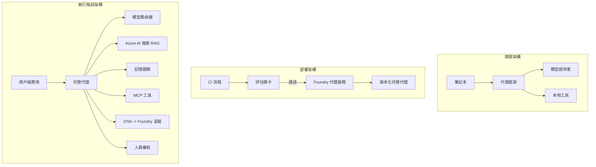

# 使用 Microsoft Foundry 部署可擴展的代理


到目前為止，您已經建立了在筆記本電腦上運行的代理，透過 `az login` 命令和一些環境變數來驅動。這正是學習的正確方式，但這並不是數千名客戶在凌晨三點依賴的代理應有的運作方式。

本課程著重於「在我的機器上有效」與「在生產環境中可靠且經濟地運作」之間的差距。我們將使用 **Microsoft Foundry** 和 **Microsoft Foundry Agent Service** 來彌合此差距，並構建具有工具、檢索、記憶、評估與監控功能的真實客戶支持代理。

## 簡介

本課程將涵蓋：

- <strong>原型代理</strong> 與 <strong>部署代理</strong> 的差異，以及為什麼轉變主要關乎模型 <em>周圍</em> 的所有其他事物。
- 代理的 <strong>部署模式</strong>：客戶端托管、服務托管（Hosted Agents）以及工作流程編排。
- Microsoft Foundry 上代理的 <strong>生命週期</strong> — 創建、版本管理、部署、評估、監視、退役。
- <strong>擴展策略</strong>：模型路由、快取、併發控制，以及無狀態設計。
- 使用 OpenTelemetry 與 Foundry 追蹤的 <strong>可觀察性</strong>。
- 透過模型選擇、路由與評估關卡實現的 <strong>成本優化</strong>。
- <strong>企業考量</strong>：治理、人為核准，以及在生產環境中安全執行 MCP 伺服器。

## 學習目標

完成本課程後，您將能夠：

- 為特定代理工作負載選擇正確的部署模式。
- 將代理部署到 Microsoft Foundry Agent Service，以實現版本控制、治理和可觀察性。
- 對代理進行追蹤工具的儀表化並串接在每次發布前執行的評估管線。
- 應用模型路由和快取，控制大規模下的延遲和成本。
- 為高風險動作新增人工核准關卡，並以生產安全方式整合 MCP 伺服器。

## 前置條件

本課程假設您已完成先前課程，並熟悉：

- 使用 [Microsoft Agent Framework](../14-microsoft-agent-framework/README.md)（第14課）構建代理。
- [工具使用](../04-tool-use/README.md)（第4課）和 [Agentic RAG](../05-agentic-rag/README.md)（第5課）。
- [代理記憶體](../13-agent-memory/README.md)（第13課）和 [Agentic 協議 / MCP](../11-agentic-protocols/README.md)（第11課）。
- [可觀察性與評估](../10-ai-agents-production/README.md)（第10課） — 本課程直接建立在此基礎上。

您還需要：

- 一個 **Azure 訂閱** 和一個擁有至少一個已部署聊天模型的 **Microsoft Foundry 專案**。
- 已驗證的 **Azure CLI** (`az login`)。
- Python 3.12+ 版本與本儲存庫 [`requirements.txt`](../../../requirements.txt) 中的套件。

## 從原型到生產：真正改變的是什麼

原型代理和生產代理共享相同的核心迴圈 — 推理、調用工具、回應。改變的是緊緊包裹在該循環外的所有事物。模型約佔生產代理的 20%；其餘 80% 是運營架構。

| 方面 | 原型 | 生產 |
| --- | --- | --- |
| <strong>托管</strong> | 在您的筆記本中運行 | 作為托管服務運行，具版本控制與逐步釋出 |
| <strong>身份識別</strong> | 您的 `az login` 令牌 | 具有範圍角色基礎存取控制的託管身份 |
| <strong>狀態</strong> | 記憶體內，重啟即失 | 外部化（線程存儲、記憶服務） |
| <strong>失敗處理</strong> | 您看到追蹤日誌 | 重試、後備方案、死信隊列、警報 |
| <strong>成本</strong> | 「只有幾分錢」 | 按請求追蹤，路由、快取與預算控制 |
| <strong>品質</strong> | 您人工查看輸出 | 每次發布前自動評估 |
| <strong>信任</strong> | 您批准每個動作 | 風險動作須政策規範及人工參與 |

請記住此表格，以下各節分別對應表中的一行。

## 代理部署模式

通常會以三種模式組合使用。

### 1. 客戶端托管代理

代理物件存在於 <em>您的</em> 應用程序進程中。您的程式碼直接呼叫模型提供者，推理迴圈在您的服務中運行。這是之前所有課程所做的方式。

- <strong>使用時機</strong>：當您需要完全控制循環、客製中介軟體，或將代理嵌入現有後端時。
- <strong>取捨</strong>：擴展性、狀態管理與韌性由您自行負責。

### 2. 托管代理（Foundry Agent Service）

代理<em>註冊為 Microsoft Foundry 中的資源</em>。Foundry 承擔推理迴圈，儲存線程，執行內容安全與角色基礎存取控制，並在 Foundry 入口網站中顯示代理。您的應用成為輕量客戶端，負責建立線程和讀取回應。

- <strong>使用時機</strong>：當您想要耐久性、內建可觀察性、治理功能以及更少的運營範圍時。
- <strong>取捨</strong>：降低底層控制權，以換取托管運行時。

### 3. 代理工作流程

多個代理（及工具）組成帶有明確控制流程的圖形 — 包含順序步驟、分支、人為核准節點，以及可暫停與恢復的耐久性檢查點。這是 Microsoft Agent Framework **Workflows** 功能在部署規模上的應用。

- <strong>使用時機</strong>：當單一任務跨多個專用代理，或中途需核准步驟時。
- <strong>取捨</strong>：更多移動元件；需更高階的編排可觀察性。



## Microsoft Foundry 上的代理生命週期

部署代理並非一次性的 `push` 操作，而是一個迴圈，很像軟體發行週期，因為事實上它就是如此。



關鍵概念，延續自 [第10課](../10-ai-agents-production/README.md)：**離線評估是關卡，不是事後考量。** 新代理版本必須通過評估門檻才能發布。線上可觀察性將實際失敗反饋回離線測試集。這就是整個迴圈。

## 擴展策略

擴展代理與擴展無狀態 Web API 不同，因為每個請求可能觸發多次昂貴的模型和工具調用。以下四種技術承載大部分負載。

**無狀態請求處理。** 不在進程記憶體中保持任何用戶狀態。將對話線程持久化在 Foundry 線程存儲或記憶服務中，以便任何實例皆能處理任何請求。這正是您能水平擴展的關鍵 — 添加實例，免除黏著會話。

**模型路由。** 並非每個請求都需要最強大（也最昂貴）的模型。將簡單請求 — 意圖分類、簡短事實回答 — 路由到小型快速模型，將大型模型保留給真正需要推理的請求。Foundry 的 **Model Router** 可自動完成，您也可自行實作輕量級分類器。在實驗中您將構建 DIY 版本。

**回應快取。** 許多客服查詢幾乎重複（「如何重設密碼？」）。快取常見問題答案，無需每次都呼叫模型。即使是適度的快取命中率，亦能顯著降低成本和延遲。

**併發控制與背壓。** 模型提供者有速率限制。限制您的併發量，使用指數退避重試，並優雅失敗（排隊回應「我們已在處理中」優於 500 錯誤）。



## 生產環境中的可觀察性

您無法操作看不到的系統。如第10課所述，Microsoft Agent Framework 原生輸出 **OpenTelemetry** 追蹤資料 — 每次模型呼叫、工具調用和編排步驟都化作 span。在生產環境中，您將這些 span 匯出到 Microsoft Foundry（或任何相容 OTel 的後端），以便：

- 追蹤單一客戶抱怨，跨越所有模型和工具調用的全過程。
- 持續監測每請求的 p50 / p95 延遲和成本走勢。
- 在使用者（或財務團隊）察覺前，針對錯誤率激增和成本異常發出警報。

```python
from agent_framework.observability import get_tracer

tracer = get_tracer()

with tracer.start_as_current_span("support_request") as span:
    span.set_attribute("customer.tier", "enterprise")
    span.set_attribute("routed.model", "gpt-5-nano")
    # 代理執行會自動在此範圍內追蹤
```

如 `customer.tier` 與 `routed.model` 等屬性，讓大量追蹤資料成為可回答的問題（「企業客戶是否過度被路由到小模型？」）。

## 成本優化

生產代理成本主要受令牌數量驅動。三個槓桿，影響依序為：

1. **選擇合適大小的模型。** 通過評估門檻的小型模型幾乎總是比通過的巨大模型更便宜。使用評估 <em>證明</em> 小模型足夠好，而非基於謹慎選擇最大模型。
2. **按複雜度路由。** 如前所述 — 只有真正需要大型模型推理的請求才付出大型模型價格。
3. **積極快取。** 最便宜的模型呼叫是您根本不需要進行的那一次。

評估關卡與成本控制是同一紀律的兩種視角：評估告訴您 <em>品質底線</em>，路由與快取讓成本儘可能接近該底線。

## 企業部署考量

**治理。** 托管代理繼承 Foundry 的角色基礎存取控制、內容安全和審計日誌。為每個代理提供具有最低權限的管理身份 — 如知識庫的唯讀訪問權限，票務 API 的範圍訪問權限，且僅限所需。

**人工參與。** 某些動作不可完全自動化 — 退費、刪除帳戶、法律團隊升級。Microsoft Agent Framework 支援 <strong>需核准</strong> 的工具：代理提出動作，執行暫停，由人工核准或拒絕，工作流程恢復。您在 [第6課](../06-building-trustworthy-agents/README.md) 見過原始用法，現在部署它。

**生產中的 MCP。** [MCP](../11-agentic-protocols/README.md) 允許您的代理通過標準介面調用外部工具。在生產中，將每個 MCP 伺服器視為不受信任的邊界：固定伺服器版本，使用範圍身份運行，驗證其輸出，絕不暴露秘密給它。MCP 伺服器是依賴項，依賴項要打補丁、審核並限制速率。



這三張圖 — 開發、部署、運行時 — 展現了代理生命中的三個階段。接下來的實驗室將引導您完成建構過程。

## 實作實驗室：生產就緒的客戶支持代理

打開 [`code_samples/16-python-agent-framework.ipynb`](./code_samples/16-python-agent-framework.ipynb) 並從頭操作一遍。您將組裝一個 **Contoso 客戶支持代理**，內建所有生產顧慮：

1. <strong>工具調用</strong> — 查詢訂單狀態及開啟支持工單。
2. **RAG** — 從知識庫回答政策問題（Azure AI Search，並帶有記憶體中回退機制，使筆記本無需 Search 資源即可運行）。
3. <strong>記憶體</strong> — 在對話回合之間記住客戶資訊。
4. <strong>模型路由</strong> — 複雜度分類器將各請求路由至小型或大型模型。
5. <strong>回應快取</strong> — 重複問題從快取回應。
6. <strong>人工核准</strong> — 超過門檻的退款需要人工簽核。
7. <strong>評估管線</strong> — 小型離線測試集評分代理並作為發布關卡。
8. <strong>可觀察性</strong> — 在每次請求周圍建立 OpenTelemetry 追蹤。

### 逐步說明

筆記本被組織成每個生產考慮點都是自包含且可執行的區段。核心是路由加快取的請求處理器：

```python
async def handle_support_request(query: str, customer_id: str) -> str:
    # 1. 盡可能從快取提供服務。
    cached = response_cache.get(normalize(query))
    if cached:
        return cached

    # 2. 根據複雜度路由以控制成本。
    model = "gpt-5-nano" if is_simple(query) else "gpt-5-mini"

    # 3. 在追蹤範圍內執行代理以利觀察性。
    with tracer.start_as_current_span("support_request") as span:
        span.set_attribute("routed.model", model)
        span.set_attribute("customer.id", customer_id)
        response = await support_agent.run(query, model=model)

    # 4. 快取並回傳。
    response_cache.set(normalize(query), response.text)
    return response.text
```

守護發布的評估關卡如下所示：

```python
async def evaluation_gate(agent, test_cases, threshold: float = 0.8) -> bool:
    passed = 0
    for case in test_cases:
        result = await agent.run(case["input"])
        if score_response(result.text, case["expected"]) >= 0.8:
            passed += 1
    pass_rate = passed / len(test_cases)
    print(f"Evaluation pass rate: {pass_rate:.0%} (gate: {threshold:.0%})")
    return pass_rate >= threshold  # 僅在閘道通過時部署
```

請詳讀每一行 — 筆記本刻意讓原始元件小巧，以免任何框架調用掩蓋邏輯。

## 使用煙霧測試驗證已部署代理

上述評估關卡是<em>離線</em>作用於代理物件。當代理以托管代理形式部署後，您還需更簡易的一項檢查：**已部署的端點是否真的能回答？**

所謂「部署成功」只證明控制平面接受了定義 — 不代表代理會回應。缺失依賴、錯誤的模型路由或已過期連線，都可能讓部署綠燈卻無任何回應。<strong>煙霧測試</strong>能在幾秒鐘內偵測出這類問題，每次部署皆執行，成本遠低於完整評估。

本儲存庫隨附基於 [AI Smoke Test](https://github.com/marketplace/actions/ai-smoke-test) GitHub Action 的即用型煙霧測試流程：

- <strong>測試集</strong> — [`tests/lesson-16-smoke-tests.json`](../../../tests/lesson-16-smoke-tests.json) 包含 Contoso 支持代理的提示和斷言（基於政策的答案、訂單查詢、保持主題相關性及多回合線程連續性）。其他課程代理的目錄與其同目錄 — 詳見 [`tests/README.md`](../tests/README.md)。
- <strong>工作流程</strong> — [`.github/workflows/smoke-test.yml`](../../../.github/workflows/smoke-test.yml) 以 Azure OIDC 登入，將每個提示 POST 至代理的 Responses 端點，任何斷言不符即使作業失敗。

```yaml
- name: Smoke-test hosted agent
  uses: JFolberth/ai-smoketest@v1
  with:
    project_endpoint: ${{ inputs.project_endpoint }}
    agent_name: ContosoSupportAgent
    tests_file: tests/lesson-16-smoke-tests.json
```


部署代理後，從 <strong>操作</strong> 標籤運行，並提供您的 Foundry 專案端點與代理名稱。聯邦身分必須在 Foundry 專案範圍內擁有 **Azure AI 使用者** 角色。把這些層次想像成金字塔：煙霧測試（是否可達且回應？）在每次部署時執行，離線評估（是否足夠好可發布？）在升級前執行，線上評估（實際運作表現如何？）則持續執行。

## 知識檢核

在進行任務前測試您的理解。

**1. 大約生產代理中「模型」占多少比例？其餘部分是什麼？**

<details>
<summary>答案</summary>

模型是系統中的少數部分 — 通常約為 20%。其餘是操作骨架：託管與版本管理、身分與 RBAC、外部化狀態、故障處理、費用追蹤、評估和人機介入控管。上線生產主要是圍繞推理迴圈<em>構建</em>所有這些。
</details>

**2. 什麼時候會選擇 Hosted Agent 而非客戶端託管代理？**

<details>
<summary>答案</summary>

當您想要有內建耐久性（持續運行可恢復的執行緒）、可觀察性、內容安全性與 RBAC 的管理型執行環境，且願意犧牲一些對推理迴圈的底層控制以降低操作面積。當需要完全控制推理迴圈或將代理嵌入既有後端時，客戶端託管較為合適。
</details>

**3. 為什麼可擴展代理必須在自己的進程記憶體中無狀態？**

<details>
<summary>答案</summary>

如此任何實例都能處理任意請求，這讓水平擴展不需使用黏著會話成為可能。每個使用者的對話狀態外部化存放於執行緒儲存或記憶體服務中。若狀態保存在進程記憶體，重啟後會遺失，且無法自由分散負載。
</details>

**4. 模型路由解決了什麼問題？它與評估有何關係？**

<details>
<summary>答案</summary>

路由會將簡單請求導向小型、廉價且快速的模型，並保留大型模型用於真正的推理，從而控管延遲與成本。它和評估的關係在於，評估<em>證明</em>小模型對某類請求足夠良好 — 未評估的路由僅是猜測。
</details>

**5. 什麼是「評估閘門」，它在生命週期中位於哪裡？**

<details>
<summary>答案</summary>

評估閘門會對新代理版本運行離線測試集，除非通過率達門檻，否則阻止部署。它位於生命週期的「版本」與「部署」之間，使品質成為發布的先決條件，而非事後檢查。
</details>

**6. 為什麼在生產中 MCP 伺服器應被視為不受信任的邊界？**

<details>
<summary>答案</summary>

因為它是代理所調用的外部依賴。您應該固定版本、以限縮身分執行、驗證其輸出、限制速率，並且絕不洩露祕密給它 — 這是對待任何第三方依賴的相同紀律。其輸出流入代理推理，未驗證的信任是安全風險。
</details>

**7. 哪種單一變更通常對生產代理成本影響最大？為何？**

<details>
<summary>答案</summary>

正確挑選模型大小 — 使用在您的評估閘門仍能通過的最小模型。成本主要來自 token，符合品質標準的較小模型幾乎總是比更大的便宜。快取與路由可進一步降低成本，但選擇合適的基底模型有最大的一階影響。
</details>

**8. span 屬性如 `customer.tier` 和 `routed.model` 在可觀察性上扮演什麼角色？**

<details>
<summary>答案</summary>

它們將原始追蹤轉化成可回答的商業問題。沒有屬性時只有一堆 span；有了屬性，您可以詢問「企業客戶是否過度被導向小模型？」或「哪個模型處理我們最慢的請求？」屬性是依照對您的營運重要的維度切分遙測資料的方式。
</details>

## 任務

以實驗室中的客服代理為基礎，並針對特定情境強化：**一家 SaaS 公司的訂閱帳單客服代理。**

您的提交應包含：

1. <strong>替換工具</strong>為與帳單相關的工具：`get_subscription_status`、`get_invoice`，和 `issue_credit`（超過 50 美元的信用需人工批准）。
2. **新增三份 RAG 文件**，涵蓋公司退費政策、帳單週期及取消政策。
3. <strong>擴充評估集</strong>至至少八個案例，其中至少兩個<em>應該</em>觸發人工批准路徑，並確認評估閘門正確通過或拒絕。
4. <strong>新增一個成本報告</strong>：在代理執行十個混合查詢後，列印多少走小模型，多少走大模型，以及多少從快取命中。

撰寫一段簡短說明（以 markdown 格式），解釋您選擇了哪個模型路由規則，以及如何用實際流量驗證它。沒有唯一正確答案 — 評估重點在於您是否能合理連結生產考量。

## 摘要

本課您使用 Microsoft Foundry 將代理從原型推向生產：

- 進入生產主要是圍繞模型的<strong>操作骨架</strong>—託管、身分、狀態、故障處理、費用、品質與信任。
- 您學會了三種<strong>部署模式</strong>—客戶端託管、Hosted Agents 與 Agent Workflows—以及它們適用時機。
- 您了解了<strong>代理生命週期</strong>，其中離線<strong>評估作為釋出閘門</strong>，線上可觀察性將故障回饋至測試集。
- 您運用<strong>擴展策略</strong>—無狀態設計、模型路由、快取與有限併發—並將其連結至<strong>成本優化</strong>。
- 您整合了<strong>企業控管</strong>：RBAC、人機介入審核與生產安全的 MCP 整合。
- 您構建了<strong>生產準備的客服代理</strong>，將所有考量以可執行程式碼串接在一起。

下一課將走相反路線：您將把代理<em>下放</em>到單一開發者機器，並完全本地運行。

## 參考資源

- <a href="https://learn.microsoft.com/azure/ai-foundry/what-is-azure-ai-foundry" target="_blank">Microsoft Foundry 文件</a>
- <a href="https://learn.microsoft.com/azure/ai-foundry/agents/overview" target="_blank">Microsoft Foundry 代理服務概述</a>
- <a href="https://learn.microsoft.com/en-us/agent-framework/overview/?wt.mc_id=youtube_26688_organicsocial_reactor&pivots=programming-language-python" target="_blank">Microsoft 代理框架</a>
- <a href="https://learn.microsoft.com/azure/ai-foundry/concepts/model-router" target="_blank">Microsoft Foundry 中的模型路由器</a>
- <a href="https://learn.microsoft.com/azure/search/search-what-is-azure-search" target="_blank">Azure AI 搜尋</a>
- <a href="https://opentelemetry.io/" target="_blank">OpenTelemetry</a>
- <a href="https://github.com/marketplace/actions/ai-smoke-test" target="_blank">AI 煙霧測試 GitHub Action</a>
- <a href="https://modelcontextprotocol.io/" target="_blank">模型上下文協定 (MCP)</a>

## 前一課

[建構電腦使用代理 (CUA)](../15-browser-use/README.md)

## 下一課

[建立本地 AI 代理](../17-creating-local-ai-agents/README.md)

---

<!-- CO-OP TRANSLATOR DISCLAIMER START -->
**免責聲明**：
此文件已使用 AI 翻譯服務 [Co-op Translator](https://github.com/Azure/co-op-translator) 進行翻譯。雖然我們努力追求準確性，但請注意自動翻譯可能包含錯誤或不準確之處。原始文件的母語版本應視為權威來源。對於關鍵資訊，建議採用專業人工翻譯。我們不對因使用此翻譯所產生的任何誤解或誤譯承擔責任。
<!-- CO-OP TRANSLATOR DISCLAIMER END -->