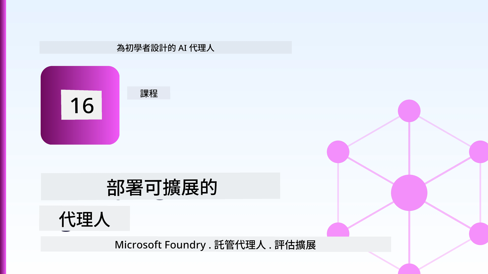
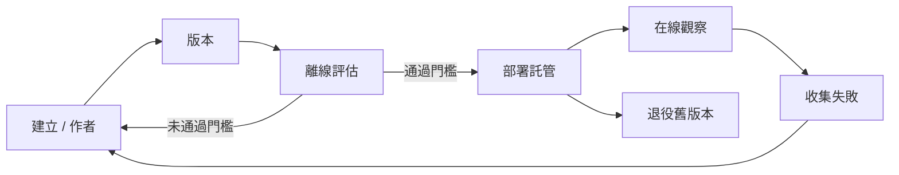
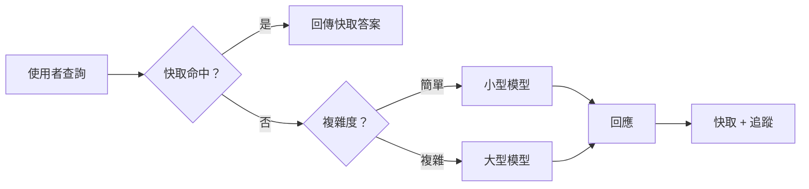
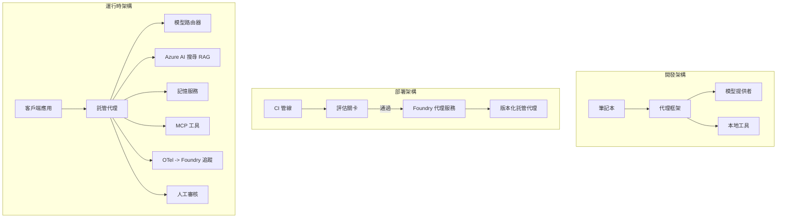

# 使用 Microsoft Foundry 部署可擴展的代理



到目前為止，你在課程中已經建立了可在筆記型電腦上運行的代理，透過 `az login` 和少量環境變數驅動。這正是學習的正確方法。但並非適合在凌晨三點時為成千上萬用戶提供服務的代理運行方式。

本課程關注「我的機器上能運行」與「在生產環境中可靠且經濟地運行」之間的差距。我們使用 **Microsoft Foundry** 及 **Microsoft Foundry Agent Service** 來彌補這個差距，並構建一個具備工具、檢索、記憶、評估與監控的真實客戶支援代理。

## 簡介

本課程將涵蓋：

- <strong>原型代理</strong>與<strong>部署代理</strong>之間的差異，以及為何轉換主要涉及模型<em>之外</em>的所有周邊因素。
- 代理的<strong>部署模式</strong>：客戶端托管、服務托管（托管代理），以及工作流程編排。
- Microsoft Foundry 中的<strong>代理生命週期</strong> — 建立、版本控制、部署、評估、觀察、退役。
- <strong>擴展策略</strong>：模型路由、快取、併發和無狀態設計。
- 使用 OpenTelemetry 和 Foundry 追蹤的<strong>可觀察性</strong>。
- 透過模型選擇、路由和評估門檻的<strong>成本優化</strong>。
- <strong>企業考量</strong>：治理、人為審核，以及於生產環境中安全運行 MCP 伺服器。

## 學習目標

完成本課後，您將會瞭解如何：

- 為特定代理工作負載選擇合適的部署模式。
- 將代理部署到 Microsoft Foundry Agent Service，使其具備版本控制、治理與可觀察性。
- 為代理加裝追蹤功能，並串接在每次釋出前執行的評估管線。
- 應用模型路由和快取，以在大規模下控制延遲和成本。
- 為高風險行為增加人工審核門檻，並以生產安全的方式整合 MCP 伺服器。

## 先決條件

本課程假設您已完成先前課程，並熟悉：

- 使用 [Microsoft Agent Framework](../14-microsoft-agent-framework/README.md) 建構代理（第14課）。
- [工具使用](../04-tool-use/README.md)（第4課）和 [Agentic RAG](../05-agentic-rag/README.md)（第5課）。
- [代理記憶](../13-agent-memory/README.md)（第13課）和 [Agentic Protocols / MCP](../11-agentic-protocols/README.md)（第11課）。
- [可觀察性與評估](../10-ai-agents-production/README.md)（第10課）— 本課即是基於此建立。

您還將需要：

- 一個 **Azure 訂閱** 和一個至少部署了一個聊天模型的 **Microsoft Foundry 專案**。
- 已透過 `az login` 認證的 **Azure CLI**。
- Python 3.12+ 及本倉庫中 [`requirements.txt`](../../../requirements.txt) 的套件。

## 從原型到生產：真正的改變

原型代理和生產代理共用相同的核心迴圈 — 推理、呼叫工具、回應。改變的是包裹該迴圈的周邊環節。模型約佔生產代理的20%；其餘80%是運營骨架。

| 事項 | 原型 | 生產 |
| --- | --- | --- |
| <strong>主機環境</strong> | 運行於你的筆記本中 | 作為托管服務運行、版本控制和部署 |
| <strong>身份</strong> | 你的 `az login` 令牌 | 受權限範圍限制的管理身份 |
| <strong>狀態</strong> | 記憶體中，重啟即消失 | 外部化（線程存儲、記憶體服務） |
| <strong>故障</strong> | 你看到錯誤追蹤 | 重試、降級、死信、警報 |
| <strong>成本</strong> | 「幾分錢而已」 | 逐請求追蹤，路由，快取和預算控制 |
| <strong>質量</strong> | 你肉眼檢視輸出 | 每次釋出前自動評估 |
| <strong>信任</strong> | 你批准每一行動 | 政策＋人為介入高風險行為 |

請記住這張表。以下每個章節對應其中一行。

## 代理部署模式

有三種模式，常常會結合使用。

### 1. 客戶端托管代理

代理物件運作在<em>你的</em>應用程序進程中，你的程式碼直接呼叫模型供應者；推理迴圈也在你服務裡執行。這是先前所有課程都在做的。

- <strong>使用時機</strong>：當你需要完全控制迴圈、自訂中介軟體，或把代理內嵌在現有後端時。
- <strong>權衡</strong>：擴展性、狀態和韌性由你自行管理。

### 2. 托管代理（Foundry Agent Service）

代理在 Microsoft Foundry 中<em>被註冊成資源</em>。Foundry 托管推理迴圈、儲存對話線程、實施內容安全與 RBAC，並讓代理在 Foundry 入口網站可見。你的應用變成輕量客戶端，負責建立線程和讀取回應。

- <strong>使用時機</strong>：當你需要耐久性、內建可觀察性、治理和較小營運負擔。
- <strong>權衡</strong>：以管理運行時換取較少底層控制。

### 3. 代理工作流程

多個代理（和工具）組合成帶有明確控制流的圖：串接步驟、分支、人為審核節點，以及可暫停並恢復的耐久檢查點。這是 Microsoft Agent Framework <strong>工作流程</strong> 功能於部署規模上的應用。

- <strong>使用時機</strong>：單一任務跨多個專業代理，或中間需要審核步驟時。
- <strong>權衡</strong>：多個移動組件；需要編排層級的可觀察性。


## Microsoft Foundry 上的代理生命週期

部署代理不是一次性 `push`，而是一個迴圈，很像軟體釋出週期，因為它本質上就是。



來自 [第10課](../10-ai-agents-production/README.md) 的核心概念：**離線評估是一道門檻，非附帶考量。** 新代理版本未通過評估門檻就不會發佈。線上可觀察性則將真實世界的失敗反饋回離線測試集。這就是整個迴圈。

## 擴展策略

擴展代理不同於擴展無狀態的網頁 API，因為每個請求可能觸發多個高成本的模型和工具呼叫。下列四種技術負擔大部分工作。

**無狀態請求處理。** 不在進程記憶體中保留每個用戶狀態。將對話線程持久化至 Foundry 線程存儲或記憶體服務，使任何實例都能處理任何請求。這讓你可以水平擴展 — 新增實例無需黏性會話。

**模型路由。** 並非每個請求都需最高效能（也是最昂貴）的模型。將簡單請求 — 意圖分類、簡短事實回答 — 路由到小型快速模型，複雜推理再用大型模型。Foundry 的 **Model Router** 可輔助，或你也能自己實作輕量分類器。你會在實驗中打造自製版。

**回應快取。** 許多支援查詢近乎重複（「我如何重設密碼？」）。快取常見問題回答，直接回應而不需觸發模型。即使是適度的快取命中率，也能顯著降低成本與延遲。

**併發與背壓。** 模型供應者有速率限制。限制併發度，採用指數退避重試，並優雅失敗（排隊中顯示「我們正在處理」的回應比直接出現 500 錯誤好）。



## 生產環境的可觀察性

你無法管理看不到的事物。如第10課所述，Microsoft Agent Framework 本身會發出 **OpenTelemetry** 追蹤 — 每次模型呼叫、工具調用和編排步驟都成為 span。在生產中，將 span 匯出到 Microsoft Foundry（或任何 OTel 相容後端），以便：

- 端對端追蹤單一客戶投訴，涵蓋所有模型與工具呼叫。
- 觀察每請求的 p50/p95 延遲與成本走勢。
- 在用戶（或財務團隊）察覺前，對錯誤率激增和成本異常發出警報。

```python
from agent_framework.observability import get_tracer

tracer = get_tracer()

with tracer.start_as_current_span("support_request") as span:
    span.set_attribute("customer.tier", "enterprise")
    span.set_attribute("routed.model", "gpt-5-nano")
    # 代理執行會在此區間內自動被追蹤
```

像 `customer.tier` 和 `routed.model` 屬性會將龐大追蹤紀錄轉換成可回答的問題（「企業客戶是否過度路由到小模型？」）。

## 成本優化

生產代理的成本多由代幣量主導。下面三個槓桿，影響力由大到小：

1. **對大小模型做適當選擇。** 通過你評估門檻的小模型幾乎總比通過同門檻的大模型便宜。用評估來<em>證明</em>小模型足夠好，不要僅憑謹慎選最大模型。
2. **依複雜度路由。** 同上 — 僅使需要大模型推理的請求支付大模型成本。
3. **積極快取。** 最便宜的模型呼叫是你從未發出過的那次。

評估門檻和成本控制是同一門學問的兩個面向：評估確定<em>品質底線</em>，路由和快取維持成本接近該底線。

## 企業部署考量

**治理。** 托管代理繼承 Foundry 的 RBAC、內容安全及審核日誌。為每個代理提供具最小權限的管理身份 — 只能讀知識庫、限定範圍存取工單 API，絕無更多。

**人為介入。** 部分操作後果重大，無法完全自動化 — 退款、刪帳戶、升級法律團隊。Microsoft Agent Framework 支援<strong>需審核</strong>的工具：代理提議操作，執行暫停，人工審核通過或駁回，工作流程繼續執行。你在[第6課](../06-building-trustworthy-agents/README.md)已見過原型；此處部署實戰。

**生產環境中的 MCP。** [MCP](../11-agentic-protocols/README.md) 讓代理透過標準介面使用外部工具。在生產中，視每個 MCP 伺服器為不受信界限：固定伺服器版本，以範圍身份執行，驗證其輸出，永不洩露機密給它。MCP 伺服器是依賴項，而依賴會被修補、審核和限流。



這三個圖 — 開發、部署、運行時 — 是同一個代理生命週期的三個階段。接下來的實驗將引導你搭建它。

## 實作實驗：一個生產就緒的客戶支援代理

開啟 [`code_samples/16-python-agent-framework.ipynb`](./code_samples/16-python-agent-framework.ipynb) ，從頭到尾完成這份筆記本。你將組裝一個 **Contoso 客戶支援代理**，深度整合所有生產考量：

1. <strong>工具呼叫</strong> — 查詢訂單狀態並開啟支援工單。
2. **RAG** — 從知識庫回答政策問題（Azure AI Search，搭配記憶體備用，筆記本無需 Search 資源即可運行）。
3. <strong>記憶</strong> — 記住對話中客戶的上下文。
4. <strong>模型路由</strong> — 複雜度分類器將每個請求路由到小型或大型模型。
5. <strong>回應快取</strong> — 重複問題直接從快取返回。
6. <strong>人工審核</strong> — 超過門檻的退款需人工簽核。
7. <strong>評估管線</strong> — 小型離線測試集對代理打分，作為發佈門檻。
8. <strong>可觀察性</strong> — 圍繞每個請求的 OpenTelemetry 追蹤。

### 實作導覽

筆記本組織為每個生產考量一個自給自足、可執行的章節。核心是路由加快取的請求處理器：

```python
async def handle_support_request(query: str, customer_id: str) -> str:
    # 1. 盡可能從快取中提供服務。
    cached = response_cache.get(normalize(query))
    if cached:
        return cached

    # 2. 根據複雜度進行路由以控制成本。
    model = "gpt-5-nano" if is_simple(query) else "gpt-5-mini"

    # 3. 在追蹤區間內執行代理以便觀察。
    with tracer.start_as_current_span("support_request") as span:
        span.set_attribute("routed.model", model)
        span.set_attribute("customer.id", customer_id)
        response = await support_agent.run(query, model=model)

    # 4. 快取並回傳。
    response_cache.set(normalize(query), response.text)
    return response.text
```

守護發佈的評估門檻如下所示：

```python
async def evaluation_gate(agent, test_cases, threshold: float = 0.8) -> bool:
    passed = 0
    for case in test_cases:
        result = await agent.run(case["input"])
        if score_response(result.text, case["expected"]) >= 0.8:
            passed += 1
    pass_rate = passed / len(test_cases)
    print(f"Evaluation pass rate: {pass_rate:.0%} (gate: {threshold:.0%})")
    return pass_rate >= threshold  # 僅當閘門通過時部署
```

詳細閱讀每一行 — 筆記本刻意將原語寫得很小，以避免隱藏在框架調用背後。

## 以煙霧測試驗證已部署代理

上述評估門檻是<em>離線</em>直接作用於代理物件。當代理部署為托管代理後，你還需要一個更廉價的檢查點：**部署後的端點是否真的在回應？**

「成功部署」只證明控制平面接收了定義，但不保證代理有回應。遺失依賴、模型路由錯誤、連線逾期都可能導致綠色部署沒有回應。<strong>煙霧測試</strong>可在數秒內抓出這些問題，每次部署必執行，成本遠低於完整評估。

本倉庫提供建構在 [AI Smoke Test](https://github.com/marketplace/actions/ai-smoke-test) GitHub Action 上的即用型煙霧測試管線：

- <strong>目錄</strong> — [`tests/lesson-16-smoke-tests.json`](../../../tests/lesson-16-smoke-tests.json) 包含 Contoso 支援代理的提示和斷言（具依據的政策答案、訂單查詢、保持主題以及多回合對話連貫性）。其他課程代理的目錄與其並列 — 參見 [`tests/README.md`](../tests/README.md)。
- <strong>工作流程</strong> — [`.github/workflows/smoke-test.yml`](../../../.github/workflows/smoke-test.yml) 使用 Azure OIDC 登入，並將每條提示 POST 至代理的 Responses 端點，對任何斷言失敗報錯。

```yaml
- name: Smoke-test hosted agent
  uses: JFolberth/ai-smoketest@v1
  with:
    project_endpoint: ${{ inputs.project_endpoint }}
    agent_name: ContosoSupportAgent
    tests_file: tests/lesson-16-smoke-tests.json
```


部署代理後，從 **Actions** 索引標籤執行它，並提供您的 Foundry 專案端點與代理名稱。聯邦身份在 Foundry 專案範圍內需具備 **Azure AI User** 角色。將這些層級想像成金字塔：每次部署都會運行煙霧測試（能否達到且有回應？），晉升前會執行離線評估（品質是否足夠？），而線上評估（在實際環境中的表現如何？）則是持續進行的。

## 知識測驗

在進行作業前先測試您的理解。

**1. 大約生產代理中「模型」占多少比例，其餘的是什麼？**

<details>
<summary>回答</summary>

模型是系統的少數部分 — 通常約佔 20%。其餘是運營骨架：託管與版本管理、身份與 RBAC、外部狀態、錯誤處理、成本追蹤、評估與人員介入控制。投入生產主要是建構在 <em>推理迴圈周圍</em> 的一切。
</details>

**2. 何時會選擇 Hosted Agent 而非客戶端託管代理？**

<details>
<summary>回答</summary>

當您想要托管有內建耐久性（可持續且可恢復的執行緒）、可觀測性、內容安全與 RBAC 的管理運行時，且願意以較少的推理迴圈低階控制換取較低的運營面積時。當需要完全掌控迴圈或在已有後端內嵌代理時，客戶端託管較為理想。
</details>

**3. 為何可擴展代理在自身進程記憶體中必須是無狀態的？**

<details>
<summary>回答</summary>

這樣每個實例才能處理任何請求，允許水平擴展且無需黏性會話。每用戶對話狀態外部化於執行緒存儲或記憶體服務中。如果狀態存在進程記憶體中，重啟時會遺失，且無法自由分配負載。
</details>

**4. 模型路由解決什麼問題，並與評估有何關聯？**

<details>
<summary>回答</summary>

路由將簡單請求導向小型、便宜且快速模型，將大型模型留給真正的推理，控制延遲與成本。與評估相關是因為評估是 <em>證明</em> 小模型對一類請求足夠的依據 — 路由沒評估就等於是猜測。
</details>

**5. 什麼是「評估閘門」，它在生命週期中位於哪裡？**

<details>
<summary>回答</summary>

評估閘門對新代理版本執行離線測試集，除非通過率超過門檻，否則阻擋部署。它位於「版本」與「部署」間，讓品質成為發佈前提，而非事後檢查。
</details>

**6. 為何 MCP 伺服器在生產環境中應視為不受信任邊界？**

<details>
<summary>回答</summary>

因為它是代理呼叫的外部依賴。您應鎖定版本、用範圍身份執行、驗證輸出、限制流量，且絕不對其暴露祕密 — 這與任何第三方依賴需遵守的紀律相同。其輸出流入代理推理，未驗證的信任即為安全風險。
</details>

**7. 哪項單一調整通常對生產代理成本影響最大，為什麼？**

<details>
<summary>回答</summary>

對模型尺寸調整 — 使用最小且仍通過評估閘門的模型。成本主要由標記數決定，且達到品質標準的小模型幾乎總是比大型模型便宜。緩存與路由可進一步降低成本，但選擇合適基模型是最直接的影響因素。
</details>

**8. 像 `customer.tier` 和 `routed.model` 這類跨度屬性在觀測性中扮演什麼角色？**

<details>
<summary>回答</summary>

它們將原始追蹤轉化成可回答的業務問題。沒有屬性，您只有一堆跨度；有了它們，您可以問「企業客戶是否太常被路由到小模型？」或「哪個模型處理了我們最慢的請求？」屬性是根據重要維度切割遙測資料的方法。
</details>

## 作業

以實驗室的客戶支援代理為基礎，針對以下特定場景加強：**SaaS 公司的訂閱帳單支援代理。**

您的提交應包含：

1. <strong>將工具更換為與帳單相關的工具</strong>：`get_subscription_status`、`get_invoice` 和 `issue_credit`（超過 50 美元的信用需要人工批准）。
2. **新增三份 RAG 文件**，涵蓋公司退款政策、帳單週期與取消政策。
3. <strong>擴充評估集</strong> 至至少八個案例，其中至少兩個 <em>應該</em> 觸發人工審核路徑，並確認評估閘門正確通過或失敗。
4. <strong>新增一份成本報告</strong>：運行十筆混合查詢後，列印多少請求送往小模型、多少送往大模型，以及多少來自快取。

請用一段簡短文字（Markdown 儲存格中）說明您選擇的模型路由規則與如何用實際流量驗證它。此無唯一正確答案 — 評分重點在於您是否將生產關切整合得具邏輯性。

## 小結

本課程中您學會了如何將代理從原型推向 Microsoft Foundry 生產：

- 生產跳躍主要是關於模型周圍的<strong>運營骨架</strong> — 託管、身份、狀態、錯誤處理、成本、質量與信任。
- 您學習了三種<strong>部署模式</strong> — 客戶端託管、Hosted Agents 及代理工作流程 — 以及它們的適用時機。
- 您走過了<strong>代理生命週期</strong>，其中離線<strong>評估為發佈閘門</strong>，線上可觀測性將故障反饋至測試集。
- 您應用了<strong>擴展策略</strong> — 無狀態設計、模型路由、快取和有限並發 — 並將其與<strong>成本最佳化</strong>掛鉤。
- 您串接了<strong>企業控制</strong>：RBAC、人工介入審核與符合生產安全的 MCP 整合。
- 您建構了<strong>可投入生產的客戶支援代理</strong>，使所有關切點整合於可執行程式碼中。

下一課將走反方向的旅程：非將代理擴展上雲，而是將它們<em>下放</em>到單一開發者機器，完全在本地執行。

## 參考資源

- <a href="https://learn.microsoft.com/azure/ai-foundry/what-is-azure-ai-foundry" target="_blank">Microsoft Foundry 文件</a>
- <a href="https://learn.microsoft.com/azure/ai-foundry/agents/overview" target="_blank">Microsoft Foundry 代理服務概述</a>
- <a href="https://learn.microsoft.com/en-us/agent-framework/overview/?wt.mc_id=youtube_26688_organicsocial_reactor&pivots=programming-language-python" target="_blank">Microsoft Agent Framework</a>
- <a href="https://learn.microsoft.com/azure/ai-foundry/concepts/model-router" target="_blank">Microsoft Foundry 中的模型路由器</a>
- <a href="https://learn.microsoft.com/azure/search/search-what-is-azure-search" target="_blank">Azure AI Search</a>
- <a href="https://opentelemetry.io/" target="_blank">OpenTelemetry</a>
- <a href="https://github.com/marketplace/actions/ai-smoke-test" target="_blank">AI Smoke Test GitHub Action</a>
- <a href="https://modelcontextprotocol.io/" target="_blank">Model Context Protocol (MCP)</a>

## 前一課

[建立電腦使用代理 (CUA)](../15-browser-use/README.md)

## 下一課

[建立本地 AI 代理](../17-creating-local-ai-agents/README.md)

---

<!-- CO-OP TRANSLATOR DISCLAIMER START -->
**免責聲明**：
此文件已使用 AI 翻譯服務 [Co-op Translator](https://github.com/Azure/co-op-translator) 進行翻譯。雖然我們努力追求準確性，但請注意自動翻譯可能包含錯誤或不準確之處。原始文件的母語版本應視為權威來源。對於關鍵資訊，建議採用專業人工翻譯。我們不對因使用此翻譯所產生的任何誤解或誤譯承擔責任。
<!-- CO-OP TRANSLATOR DISCLAIMER END -->