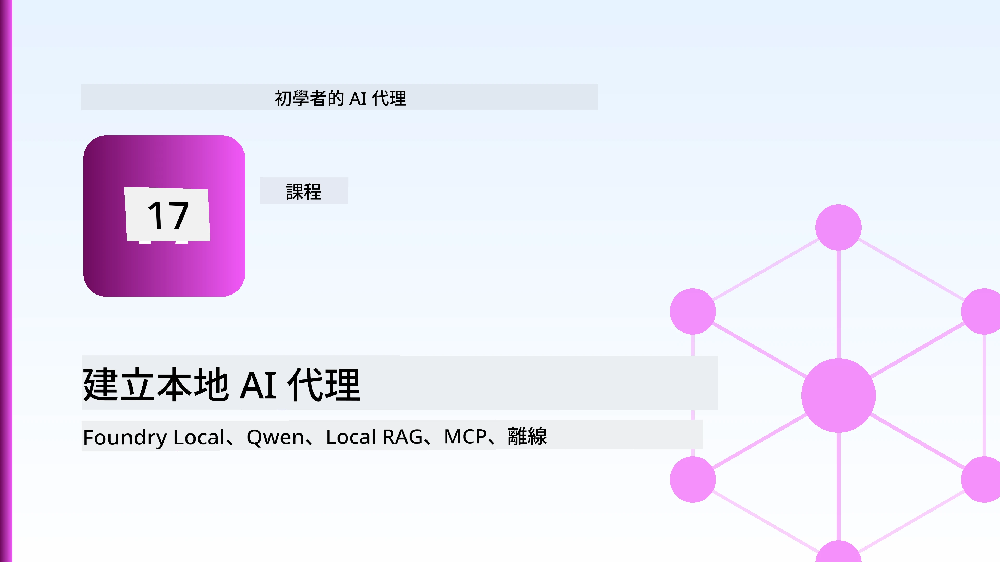
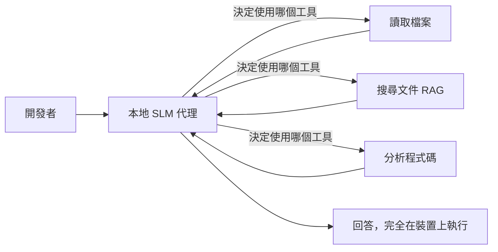
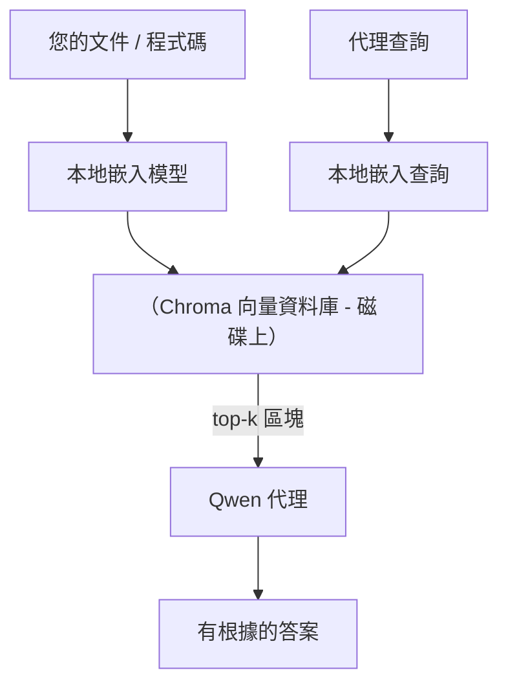
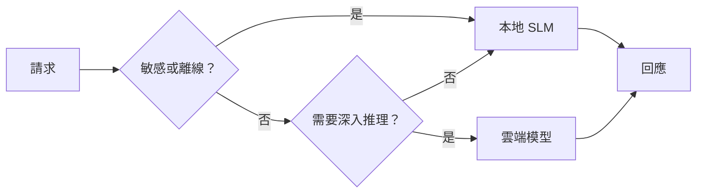

# 使用 Microsoft Foundry Local 和 Qwen 創建本地 AI 代理



前一課將代理擴展到雲端。本課則是將其縮小至單一機器。課程結束時，你將擁有一個能夠推理、呼叫工具、閱讀文件並搜尋文件資料的工程助理 —— **一點雲端推理呼叫都沒有。**

為什麼你會想這麼做？實際工程工作中經常出現的三個原因：

- **隱私。** 程式碼和文件從不離開機器。沒有提示、沒有片段、沒有客戶資料會穿越網路邊界。
- **成本。** 本地推理沒有按代幣計費。你可以整天迭代，成本僅是電費。
- **離線。** 在飛機上、在安全設施內或斷網期間，代理依然運作。

折衷是你將前沿雲端模型換成在 CPU、GPU 或 NPU 上運行的 **小型語言模型（SLM）**。本課重點是建構在此限制下 <em>優良</em> 的代理，而非假裝限制不存在。

## 介紹

本課將涵蓋：

- **小型語言模型（SLMs）** — 它們是什麼、適合做什麼、不適合做什麼。
- **Microsoft Foundry Local** — 一個在裝置上下載並提供模型的執行時環境，透過 **OpenAI 兼容 API**。
- **Qwen 函數呼叫模型** — 可靠產生工具呼叫的 SLM，讓本地 <em>代理</em>（不僅是本地聊天）成為可能。
- **本地工具、本地 RAG 與本地 MCP** — 為代理提供無需雲端的能力。
- <strong>混合模式</strong> — 何時保留本地，何時呼叫雲端。

## 學習目標

完成本課後，你將知道如何：

- 解釋 SLM 的取捨並挑選合適的本地代理使用案例。
- 使用 Foundry Local 在本地部署 Qwen 模型，並透過 OpenAI 兼容端點連接。
- 構建完整在工作站運行的工具呼叫代理。
- 使用本地向量資料庫（Chroma）建立基於自己文件的本地 RAG。
- 將代理連接至本地 MCP 伺服器，並對混合本地/雲端設計進行推理。

## 先決條件

本課假設你已完成前面的課程並熟悉：

- [工具使用](../04-tool-use/README.md)（第4課）與 [Agentic RAG](../05-agentic-rag/README.md)（第5課）。
- [Agentic 協定 / MCP](../11-agentic-protocols/README.md)（第11課）。
- [Microsoft 代理框架](../14-microsoft-agent-framework/README.md)（第14課）。

你還需要：

- 一台開發工作站。**8GB 記憶體是合理的最低標準**；16GB 以上較舒適。有 GPU 或 NPU 有助益，但非必需。
- 安裝好 **Microsoft Foundry Local**（見下方設定部分）。
- Python 3.12+ 及本倉庫 [`requirements.txt`](../../../requirements.txt) 所列套件，另外本課需要 `foundry-local-sdk`、`openai` 與 `chromadb`。

## 小型語言模型：本地工作的合適工具

前沿雲端模型有數千億參數，且背後有資料中心支持。SLM 只有幾十億參數，並且必須放入你筆電的記憶體。這差異設定了明確的期望。

**SLM 擅長：**

- 有結構、有界限的任務 — 分類、萃取、匯總已知文件。
- <strong>工具呼叫</strong> — 決定呼叫哪個函數及其參數。
- 針對自己資料快速、便宜、私密的迭代。

**SLM 較弱項：**

- 開放式的、多階推理涵蓋大量上下文。
- 廣泛的世界知識（見過的少，忘得快）。

因此，本地代理的贏家策略是：**讓 SLM 負責協調，讓工具負責繁重工作。** 模型不需要 <em>知道</em> 你的程式碼庫，它需要知道何時呼叫 `read_file` 和 `search_docs`。這正符合 SLM 的強項。



## Microsoft Foundry Local

**Microsoft Foundry Local** 是輕量級執行時，在你的機器上下載、管理並提供模型。最重要的是它暴露了 **OpenAI 兼容的 HTTP 端點** — 意味著 OpenAI SDK 和 Microsoft 代理框架的 OpenAI 用戶端只需更改 `base_url` 即可使用。你學到的一切代理建構知識直接適用，只是端點從雲端換到 `localhost`。

Foundry Local 也會自動為你的硬體選擇最優版本 — CPU 版本、CUDA/GPU 版本或 NPU 版本 — 無需你針對每台機器手動優化。

### 設定

安裝 Foundry Local（見你的作業系統對應的[文件](https://learn.microsoft.com/azure/ai-foundry/foundry-local/)），然後確認服務運作：

```bash
# 安裝（範例；請依照您的平台文件操作）
winget install Microsoft.FoundryLocal      # Windows 作業系統
# brew install microsoft/foundrylocal/foundrylocal   # macOS 系統

# 下載並執行 Qwen 模型，然後啟動本地服務
foundry model run qwen2.5-7b-instruct
foundry service status
```

服務啟動後會得到本地 OpenAI 兼容端點（通常是 `http://localhost:PORT/v1`）。筆記本使用 `foundry-local-sdk` 自動發現端點，無需硬編碼端口。

## Qwen 函數呼叫：為何重要

代理若要成為代理，必須能呼叫工具。很多 SLM 可以聊天但產生不可靠、格式錯誤的工具呼叫。**Qwen** 模型經過函數呼叫訓練，能穩定輸出格式良好的工具呼叫結構 — 這正是將本地聊天模型變成本地 <em>代理</em> 的關鍵。

流程是你已知的標準工具呼叫循環，只是在裝置上執行：


## 本地 RAG

文件搜尋是本地代理發揮價值的地方。不是靠 SLM 記住你的框架文件，而是將文件嵌入成 <strong>本地向量資料庫</strong>，讓代理按需檢索相關片段。

我們用 **Chroma**，這是可嵌入的向量庫，直接在進程中運行無需伺服器管理。全流程完全本地：本地嵌入模型 → 本地向量 → 本地檢索 → 本地 SLM。



這是第5課的 Agentic RAG 模式 —— 唯一差別是每個組件都跑在你的機器上。

## 本地 MCP 伺服器

[MCP](../11-agentic-protocols/README.md) 是一種傳輸協定，不是雲端服務。MCP 伺服器能以本地 stdio 進程運行，透過標準協定向代理暴露工具。這讓你能完全離線重用日益豐富的 MCP 伺服器生態系統 — 文件系統訪問、git 操作、資料庫查詢等。

安全姿態與雲端不同但不缺失：本地 MCP 伺服器執行於你的用戶權限下，因此要限制其操作範圍（如專案目錄，而非整個主目錄），並將它的輸出視為輸入來驗證。

## 混合雲端與本地模式

以本地優先不代表只能本地。成熟系統依據敏感度與難度進行路由：

| 狀況 | 位置 |
| --- | --- |
| 敏感程式碼／資料，或離線情況 | **本地 SLM** |
| 簡單、有界任務 | **本地 SLM**（低成本，快速） |
| 非敏感資料的複雜多跳推理 | <strong>雲端模型</strong> |
| 斷網期間的所有任務 | **本地 SLM**（漸進降級） |

這呼應第16課的 <strong>模型路由</strong> 思路 —— 區別是「模型」之一現在是你自己的機器。健壯設計在雲端不可用時退回本地，使代理品質退化而不是完全失效。



## 實作實驗：本地工程助理

打開 [`code_samples/17-local-agent-foundry-local.ipynb`](./code_samples/17-local-agent-foundry-local.ipynb) 並實作。你將建構一個<strong>完全在工作站運行的本地工程助理</strong>，能：

1. <strong>呼叫工具</strong> — 透過 Foundry Local 的 Qwen 函數呼叫。
2. <strong>執行本地文件操作</strong> — 列出並讀取專案目錄的文件。
3. <strong>分析程式碼</strong> — 報告源文件的基本指標。
4. <strong>搜尋文件</strong> — 基於 Chroma 的文件資料夾本地 RAG。
5. **使用 MCP** — 連接本地 MCP 伺服器（若沒配置則優雅跳過）。

期間完全不使用雲端推理。

### 演練

助理透過 OpenAI 兼容端點連接 Foundry Local，因此代理程式碼幾乎與雲端課程相同 —— 僅用戶端有所變動：

```python
from foundry_local import FoundryLocalManager
from openai import OpenAI

# Foundry Local 會發現/下載模型並提供本地端點。
manager = FoundryLocalManager(\"qwen2.5-7b-instruct\")
client = OpenAI(base_url=manager.endpoint, api_key=manager.api_key)  # api_key 是本地的佔位符
```

工具是普通 Python 函式，限定於某個專案目錄：

```python
def read_file(path: str) -> str:
    \"\"\"Read a file, but only inside the sandboxed project directory.\"\"\"
    full = (PROJECT_ROOT / path).resolve()
    if PROJECT_ROOT not in full.parents and full != PROJECT_ROOT:
        return \"Access denied: path is outside the project directory.\"
    return full.read_text(encoding=\"utf-8\")
```

注意沙盒檢查 —— 即使本地，讀取任意路徑的工具也是風險。筆記本將每個工具限縮到單一專案根目錄。

## 知識檢測

在進入作業前測試你的理解。

**1. 列出兩個具體理由解釋為何要本地運行代理而非在雲端。**

<details>
<summary>答案</summary>

任選其中兩項：<strong>隱私</strong>（程式碼和資料不離開機器）、<strong>成本</strong>（無代幣推理費用），及<strong>離線能力</strong>（無網路依舊運作 — 如飛機上、安全設施內或斷網期間）。常見的驅動因素是法規/合規限制禁止資料外發。
</details>

**2. 在本地代理中，SLM 與工具間建議的分工為何？為什麼？**

<details>
<summary>答案</summary>

讓 SLM <strong>協調</strong>（決定呼叫哪個工具及參數），讓 <strong>工具負擔繁重工作</strong>（讀檔、檢索文件、計算結果）。SLM 擅長有界選擇如工具挑選，但較弱於廣泛知識與長多跳推理，倚賴工具正好發揮其優勢。
</details>

**3. 為什麼能用 Foundry Local 重用雲端代理程式碼？**

<details>
<summary>答案</summary>

Foundry Local 暴露了 **OpenAI 兼容的 HTTP 端點**。只要改變 `base_url`（並用本地假 API 金鑰），OpenAI SDK 與代理框架的 OpenAI 客戶端即可使用。代理程式碼其他部分無需修改。
</details>

**4. 為何特別使用 Qwen 函數呼叫模型而非任何 SLM？**

<details>
<summary>答案</summary>

因為代理必須生成可靠、格式良好的 <strong>工具呼叫</strong>。許多 SLM 可聊天但生成錯誤或不一致的工具調用結構。Qwen 經過函數呼叫訓練，產生一致的工具調用，這讓本地聊天模型成為可用的本地代理。
</details>

**5. 本地 RAG 流程中，哪幾個組件在機器上運行？**

<details>
<summary>答案</summary>

全部：嵌入模型、向量資料庫（Chroma，硬碟中）、檢索步驟及 SLM。文件本地嵌入、本地儲存、本地檢索、由本地模型推理 — 無任何組件觸及雲端。
</details>

**6. 本地 MCP 伺服器運行在你的機器上，這是否自動代表它安全？應採取什麼預防措施？**

<details>
<summary>答案</summary>

不。MCP 伺服器以你的用戶權限運行，因此能觸及你能使用的任何內容。要限制它的作用範圍（如限定專案目錄而非整個主目錄），並視其輸出為輸入，在採取行動前進行驗證。
</details>

**7. 描述包含本地模型的合理混合路由規則。**

<details>
<summary>答案</summary>

對敏感或離線請求路由至本地 SLM；對簡單有界任務為速度與成本考量路由至本地 SLM；對非敏感資料的複雜多跳推理路由到雲端模型；雲端不可用時退回本地 SLM，使代理品質漸進降級而非失敗。這就是第16課的模型路由，並將本地電腦視為其中一模型。
</details>

**8. 運行本課本地代理現實的最低記憶體需求是多少？更多記憶體帶來什麼好處？**

<details>
<summary>答案</summary>

約 **8 GB** 是合理底限；16 GB 以上較舒適。更多記憶體可讓你運行更大、更強的模型，並保持更多上下文在記憶體中。有 GPU 或 NPU 可加快推理速度，但非必需 — Foundry Local 會在無加速器時選擇 CPU 版本。
</details>

## 作業

擴充本地工程助理，做成你選擇的小型專案的 <strong>本地文件審查員</strong>（你也可以使用本儲存庫中的某個課程資料夾）。

你的提交應包含：

1. **將真實文件／程式碼資料夾索引到 Chroma 中**（至少五個文件）。
2. **新增一個 `find_todos` 工具**，掃描專案中的 `TODO`/`FIXME` 註解並回傳檔案及行號——保持與 `read_file` 相同的沙盒檢查。

3. <strong>向代理問三個問題</strong>，強迫它結合工具：一個純 RAG 的問題，一個需要閱讀特定文件的問題，還有一個需要尋找 TODO 的問題。
4. <strong>測量它</strong>：計時三個回答的時間，並在 markdown 單元格中記錄。評論延遲是否適合你預期的工作流程。

然後寫一小段說明 **你會將什麼移至雲端，什麼會保留在本地** 給這位審閱者，並說明原因。評估重點在於本地組件是否正確串接及你的混合推理是否合理 — 而非模型品質。

## 摘要

在本課中，你構建了一個完全在你自己機器上運行的代理：

- **SLMs** 以隱私、成本和離線運行為代價換取廣度 — 並且在它們<strong>協調工具</strong>而非攜帶所有知識時表現傑出。
- **Foundry Local** 在裝置上以 **OpenAI 相容端點** 提供模型，因此你的雲端代理程式碼只需要一行改動即可轉移。
- **Qwen 函數調用模型** 讓可靠的本地工具呼叫 — 以及本地<em>代理</em> — 成為可能。
- **本地 RAG**（Chroma）和<strong>本地 MCP</strong> 在不離開機器的情況下賦予代理能力。
- <strong>混合模式</strong> 讓你能根據敏感度和難度路由，並以本地作為優雅的後備方案。

本課程完成了部署軸線：第16課將代理擴展到 Microsoft Foundry，本課將其縮小至單一工作站。下一課將轉向保持部署的代理安全。

## 額外資源

- <a href="https://learn.microsoft.com/azure/ai-foundry/foundry-local/" target="_blank">Microsoft Foundry Local 文件</a>
- <a href="https://learn.microsoft.com/azure/ai-foundry/what-is-azure-ai-foundry" target="_blank">Microsoft Foundry 文件</a>
- <a href="https://learn.microsoft.com/en-us/agent-framework/overview/?wt.mc_id=youtube_26688_organicsocial_reactor&pivots=programming-language-python" target="_blank">Microsoft Agent Framework</a>
- <a href="https://qwen.readthedocs.io/en/latest/framework/function_call.html" target="_blank">Qwen 函數調用文件</a>
- <a href="https://modelcontextprotocol.io/" target="_blank">Model Context Protocol (MCP)</a>
- <a href="https://docs.trychroma.com/" target="_blank">Chroma 向量資料庫</a>

## 前一課

[部署可擴展代理](../16-deploying-scalable-agents/README.md)

## 下一課

[保護 AI 代理](../18-securing-ai-agents/README.md)

---

<!-- CO-OP TRANSLATOR DISCLAIMER START -->
**免責聲明**：
此文件已使用 AI 翻譯服務 [Co-op Translator](https://github.com/Azure/co-op-translator) 進行翻譯。雖然我們努力追求準確性，但請注意自動翻譯可能包含錯誤或不準確之處。原始文件的母語版本應視為權威來源。對於關鍵資訊，建議採用專業人工翻譯。我們不對因使用此翻譯所產生的任何誤解或誤譯承擔責任。
<!-- CO-OP TRANSLATOR DISCLAIMER END -->