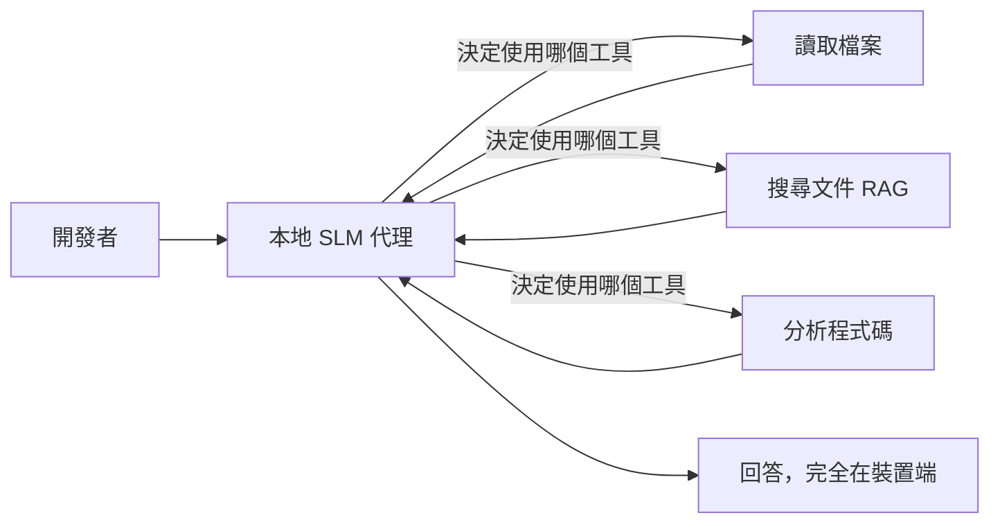
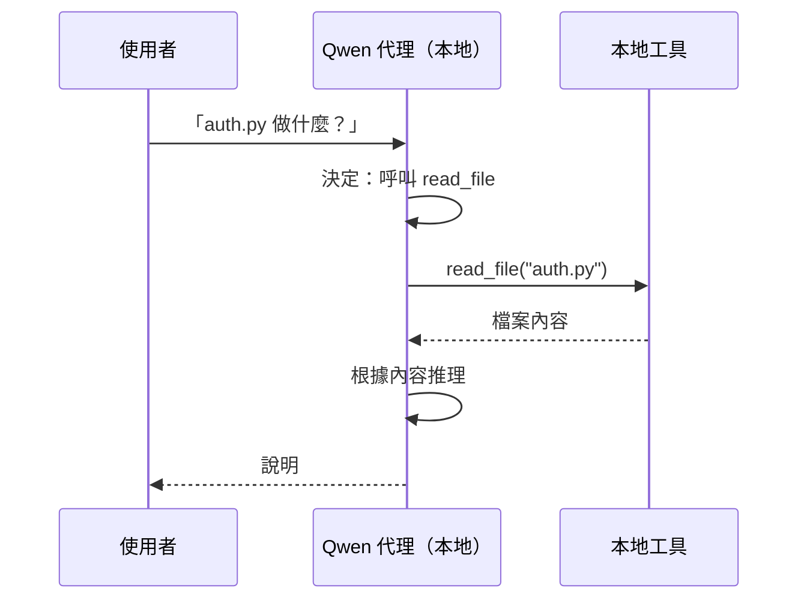
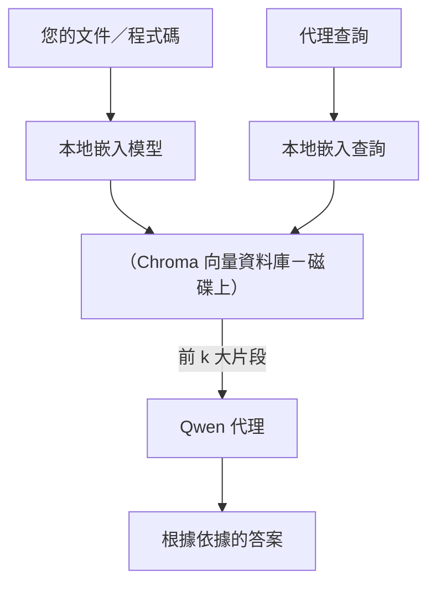
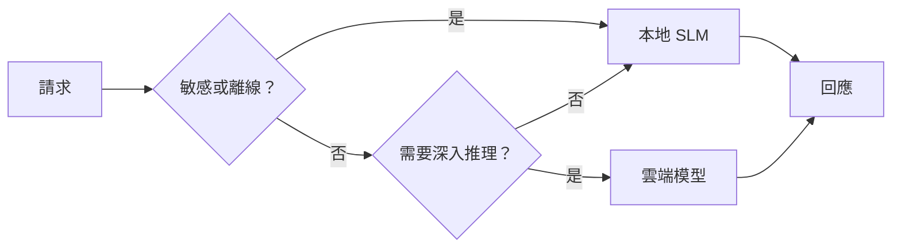

# 使用 Microsoft Foundry Local 與 Qwen 建立本地 AI 代理人


上一課將代理人擴展到了雲端。本課則是將代理人帶回到單一機器上。結束時，你將擁有一個能推理、呼叫工具、閱讀你的文件，並搜尋你的文件資料的有效工程助理 — **整個過程中完全沒有呼叫過雲端推論。**

為什麼你會想這麼做？在實際工程工作中常常會遇到三個原因：

- **隱私。** 程式碼與文件絕不離開該機器。沒有提示、沒有片段、沒有客戶資料會通過網路邊界。
- **成本。** 本地推論沒有按每個代幣計費。你可以全天迭代，只需付電費。
- **離線。** 在飛機上、在安全設施中或停電時，代理人仍可運作。

代價是你用一個 **小型語言模型（SLM）** 來取代前沿雲端模型，並在 CPU、GPU 或 NPU 上運行。本課教你如何在此限制內建立表現 <em>良好</em> 的代理人，而不是假裝沒有限制存在。

## 簡介

本課將涵蓋：

- **小型語言模型（SLM）** — 它們是什麼、適合做什麼、不適合做什麼。
- **Microsoft Foundry Local** — 一個能在裝置上下載並服務模型的執行時，透過 **OpenAI 相容 API** 提供服務。
- **Qwen 函數呼叫模型** — 能可靠產生工具呼叫的 SLM，這是實現本地 <em>代理人</em>（而不只是本地聊天）的關鍵。
- **本地工具、本地 RAG 與本地 MCP** — 讓代理人在無雲端下仍能運作。
- <strong>混合模式</strong> — 何時保留本地、何時轉向雲端。

## 學習目標

完成本課後，你將知道如何：

- 解釋 SLM 的權衡，並選擇適合的本地代理使用案例。
- 使用 Foundry Local 本地部署 Qwen 模型，並通過 OpenAI 相容端點連接。
- 建立一個完全在你的工作站上運行的工具呼叫代理人。
- 利用本地向量資料庫（Chroma）添加本地 RAG，在自己的文件上運作。
- 將代理人連接到本地 MCP 伺服器，並推理混合本地/雲端設計。

## 先決條件

本課假設你完成過早期課程，且熟悉：

- [工具使用](../04-tool-use/README.md)（第4課）與 [代理 RAG](../05-agentic-rag/README.md)（第5課）。
- [代理協議 / MCP](../11-agentic-protocols/README.md)（第11課）。
- [Microsoft Agent Framework](../14-microsoft-agent-framework/README.md)（第14課）。

你也需要：

- 一台開發工作站。**8 GB RAM 是實際最低標準**；16 GB以上更為舒適。有 GPU 或 NPU 會有幫助，但非必須。
- 安裝好 **Microsoft Foundry Local**（見下方安裝部分）。
- Python 3.12+ 與本倉庫中的 [`requirements.txt`](../../../requirements.txt) 裡的套件，另加本課用的 `foundry-local-sdk`、`openai` 與 `chromadb`。

## 小型語言模型：本地工作的合適工具

前沿的雲端模型擁有數千億參數和資料中心作後盾。SLM 擁有數十億參數，必須能適合你的筆電記憶體。這差異設定了清楚的期望。

**SLM 擅長的部分：**

- 結構化、有限界任務 — 分類、提取、摘要已知文件。
- <strong>工具呼叫</strong> — 決定呼叫哪個函數和帶什麼參數。
- 在自有資料上的快速、便宜、私密的迭代。

**SLM 比較弱的部分：**

- 開放式、多跳推理的大量上下文。
- 廣泛的世界知識（見的較少且遺忘較多）。

因此本地代理人的致勝策略是：**讓 SLM 負責協調，讓工具做重活。** 模型不用真正 <em>認識</em> 你的程式碼庫 — 它需要知道何時呼叫 `read_file` 與 `search_docs`。這恰好符合 SLM 的強項。



## Microsoft Foundry Local

**Microsoft Foundry Local** 是一個輕量的執行時，它完全在你的機器上下載、管理和服務模型。我們最重要的特性是它暴露 **OpenAI 相容 HTTP 端點** — 這代表使用 OpenAI SDK 與 Microsoft Agent Framework 的 OpenAI 客戶端只要改變 `base_url` 就能對它操作。你關於建立代理人學到的一切都能直接套用；唯一不同的是，端點從雲端變成了 `localhost`。

Foundry Local 還會自動為你的硬體選擇最佳模型版本 — CPU 版本、CUDA/GPU 版本或 NPU 版本 — 不必自己針對每台機器手動優化。

### 安裝

安裝 Foundry Local（請參閱你的作業系統相應的[文件](https://learn.microsoft.com/azure/ai-foundry/foundry-local/)），然後確認它可正常運行：

```bash
# 安裝（範例；請遵循您平台的文件）
winget install Microsoft.FoundryLocal      # Windows
# brew install microsoft/foundrylocal/foundrylocal   # macOS

# 下載並運行 Qwen 模型，然後啟動本地服務
foundry model run qwen2.5-7b-instruct
foundry service status
```

服務啟動後，你就擁有了一個本地的 OpenAI 相容端點（通常是 `http://localhost:PORT/v1`）。筆記本使用 `foundry-local-sdk` 自動發現端點，故不需硬編碼埠號。

## Qwen 函數呼叫：為何重要

一個代理人只有在能呼叫工具時才是代理人。許多 SLM 可以聊天，但產生不可靠且格式錯誤的工具呼叫。**Qwen** 模型訓練成為能完成函數呼叫，且持續輸出格式良好的工具呼叫結構 — 這正是讓本地聊天模型成為本地 <em>代理人</em> 的關鍵。

流程是你已熟悉的標準工具呼叫循環，只是執行在裝置上：



## 本地 RAG

文件搜尋是本地代理人發揮價值的地方。不用指望 SLM 記住你的框架文件，而是將這些文件嵌入到 <strong>本地向量資料庫</strong>，讓代理人按需檢索相關部分。

我們使用 **Chroma**，一個無需伺服器管理、可內嵌於程序中的向量存儲庫。管線完全本地：本地嵌入模型 → 本地向量 → 本地檢索 → 本地 SLM。



這是與第 5 課相同的 Agentic RAG 模式 — 唯一不同是所有元件都在你的機器上運行。

## 本地 MCP 伺服器

[MCP](../11-agentic-protocols/README.md) 是一種傳輸機制，不是雲端服務。MCP 伺服器可以作為本地程序在 `stdio` 上運行，通過標準協議向你的代理人暴露工具。這讓你能完全離線重用不斷增長的 MCP 伺服器生態系 — 檔案系統訪問、git 操作、資料庫查詢。

安全態勢與雲端不同，但並非不存在：本地 MCP 伺服器仍以你的使用者權限運行，故要限定它能接觸的範圍（例如一個專案目錄，而不是整個主目錄），並將其輸出視為輸入再進行驗證。

## 混合云端與本地模式

本地優先不代表只能本地。成熟系統會根據敏感性與難度做路由：

| 情況 | 運行地點 |
| --- | --- |
| 敏感程式碼/資料或離線狀態 | **本地 SLM** |
| 簡單有限界任務 | **本地 SLM**（便宜、快速） |
| 非敏感資料上的困難多跳推理 | <strong>雲端模型</strong> |
| 停電時的所有運作 | **本地 SLM**（優雅降級） |

這映照第 16 課的 <strong>模型路由</strong> 概念 — 只是其中一個「模型」現在成了你自己的機器。一個健全設計會在雲端不可用時回落到本地，讓代理人品質降低，而不是完全失效。



## 實作實驗室：本地工程助理

開啟 [`code_samples/17-local-agent-foundry-local.ipynb`](./code_samples/17-local-agent-foundry-local.ipynb) 並跟著操作。你將建立一個<strong>本地工程助理</strong>，完全運行於你的工作站上，且能：

1. <strong>呼叫工具</strong> — 透過 Foundry Local 的 Qwen 函數呼叫。
2. <strong>執行本地檔案操作</strong> — 列出並讀取專案目錄中的檔案。
3. <strong>分析程式碼</strong> — 報告原始檔案的基本指標。
4. <strong>搜尋文件</strong> — 使用 Chroma 在 docs 資料夾上執行本地 RAG。
5. **使用 MCP** — 連接本地 MCP 伺服器（未配置則優雅跳過）。

整個過程中皆不使用雲端推論。

### 解說

助理透過 OpenAI 相容端點連接 Foundry Local，因此代理人程式碼與雲端課程幾乎相同 — 唯一不同是用戶端：

```python
from foundry_local import FoundryLocalManager
from openai import OpenAI

# Foundry Local 會發現/下載模型並提供給我們一個本地端點。
manager = FoundryLocalManager(\"qwen2.5-7b-instruct\")
client = OpenAI(base_url=manager.endpoint, api_key=manager.api_key)  # api_key 是本地佔位符
```

工具是普通的 Python 函數，作用範圍限縮在專案目錄：

```python
def read_file(path: str) -> str:
    \"\"\"Read a file, but only inside the sandboxed project directory.\"\"\"
    full = (PROJECT_ROOT / path).resolve()
    if PROJECT_ROOT not in full.parents and full != PROJECT_ROOT:
        return \"Access denied: path is outside the project directory.\"
    return full.read_text(encoding=\"utf-8\")
```

注意沙箱檢查 — 即使是本地，讀取任意路徑的工具仍是不安全的。筆記本將每個工具限定在單一專案根目錄。

## 知識檢核

在進入作業前檢測你的理解。

**1. 請舉兩個在本地運行代理人，而非放在雲端的具體理由。**

<details>
<summary>答案</summary>

任何兩個：<strong>隱私</strong>（程式碼與資料永不離開該機器）、<strong>成本</strong>（不產生按代幣計費）、<strong>離線能力</strong>（無網路時仍可運作，例如在飛機上、安全設施或停電）。法規/合規約束禁止將資料送出裝置是隱私理由的常見驅動力。
</details>

**2. 本地代理人中，SLM 與工具之間推薦的分工是什麼？為什麼？**

<details>
<summary>答案</summary>

讓 SLM <strong>負責協調</strong>（決定呼叫哪個工具以及參數），讓 <strong>工具做重活</strong>（讀檔、查文件、運算結果）。SLM 擅長有限決策如工具選擇，但廣泛知識與長多跳推理較弱，因此依賴工具符合其強項。
</details>

**3. 為什麼能用 Foundry Local 重用雲端代理人程式碼？**

<details>
<summary>答案</summary>

Foundry Local 暴露一個 **OpenAI 相容 HTTP 端點**。OpenAI SDK 和代理框架的 OpenAI 客戶端只需更改 `base_url`（並使用本地占位 API 金鑰）即可，代理人程式碼其餘部分不變。
</details>

**4. 為什麼特別使用 Qwen 函數呼叫模型，而不是任何 SLM？**

<details>
<summary>答案</summary>

因為代理人必須輸出可靠且格式正確的 <strong>工具呼叫</strong>。許多 SLM 可以聊天，但產生格式錯誤或不一致的工具呼叫結構。Qwen 模型訓練函數呼叫，可持續產生一致工具呼叫，這就是讓本地聊天模型成為可用本地代理人的關鍵。
</details>

**5. 在本地 RAG 管線中，哪些元件在機器上運行？**

<details>
<summary>答案</summary>

全部：嵌入模型、向量資料庫（Chroma，在磁碟上）、檢索步驟，以及 SLM。文件是本地嵌入、本地儲存、本地檢索，本地模型推理 — 沒有元件接觸雲端。
</details>

**6. 本地 MCP 伺服器運行在你的機器上。這就代表它自動安全嗎？你還應採取什麼預防措施？**

<details>
<summary>答案</summary>

不代表。因本地 MCP 伺服器是以你的使用者權限運行，所以能存取你能存取的所有資料。應限制它能存取的範圍（例如單一專案目錄，而非整個主目錄），並將其輸出視為輸入，進行驗證後再使用。
</details>

**7. 請描述一個包含本地模型的合理混合路由規則。**

<details>
<summary>答案</summary>

將敏感或離線請求導向本地 SLM；將簡單有限任務導向本地 SLM 以提高速度與節省成本；將非敏感資料上的困難多跳推理導向雲端模型；若雲端不可用，則回落到本地 SLM，讓代理人能優雅降級不致完全失效。這是第 16 課的模型路由，加上本地機器作為一個模型。
</details>

**8. 這課中執行本地代理人的實際最低 RAM 要求是多少？較多 RAM 有何助益？**

<details>
<summary>答案</summary>

約 **8 GB** 是實際最低標準；16 GB 以上會較舒適。更多 RAM 允許你運行較大且較強的模型，且能讓上下文保留在記憶體中更多。GPU 或 NPU 可加速推論，但非必須 — Foundry Local 在找不到加速器時會自動選擇 CPU 版本。
</details>

## 作業

將本地工程助理擴增成你選擇的小型專案的<strong>本地文件審查者</strong>（如果想，可使用本倉庫的某個課程資料夾）。

你的作業應該包括：

1. 將一個真實的文件/程式碼資料夾索引入 Chroma（至少五個檔案）。
2. 新增一個 `find_todos` 工具，掃描專案中的 `TODO`/`FIXME` 註解，並回傳含檔案與行號的位置 — 並保持與 `read_file` 一樣的沙箱檢查。

3. <strong>問代理人三個問題</strong>，強迫它結合工具運作：一個純 RAG 問題、一個需要閱讀特定檔案的問題，以及一個需要尋找 TODO 清單的問題。
4. <strong>測量它</strong>：計時這三個回答，並將結果記錄在 markdown 儲存格裡。評論此延遲時間是否符合你預期的工作流程需求。

然後寫一段簡短的文字說明<strong>你會將哪些部分移至雲端，哪些會保留在本地</strong>，以及原因。你的評分標準為本地元件是否正確連接，以及你的混合推理是否合理 — 而非模型品質。

## 摘要

在本課中，你建立了完全在你自己電腦上執行的代理人：

- **SLMs** 以廣度換取隱私、成本與離線操作 — 並且在它們<strong>協調工具</strong>而非自行承擔所有知識時發揮優勢。
- **Foundry Local** 在裝置端通過<strong>與 OpenAI 相容的端點</strong>提供模型服務，使你的雲端代理人程式碼只需一行變更即可轉移。
- **Qwen 函數呼叫模型** 使得可靠的本地工具呼叫（因此也包含本地<em>代理人</em>）成為可能。
- **本地 RAG**（Chroma）和 **本地 MCP** 在不離開機器的前提下賦予代理人能力。
- <strong>混合模式</strong> 允許你依敏感度和難度分流，將本地作為優雅的後備方案。

本章完成了部署的進程：第 16 課將代理人大規模部署至 Microsoft Foundry，而本課則將其縮小部署到單台工作站。下一課將轉向保持已部署代理人的安全。

## 額外資源

- <a href="https://learn.microsoft.com/azure/ai-foundry/foundry-local/" target="_blank">Microsoft Foundry Local 文件</a>
- <a href="https://learn.microsoft.com/azure/ai-foundry/what-is-azure-ai-foundry" target="_blank">Microsoft Foundry 文件</a>
- <a href="https://learn.microsoft.com/en-us/agent-framework/overview/?wt.mc_id=youtube_26688_organicsocial_reactor&pivots=programming-language-python" target="_blank">Microsoft Agent Framework</a>
- <a href="https://qwen.readthedocs.io/en/latest/framework/function_call.html" target="_blank">Qwen 函數呼叫文件</a>
- <a href="https://modelcontextprotocol.io/" target="_blank">模型上下文協議 (MCP)</a>
- <a href="https://docs.trychroma.com/" target="_blank">Chroma 向量資料庫</a>

## 前一課

[部署可擴展代理人](../16-deploying-scalable-agents/README.md)

## 下一課

[保護 AI 代理人](../18-securing-ai-agents/README.md)

---

<!-- CO-OP TRANSLATOR DISCLAIMER START -->
**免責聲明**：
此文件已使用 AI 翻譯服務 [Co-op Translator](https://github.com/Azure/co-op-translator) 進行翻譯。雖然我們努力追求準確性，但請注意自動翻譯可能包含錯誤或不準確之處。原始文件的母語版本應視為權威來源。對於關鍵資訊，建議採用專業人工翻譯。我們不對因使用此翻譯所產生的任何誤解或誤譯承擔責任。
<!-- CO-OP TRANSLATOR DISCLAIMER END -->