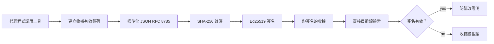
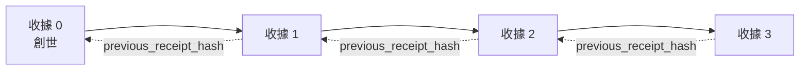

[觀看課程影片：使用密碼收據保護 AI 代理](https://youtu.be/PLACEHOLDER_VIDEO_ID)

> _(課程影片和縮圖將由 Microsoft 內容團隊於合併後新增，符合課程第 14 / 15 節的模式。)_

# 使用密碼收據保護 AI 代理

## 介紹

本課程將涵蓋：

- 為什麼 AI 代理的審計軌跡對合規、除錯和信任至關重要。
- 什麼是密碼收據，以及它與未簽署日誌行的不同之處。
- 如何用純 Python 產生代理工具呼叫的簽署收據。
- 如何離線驗證收據並檢測篡改。
- 如何串接收據，讓移除或重新排序其中之一會破壞串接鏈。
- 收據證明什麼，以及它們明確不證明什麼。

## 學習目標

完成本課程後，你將知道如何：

- 識別促使代理行動使用密碼原始憑證的失效模式。
- 對標準 JSON 有效負載產生 Ed25519 簽署的收據。
- 僅使用簽署者的公鑰獨立驗證收據。
- 透過重新驗證修改過的收據來檢測篡改。
- 建造哈希串接的收據序列並解釋串接的重要性。
- 識別收據能證明（歸屬、完整性、排序）與不能證明（行為正確性、政策合理性）之間的界限。

## 問題所在：你的代理審計軌跡

想像你已部署一個為 Contoso Travel 服務的 AI 代理。該代理會讀取客戶請求，呼叫航班 API 查詢選項，並代表客戶預訂座位。上季度，該代理處理了 5 萬筆訂單。

今天一位稽核員來訪，他們問了一個簡單問題：「請告訴我你的代理做了什麼。」

你交出日誌檔。稽核員查看後問了個更難的問題：「我怎麼知道這些日誌沒有被修改？」

這就是審計軌跡的問題。今日多數代理部署依賴：

- <strong>應用日誌</strong>：由代理自身撰寫，任何有檔案系統存取權的人都可編輯。
- <strong>雲端日誌服務</strong>：在平台層面可防篡改，但前提是稽核員信任平台營運者。
- <strong>資料庫交易日誌</strong>：適合記錄資料庫變動，但不適合任意工具呼叫。

這些解決方案都無法答覆稽核員的問題，而不要求稽核員信任某方（你、你的雲端供應商、你的資料庫廠商）。對內部使用，這種信任通常可接受。但對規管工作負載（金融、醫療、受到歐盟 AI 法案規範的），則不可接受。

密碼收據解決此問題，讓每個代理行動都可獨立驗證。稽核員不需信任你，只要有你的公鑰和收據本身即可。

## 什麼是密碼收據？

收據是記錄代理行動的 JSON 物件，並以數位簽章簽署。



一個最簡收據如下：

```json
{
  "type": "agent.tool_call.v1",
  "agent_id": "contoso-travel-bot",
  "tool_name": "lookup_flights",
  "tool_args_hash": "sha256:a3f9c1...",
  "result_hash": "sha256:7b2e1d...",
  "policy_id": "contoso-travel-policy-v3",
  "timestamp": "2026-04-25T14:30:00Z",
  "sequence": 47,
  "previous_receipt_hash": "sha256:9d4e6a...",
  "signature": {
    "alg": "EdDSA",
    "sig": "c5af83...",
    "public_key": "8f3b2c..."
  }
}
```

三個屬性在起作用：

1. <strong>簽章</strong>。收據由代理閘道使用 Ed25519 私鑰簽署。任何擁有對應公鑰的人都能離線驗證簽章。篡改任何欄位都會使簽章無效。

2. <strong>標準編碼</strong>。簽署前，收據經 JSON 標準化方案（JCS，RFC 8785）序列化。此舉確保兩份同樣邏輯的收據在不同實作間生成同樣的位元組序列。若無標準化，不同 JSON 序列化器會為相同內容產生不同的簽章。

3. <strong>哈希串接</strong>。`previous_receipt_hash` 欄位將每份收據與前一份銜接。移除或重新排序任一收據會破壞後續所有收據。篡改在串接鏈層面即明顯，即便個別簽章被繞過。

這些特性合力提供三項保證：

- <strong>歸屬</strong>：此私鑰簽署此內容。
- <strong>完整性</strong>：內容自簽署後未被更改。
- <strong>排序</strong>：本收據在串接鏈中位於該收據之後。

## 用 Python 產生收據

你不需要特殊函式庫來產生收據。密碼學基元廣泛可用，邏輯僅數十行 Python。

`code_samples/18-signed-receipts.ipynb` 中的實作演練會示範整個流程。摘要如下：

```python
import json
import hashlib
import base64
from nacl import signing
from jcs import canonicalize  # RFC 8785 規範的 JSON

def b64url_nopad(data: bytes) -> str:
    return base64.urlsafe_b64encode(data).decode("ascii").rstrip("=")

def sha256_canonical(obj) -> str:
    """SHA-256 of a Python object's JCS-canonical JSON form."""
    return f"sha256:{hashlib.sha256(canonicalize(obj)).hexdigest()}"

# 產生或載入簽名金鑰（在生產環境中，請存放於金鑰保管庫）
signing_key = signing.SigningKey.generate()
verify_key = signing_key.verify_key

# 建立收據負載（尚未簽名）
tool_args = {"origin": "SYD", "destination": "LAX"}
tool_result = [{"flight": "QF11", "price": 1850, "stops": 0}]

payload = {
    "type": "agent.tool_call.v1",
    "agent_id": "contoso-travel-bot",
    "tool_name": "lookup_flights",
    "tool_args_hash": sha256_canonical(tool_args),
    "result_hash": sha256_canonical(tool_result),
    "policy_id": "contoso-travel-policy-v3",
    "timestamp": "2026-04-25T14:30:00Z",
    "sequence": 0,
    "previous_receipt_hash": None,
}

# 規範化、雜湊、簽名。
canonical_bytes = canonicalize(payload)
message_hash = hashlib.sha256(canonical_bytes).digest()
signature_bytes = signing_key.sign(message_hash).signature

# 附加一個結構化的簽名物件。
receipt = {
    **payload,
    "signature": {
        "alg": "EdDSA",
        "sig": b64url_nopad(signature_bytes),
        "public_key": b64url_nopad(bytes(verify_key)),
    },
}
```

這就是整個簽署流程。筆記本中逐步帶你完成各步驟。

## 驗證收據與檢測篡改

驗證是反向操作：

```python
import base64
import hashlib
from nacl import signing
from nacl.exceptions import BadSignatureError
from jcs import canonicalize

def b64url_decode(s: str) -> bytes:
    padding = "=" * ((4 - len(s) % 4) % 4)
    return base64.urlsafe_b64decode(s + padding)

def verify_receipt(receipt: dict) -> bool:
    # 簽名是一個結構化的物件：{"alg", "sig", "public_key"}。
    sig_obj = receipt.get("signature")
    if not sig_obj or sig_obj.get("alg") != "EdDSA":
        return False

    # 重建實際被簽名的有效載荷（除簽名外的所有內容）。
    payload = {k: v for k, v in receipt.items() if k != "signature"}

    canonical_bytes = canonicalize(payload)
    message_hash = hashlib.sha256(canonical_bytes).digest()

    try:
        verify_key = signing.VerifyKey(b64url_decode(sig_obj["public_key"]))
        verify_key.verify(message_hash, b64url_decode(sig_obj["sig"]))
        return True
    except BadSignatureError:
        return False
```

此函式輸入收據，回傳簽章有效時為 `True`，否則 `False`。不需網路呼叫、無服務依賴、也不需信任任何第三方。

為展示篡改檢測，筆記本示範了：

1. 產生有效收據並確認通過驗證。
2. 修改 `tool_args_hash` 欄位的一個位元組。
3. 重新驗證，結果失敗。

這是收據具篡改可見性的實際示範：任何微小修改都會破壞簽章。

## 為多步驟代理串接收據

單份簽署收據保護單一行動。串接收據鏈保護一連串行動。



每份收據記錄著前一份的哈希。若攻擊者想悄悄移除收據 2，要麼：

- 修改收據 3 的 `previous_receipt_hash` 欄位（會破壞收據 3 的簽章），要麼
- 偽造收據 3 的簽章（須代理私鑰）。

若私鑰保存在硬體金鑰保管庫且你以每份收據公佈公鑰，這兩種攻擊均難以不被察覺成功。

筆記本示範：

1. 建立三份收據的串接鏈。
2. 驗證每份收據的 `previous_receipt_hash` 與前一收據的實際哈希相符。
3. 在中間篡改一份收據，結果串接鏈在該點被破壞。

這就是產生稽核員可驗證且無須信任你的審計軌跡的方式。

## 收據證明什麼（及不證明什麼）

這是本課程中最重要的一節。收據很強大，但其能力有限。

**收據證明三件事：**

1. <strong>歸屬</strong>：特定私鑰簽署特定有效負載。
2. <strong>完整性</strong>：有效負載自簽署後未被改動。
3. <strong>排序</strong>：本收據後於串接鏈中先前收據。

**收據不證明：**

1. <strong>正確性</strong>：代理行為是否正確。錯誤答案的收據與正確答案的收據同樣能被簽署。
2. <strong>政策遵循</strong>：`policy_id` 指涉的政策是否真的被執行，或若檢查過是否會允許此行動。收據記錄的是所聲稱的內容，不是執行結果。
3. <strong>鑑別超越金鑰</strong>：收據說「此金鑰簽署此內容」，不代表「此人或組織授權」。將金鑰連結到人或組織需另行身分識別基礎設施（目錄、公開金鑰註冊等）。
4. <strong>輸入真實性</strong>：若代理收到遭竄改的提示並依其行動，收據誠實記錄該行為。收據位於輸入驗證之後，非取代。

此界限重要因兩點：

- 告訴你收據的用途：使代理行為可被審核與防篡改，即使跨組織。
- 告訴你還需要哪些層級：輸入驗證（課程 6）、政策執行（下文簡述）、身分識別基礎設施（本課程未涵蓋）。

常見錯誤是以為「有收據」就代表「已治理」。事實不是。收據是基礎，治理是你建立在上面的系統。

## 生產參考

本課程中的 Python 程式碼刻意簡潔，讓你能逐行理解流程。生產環境有兩種選擇：

1. <strong>直接使用密碼學基元</strong>。上方看到的 50 行足以滿足很多情境。PyNaCl（Ed25519）和 `jcs` 套件（標準 JSON）都是經常維護且經審計的函式庫。

2. <strong>使用生產用收據函式庫</strong>。數個開源專案實作此模式並增添功能（密鑰輪替、批量驗證、JWK 集分發、與政策引擎整合）：
   - 本課程使用的收據格式遵循一個 IETF 網際網路草案（`draft-farley-acta-signed-receipts`），正在標準化過程中。
   - 微軟代理治理工具包結合收據與 Cedar 政策決策；可見該代碼庫的教程 33 完整範例。
   - `protect-mcp`（npm）和 `@veritasacta/verify`（npm）套件提供基於 Node 的收據簽署和離線驗證實作，適合用於為任何 MCP 伺服器包裝防篡改審計軌跡。

自行實作或使用函式庫的抉擇，類似寫自己 JWT 函式庫或使用測試過的函式庫：兩者皆合理；後者節省時間且減少審計範圍；從零開始強制你理解每個基元。此課程教授從零開始路徑，為你兩種選擇打下基礎。

## 知識檢測

開始練習前先測試你的理解。

**1. 收據用代理的私鑰 Ed25519 簽署。稽核員僅有公鑰。稽核員能離線驗證收據嗎？**

<details>
<summary>答案</summary>

能。Ed25519 驗證只需公鑰及簽署位元組。不需網路呼叫，也不依賴任何服務。此特性是收據可用於隔離網路、多組織或低信任稽核環境的關鍵。
</details>

**2. 攻擊者改動收據的 `policy_id` 欄位，聲稱其受更寬鬆政策約束。簽章是在原始有效負載上產生的。驗證時會怎樣？**

<details>
<summary>答案</summary>

驗證失敗。簽章是根據標準化後的原始有效負載計算的；改動任一欄位會改變標準化位元組，進而改變 SHA-256 哈希，令簽章無效。攻擊者必須有私鑰才能重新簽署，但他們沒有。
</details>

**3. 為什麼收據使用 `tool_args_hash` 和 `result_hash`，而非存放原始參數和結果？**

<details>
<summary>答案</summary>

有兩個原因。第一，收據可能需要歸檔或在洩漏原始內容（個資、商業數據）敏感的環境中傳送。用哈希使收據保持小且內容保密；稽核員只需驗證哈希是否與另行存放的實際內容相符。第二，哈希尺寸固定；用哈希的收據大小不受輸入輸出資料量大小影響。
</details>

**4. `previous_receipt_hash` 欄位串接收據鏈。如果攻擊者悄悄刪除鏈中一份收據，什麼會失效？**

<details>
<summary>答案</summary>

被刪除後的所有收據都失效。它們的 `previous_receipt_hash` 不再與實際的前一收據哈希匹配（因為原先參照的收據不存在，鏈現在指向不同的前任）。若要隱藏刪除，攻擊者須重新簽署所有後續收據，這需要私鑰。
</details>

**5. 收據驗證成功。這是否證明代理行動正確、合理或符政策？**

<details>
<summary>答案</summary>

不。有效收據證明三件事：歸屬（金鑰簽署此內容）、完整性（內容未更改）、排序（此收據晚於之前收據）。不代表行動正確、`policy_id` 指涉的政策有執行，或代理遵守所有規則。收據讓代理行為可審計，不保證正確。這是本課程中最重要的界限。
</details>

## 練習任務

打開 `code_samples/18-signed-receipts.ipynb`，完成四個部分：

1. **第 1 節**：簽署你的第一份收據並驗證。
2. **第 2 節**：篡改收據並觀察驗證失敗。
3. **第 3 節**：建立三份收據串接鏈並驗證鏈的完整性。
4. **第 4 節**：將此模式應用於使用微軟代理框架建構的代理：以收據簽署包裝工具呼叫，然後獨立驗證收據。

**進階挑戰 1：** 在收據結構中新增你自行選擇的欄位（例如請求 ID 用於追蹤），更新標準簽署邏輯使其納入，並確認收據簽署後可正確通過驗證。然後簽署後修改該欄位並確認驗證失敗。此挑戰迫使你瞭解標準化編碼的每個位元組如何影響簽章。
**進階挑戰 2：** 將你的兩張收據做 SHA-256 雜湊（以確定性順序串接它們的標準化位元組），並在第三張收據中以新欄位嵌入此雜湊摘要後再簽署。驗證三張收據仍能正常往返。你剛剛建立了一步驟的包含證明：持有第三張收據的任何人都能證明前兩張收據在簽署時存在，而無需揭露內容。這是選擇性揭露收據在大規模使用時的模式（Merkle 承諾，RFC 6962）。

## 結論

加密收據提供 AI 代理一條審計軌跡，具有：

- <strong>獨立可驗證</strong>：任何擁有公鑰的一方均可驗證，無需依賴服務。
- <strong>篡改可察覺</strong>：任何修改都會使簽章失效。
- <strong>可攜性</strong>：收據是一個小型 JSON 檔案；可存檔、傳輸並隨時驗證。
- <strong>標準對齊</strong>：建立於 Ed25519（RFC 8032）、JCS（RFC 8785）及 SHA-256，皆為廣泛部署的基元。

它們不是輸入驗證、政策執行或身份基礎設施的替代品，而是這些層次的基礎。當你要將代理部署於受監管的工作負載、多組織流程或未來審計者無法假定信任你的任何場景時，收據就是讓審計軌跡真實誠信的方式。

最重要的重點是：收據證明誰在何時說了什麼，但不證明所說的是事實或正確。請牢記這一區分。這是誠實溯源系統與誤導系統的差別。

## 生產檢查清單

當你準備從本課程畢業，部署帶收據簽署的代理於實際環境時：

- [ ] **將簽署金鑰移出開發者筆電。** 使用 Azure Key Vault、AWS KMS 或硬體安全模組。簽署收據的私鑰絕不可存放在原始碼控管或應用機器之明文中。
- [ ] **公布驗證公鑰。** 審計者需要離線驗證。標準作法是在已知 URL 提供 JWK 集合 (RFC 7517)，例如 `https://your-org.example.com/.well-known/agent-keys.json`。
- [ ] **外部錨定鏈條。** 定期將最新鏈頭雜湊寫入透明度日誌（Sigstore Rekor、RFC 3161 時戳權威或第二個內部系統），讓外部方能確認「此鏈條曾於此時間存在」。
- [ ] **不可變地存儲收據。** 附加唯一 Blob 儲存（Azure Storage 帶不可變政策，AWS S3 Object Lock）防止內部人員在儲存層竄改歷史。
- [ ] **決定保存期限。** 許多合規規範要求多年保存。規劃收據成長（每張約 500 bytes；代理每天呼叫 10K 會產生約 1.8 GB/年）。
- [ ] **註明收據不涵蓋項目。** 收據證明歸屬、完整性與順序。你的運行手冊應明確列出哪些額外控管（輸入驗證、政策執行、速率限制、身份基礎設施）與收據共同構成治理體系。

### 想了解更多關於保障 AI 代理安全的問題？

加入 [Microsoft Foundry Discord](https://aka.ms/ai-agents/discord)，與其他學習者會面，參加辦公時間並獲得 AI 代理問題解答。

## 延伸學習

本課程涵蓋單一收據簽署與雜湊鏈序列。同樣的基元組合可構成多種更進階的模式，隨著治理態勢成熟你可能會遇見：

- **選擇性揭露。** 當收據的欄位各自承諾（RFC 6962 式 Merkle 樹），你可以向特定審計者揭露特定欄位，並證明其他未改變而無需公開。適用於同一收據需同時滿足全面審計（需完整性）與資料最小化規範（GDPR 等，審計者應見最少資訊）。
- **收據撤銷。** 若簽署金鑰遭入侵，需有方式將該私鑰起特定時間點後簽署之收據標示為不可信。標準作法：短生命簽署金鑰加公布撤銷清單，或含撤銷條目的透明度日誌。
- **雙邊/分割簽章收據。** 有些實作將簽署負載拆分為執行前（`authorization_*`）與執行後（`result_*`）兩半獨立簽章，適合授權決策與觀察結果由不同執行者或時間生成情境。這是本課教學收據格式的附加組合。
- **負載組合。** 收據封印你放入 `result_hash` 的資料。實務負載往往比單一工具呼叫結果更豐富：決策前推理（模型預測、考慮選項、證據及其完整性、風險態勢、問責鏈、閘門結果）都可包含其中，由單一收據密封。保持收據格式簡潔，讓負載 schema 按領域演化。
- **跨實作一致性。** 多個獨立實作（Python、TypeScript、Rust、Go）對相同收據格式進行測試向量交叉驗證。若你自建實作，通過公佈向量確認協議層相容性。
- **後量子遷移。** Ed25519 現正廣泛部署但非量子安全。收據格式為演算法彈性：簽章欄 `signature.alg` 可攜帶 `ML-DSA-65`（NIST 後量子簽章標準），以便遷移。規劃雙簽署過渡期間。

## 額外資源

- <a href="https://datatracker.ietf.org/doc/draft-farley-acta-signed-receipts/" target="_blank">IETF 網際網路草案：機器對機器存取控制的簽署決策收據</a>
- <a href="https://learn.microsoft.com/azure/ai-studio/responsible-use-of-ai-overview" target="_blank">負責任的 AI 總覽（Azure AI）</a>
- <a href="https://datatracker.ietf.org/doc/html/rfc8032" target="_blank">RFC 8032：愛德沃茲曲線數位簽章演算法（EdDSA）</a>
- <a href="https://datatracker.ietf.org/doc/html/rfc8785" target="_blank">RFC 8785：JSON 標準化方案（JCS）</a>
- <a href="https://datatracker.ietf.org/doc/html/rfc6962" target="_blank">RFC 6962：證書透明度</a>（選擇性揭露收據所用 Merkle 樹結構）
- <a href="https://github.com/microsoft/agent-governance-toolkit/blob/main/docs/tutorials/33-offline-verifiable-receipts.md" target="_blank">Microsoft 代理治理工具包教程 33：離線可驗證決策收據</a>
- <a href="https://github.com/ScopeBlind/agent-governance-testvectors" target="_blank">本課程所用收據格式跨實作一致性測試向量</a>（Apache-2.0 授權）
- <a href="https://pynacl.readthedocs.io/" target="_blank">PyNaCl 文件</a>（Python 中的 Ed25519）

## 前一課

[建立電腦操作代理 (CUA)](../15-browser-use/README.md)

## 下一課

_(由課程維護人員決定)_

---

<!-- CO-OP TRANSLATOR DISCLAIMER START -->
**免責聲明**：
此文件已使用 AI 翻譯服務 [Co-op Translator](https://github.com/Azure/co-op-translator) 進行翻譯。雖然我們努力追求準確性，但請注意自動翻譯可能包含錯誤或不準確之處。原始文件的母語版本應視為權威來源。對於關鍵資訊，建議採用專業人工翻譯。我們不對因使用此翻譯所產生的任何誤解或誤譯承擔責任。
<!-- CO-OP TRANSLATOR DISCLAIMER END -->