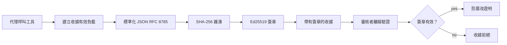
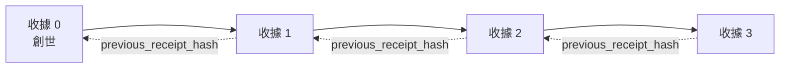

[觀看課程影片：使用密碼學收據保護 AI 代理](https://youtu.be/PLACEHOLDER_VIDEO_ID)

> _(課程影片與縮圖將由 Microsoft 內容團隊於合併後新增，符合第 14 / 15 課的模式。)_

# 使用密碼學收據保護 AI 代理

## 介紹

本課程將涵蓋：

- 為何 AI 代理的審計軌跡對合規、除錯與信任至關重要。
- 什麼是密碼學收據，以及它與未簽名的日誌行有何不同。
- 如何用純 Python 為代理的工具呼叫產生已簽名的收據。
- 如何離線驗證收據並偵測竄改。
- 如何串接收據，使得移除或重排收據會破壞整個鏈結。
- 收據能證明什麼，明確不能證明什麼。

## 學習目標

完成本課後，您將能夠：

- 辨識驅動代理行動密碼學來源追蹤的失效模態。
- 產生對規範 JSON 載荷以 Ed25519 簽名的收據。
- 僅用簽署方的公鑰獨立驗證收據。
- 透過重新執行驗證修改過的收據來偵測竄改。
- 建立哈希串接的收據序列並說明鏈結的重要性。
- 辨識收據所能證明（歸屬、完整性、排序）與不能證明（行動正確性、政策合理性）之間的界線。

## 問題描述：代理的審計軌跡

想像您已部署 Contoso Travel 的 AI 代理。代理讀取客戶請求，呼叫航班 API 查詢選項，並代表客戶訂位。上季，代理處理了 5 萬筆訂位。

今天稽核員來了。他們問一個簡單問題：「請展示代理的行為。」

您交出日誌檔案。稽核員看過後問更困難的問題：「我怎麼知道這些日誌沒有被修改？」

這就是審計軌跡問題。現今大多數代理部署依賴於：

- <strong>應用程式日誌</strong>：由代理本身撰寫，任何有檔案系統權限的人都能修改。
- <strong>雲端日誌服務</strong>：在平台層級防篡改，但前提是稽核員必須信任平台營運者。
- <strong>資料庫交易日誌</strong>：適用於資料庫變更，卻不適合任意工具呼叫的監控。

這些方法都無法直接回答稽核員的問題，除非他們信任某方（您、雲端提供者、資料庫廠商）。公司內部使用時這種信任尚可接受，但對受規範管制的工作負載（金融、醫療、受歐盟 AI 法案影響者）則不行。

密碼學收據的解決方案是讓每項代理行動皆可獨立驗證。稽核員不需信任您，只要有您的公鑰和收據本身即可。

## 什麼是密碼學收據？

收據是一個 JSON 物件，記錄代理所作的行動，並以數位簽章簽署。



一個最簡收據長這樣：

```json
{
  "type": "agent.tool_call.v1",
  "agent_id": "contoso-travel-bot",
  "tool_name": "lookup_flights",
  "tool_args_hash": "sha256:a3f9c1...",
  "result_hash": "sha256:7b2e1d...",
  "policy_id": "contoso-travel-policy-v3",
  "timestamp": "2026-04-25T14:30:00Z",
  "sequence": 47,
  "previous_receipt_hash": "sha256:9d4e6a...",
  "signature": {
    "alg": "EdDSA",
    "sig": "c5af83...",
    "public_key": "8f3b2c..."
  }
}
```

三個屬性發揮作用：

1. <strong>簽章。</strong>收據由代理入口使用 Ed25519 私鑰簽名。任何擁有對應公鑰的人皆可離線驗證簽章。任一欄位被竄改會使簽章失效。

2. <strong>規範編碼。</strong>簽名前，收據使用 JSON 規範化方案（JCS，RFC 8785）序列化。這確保兩個實作產生同樣邏輯收據時，輸出位元組皆相同。若無此規範化，不同 JSON 序列化器會針對相同內容生成不同簽章。

3. **哈希串接。**`previous_receipt_hash` 欄位將每張收據串接至前一張。移除或重排收據會破壞後續每張收據。即使個別簽章被繞過，竄改在鏈結層面仍可見。

這些特性提供三個保證：

- <strong>歸屬性</strong>：這把鑰匙簽署了此內容。
- <strong>完整性</strong>：內容自簽署後未被修改。
- <strong>排序</strong>：此收據在鏈中位於該收據之後。

## 在 Python 中產生收據

您不需要特別函式庫就能產生收據。密碼學基礎元件普遍可用，邏輯只有幾十行 Python。

`code_samples/18-signed-receipts.ipynb` 的動手實作會引導整個流程。概要如下：

```python
import json
import hashlib
import base64
from nacl import signing
from jcs import canonicalize  # RFC 8785 標準 JSON

def b64url_nopad(data: bytes) -> str:
    return base64.urlsafe_b64encode(data).decode("ascii").rstrip("=")

def sha256_canonical(obj) -> str:
    """SHA-256 of a Python object's JCS-canonical JSON form."""
    return f"sha256:{hashlib.sha256(canonicalize(obj)).hexdigest()}"

# 產生或載入簽署金鑰（在生產環境中，請存放於金鑰庫）
signing_key = signing.SigningKey.generate()
verify_key = signing_key.verify_key

# 建立收據內容（尚未簽名）
tool_args = {"origin": "SYD", "destination": "LAX"}
tool_result = [{"flight": "QF11", "price": 1850, "stops": 0}]

payload = {
    "type": "agent.tool_call.v1",
    "agent_id": "contoso-travel-bot",
    "tool_name": "lookup_flights",
    "tool_args_hash": sha256_canonical(tool_args),
    "result_hash": sha256_canonical(tool_result),
    "policy_id": "contoso-travel-policy-v3",
    "timestamp": "2026-04-25T14:30:00Z",
    "sequence": 0,
    "previous_receipt_hash": None,
}

# 標準化、雜湊、簽名。
canonical_bytes = canonicalize(payload)
message_hash = hashlib.sha256(canonical_bytes).digest()
signature_bytes = signing_key.sign(message_hash).signature

# 附加結構化簽名物件。
receipt = {
    **payload,
    "signature": {
        "alg": "EdDSA",
        "sig": b64url_nopad(signature_bytes),
        "public_key": b64url_nopad(bytes(verify_key)),
    },
}
```

這就是整個簽名流程。筆記本中有逐步說明。

## 驗證收據並偵測竄改

驗證是反向操作：

```python
import base64
import hashlib
from nacl import signing
from nacl.exceptions import BadSignatureError
from jcs import canonicalize

def b64url_decode(s: str) -> bytes:
    padding = "=" * ((4 - len(s) % 4) % 4)
    return base64.urlsafe_b64decode(s + padding)

def verify_receipt(receipt: dict) -> bool:
    # 簽章是一個結構化的物件：{"alg", "sig", "public_key"}。
    sig_obj = receipt.get("signature")
    if not sig_obj or sig_obj.get("alg") != "EdDSA":
        return False

    # 重建實際被簽署的有效負載（除了簽章以外的所有內容）。
    payload = {k: v for k, v in receipt.items() if k != "signature"}

    canonical_bytes = canonicalize(payload)
    message_hash = hashlib.sha256(canonical_bytes).digest()

    try:
        verify_key = signing.VerifyKey(b64url_decode(sig_obj["public_key"]))
        verify_key.verify(message_hash, b64url_decode(sig_obj["sig"]))
        return True
    except BadSignatureError:
        return False
```

此函數接收一張收據，簽章有效時回傳 `True`，否則回傳 `False`。無需網路呼叫、服務依賴，也不需信任第三方。

欲目睹竄改偵測實作，筆記本示範：

1. 產生有效收據並確認驗證通過。
2. 修改 `tool_args_hash` 欄位的一個位元組。
3. 重新驗證並觀察驗證失敗。

這是收據防篡改的實際演示：任何細微改動都會破壞簽章。

## 為多步代理串接收據鏈

單一簽名收據保護單一步驟。收據鏈則保護整個序列。



每張收據記錄上一張收據的雜湊值。攻擊者若想悄悄移除第 2 張收據，需要：

- 修改第 3 張收據的 `previous_receipt_hash` 欄位（會破壞第 3 張收據的簽章），或
- 偽造修改過的第 3 張收據新簽章（需代理私鑰）。

若私鑰存於硬體金鑰庫，且你將公鑰隨每張收據一併發布，將無法未被察覺地成功發動上述攻擊。

筆記本涵蓋：

1. 建立三張收據鏈。
2. 驗證每張收據的 `previous_receipt_hash` 是否與前一張收據的實際雜湊匹配。
3. 在中間某張收據竄改，觀察鏈結在該點斷裂。

這就是如何產生稽核員可獨立驗證、不需信任您的審計軌跡。

## 收據可證明的事（與不能證明的事）

此區為本課最重要內容。收據功能強大，但其能力有限。

**收據能證明三件事：**

1. <strong>歸屬性</strong>：特定鑰匙簽署了特定載荷。
2. <strong>完整性</strong>：載荷自簽署後未被修改。
3. <strong>排序</strong>：此收據在雜湊鏈中位於該收據之後。

**收據不能證明：**

1. <strong>正確性</strong>：代理行動是否正確。錯誤答案的收據可同樣乾淨地簽署。
2. <strong>政策符合度</strong>：`policy_id` 所指政策是否真正被評估，或是否允許此行動。收據記錄了聲稱的行為，不代表有執行政策。
3. <strong>鑰匙以外的身份</strong>：收據只說「此鑰匙簽署此內容」，不代表「某人授權此行為」。鑰匙與人員或組織之連結需要額外身分基礎架構（如目錄、公開鑰匙註冊等）。
4. <strong>輸入真實性</strong>：如果代理收到被操控的提示語並依此行動，收據忠實記錄動作。收據是輸入驗證後的下游機制，非替代。

此界線重要因為：

- 它告訴您收據適用於何種用途：使代理行為可稽核並防篡改，即使跨組織。
- 它告訴您仍需何種額外層級：輸入驗證（第 6 課）、政策執行（略述於本課）、身分基礎架構（本課範圍外）。

常見錯誤是誤認「有收據」即「受到管控」。事實非也。收據是基礎，治理是您建立其上的系統。

## 生產級參考

本課 Python 程式碼刻意保持簡潔，使您能逐行理解運作原理。生產環境有兩種選擇：

1. **直接基於密碼學基元建構。** 如上所示約 50 行足夠應用。PyNaCl（Ed25519）和 `jcs` 套件（規範 JSON）皆為維護良好且經審計的函式庫。

2. **使用生產級收據函式庫。** 有多個開源專案實作相同模式並有額外功能（鑰匙輪替、批次驗證、JWK 集合分發、與政策引擎整合）：
   - 本課使用的收據格式遵循 IETF 草案 (`draft-farley-acta-signed-receipts`)，現正標準化流程中。
   - Microsoft Agent Governance Toolkit 將收據與基於 Cedar 的政策決策組合；詳見該專案的 Tutorial 33 以獲得端對端範例。
   - `protect-mcp` (npm) 與 `@veritasacta/verify` (npm) 套件提供 Node.js 版本的收據簽署與離線驗證實作，適用於為任何 MCP 伺服器包裝防篡改稽核軌跡。
   - **[nobulex](https://github.com/arian-gogani/nobulex)** Python SDK (`pip install nobulex`) 提供相同 Ed25519 + JCS 簽署模式，具 LangChain 與 CrewAI 整合，公布交叉驗證測試向量，並透過 [OWASP PR #2210](https://github.com/OWASP/CheatSheetSeries/pull/2210) 貢獻合規映射。

自行打造與使用函式庫的抉擇，如同自寫 JWT 函式庫與採用驗證過函式庫：兩者合理；函式庫節省時間、降低稽核面；自行打造則需理解每個基元。此課教您從零落筆，為兩種選擇打下基礎。

## 知識檢測

在進行練習前自測理解。

**1. 收據以代理的 Ed25519 私鑰簽署。稽核員僅擁有公鑰，能否離線驗證收據？**

<details>
<summary>答案</summary>

可以。Ed25519 驗證只需公鑰與已簽署位元組。無需網路呼叫或任何服務依賴。此特性使收據可用於網路隔離、多組織或低信任稽核環境。
</details>

**2. 攻擊者篡改收據中的 `policy_id` 欄位，宣稱適用更寬鬆政策。簽章針對原始載荷計算，驗證時發生什麼事？**

<details>
<summary>答案</summary>

驗證失敗。簽章基於原始載荷的規範位元組，修改任何欄位會改變規範位元組與 SHA-256 雜湊，導致簽章無效。攻擊者需私鑰製作新簽章，否則無法通過。
</details>

**3. 為何收據包含 `tool_args_hash` 與 `result_hash`，非原始參數與結果？**

<details>
<summary>答案</summary>

有兩個原因。首先，收據可能需長期存檔或傳輸，若原始內容含敏感個資或商業資料則風險大。雜湊使收據保持小巧且保護內容隱私，稽核員驗證雜湊與外部存放的原始資料相符。其次，雜湊大小固定，即使輸入與輸出巨大，收據體積仍有限。
</details>

**4. `previous_receipt_hash` 欄位將每張收據與前一張鏈接。若攻擊者悄悄刪除鏈中間某張收據，何者失效？**

<details>
<summary>答案</summary>

刪除點之後所有收據失效。這些收據的 `previous_receipt_hash` 不再匹配實際鏈結（因被引用收據不存在，或鏈指向不同前驅）。若想隱藏刪除，攻擊者需重新簽署後續每張收據，必須持有私鑰。
</details>

**5. 收據驗證通過，是否證明代理行動正確、合理且符合政策？**

<details>
<summary>答案</summary>

不一定。有效收據證明三件事：歸屬（此鑰匙簽署此內容）、完整性（內容未變）、排序（此收據在該收據之後）。它不保證行動正確，政策確實評估，或代理遵守規則。收據讓代理行為可稽核，但不等於行為一定正確。這是本課最重要的界線。
</details>

## 練習題

開啟 `code_samples/18-signed-receipts.ipynb` 並完成以下四部分：

1. <strong>第一部分</strong>：簽署第一張收據並驗證。
2. <strong>第二部分</strong>：竄改收據並觀察驗證失敗。
3. <strong>第三部分</strong>：建立三張收據鏈並驗證鏈條完整性。
4. <strong>第四部分</strong>：將此模式套用於 Microsoft Agent Framework 建立的代理：在工具呼叫包裹收據簽署，再獨立驗證收據。
**彈性挑戰 1：** 使用您自行選擇的額外欄位（例如，用於追蹤的請求 ID）擴充收據架構，更新標準簽署邏輯以包含該欄位，並確認收據仍能經過驗證的往返。接著在簽署後修改該欄位，並確認驗證失敗。這迫使您理解標準編碼的每一個位元是如何對簽章產生影響。

**彈性挑戰 2：** 對您的兩份收據進行 SHA-256 雜湊串接（以確定性順序串接其標準位元），並將結果摘要作為第三份收據上的新欄位，在簽署前嵌入該欄位。驗證所有三份收據仍可往返。您剛剛建立了一步包含證明：任何持有第三份收據的人，都能證明前兩份收據在簽署時存在，且無需揭露其內容。這是選擇性揭露收據在大規模使用的模式（Merkle 承諾，RFC 6962）。

## 結論

密碼學收據為 AI 代理提供了以下的審計軌跡：

- <strong>獨立驗證</strong>：任何持有公開鑰的方都能驗證，不依賴任何服務。
- <strong>防竄改明顯</strong>：任何修改都會使簽章失效。
- <strong>可攜帶</strong>：收據是一個小型 JSON 檔案；可被存檔、傳輸並在任何地方驗證。
- <strong>符合標準</strong>：建基於 Ed25519（RFC 8032）、JCS（RFC 8785）與 SHA-256，皆為廣泛部署的原語。

它們並非輸入驗證、政策執行或身份基礎設施的替代品，而是這些層的基礎。當您將代理部署在受規管的工作負載、多組織流程或任何未必可假設未來審計者信任您的環境中，收據就是讓審計軌跡忠實的方式。

最重要的重點：收據證明了誰在何時說了什麼。它們不證明內容的真實性或正確性。請緊握此區別。這是誠實根源系統與誤導系統的差別。

## 生產清單

當您準備從此課程晉級，部署帶有收據簽章的代理於實際環境：

- [ ] **將簽章金鑰移出開發者筆電。** 使用 Azure Key Vault、AWS KMS 或硬體安全模組。用於簽署收據的私鑰絕不可存於原始碼控管或應用機器上的明文。
- [ ] **發布驗證公開金鑰。** 審計者需要離線驗證。標準分享方式是在知名 URL（RFC 7517）提供 JWK 集合，例如 `https://your-org.example.com/.well-known/agent-keys.json`。
- [ ] **外部錨定鏈頭。** 定期將最新鏈頭雜湊寫入透明日誌（Sigstore Rekor、RFC 3161 時戳權威或第二個內部系統），讓外部方能確認「此鏈於此時間存在」。
- [ ] **將收據不可變地儲存。** 只能新增的 Blob 儲存（Azure Storage 的不變性政策、AWS S3 物件鎖）防止內部人於儲存層改寫歷史。
- [ ] **決定保存期限。** 多數合規規範要求多年保存。規劃收據成長（每份收據約 500 位元組；若代理每天呼叫 1 萬次，約每年產生 1.8 GB）。
- [ ] **文件化收據不涵蓋的範圍。** 收據證明歸屬、完整性與排序。您的執行手冊應明確列出輸入驗證、政策執行、頻率限制、身份基礎設施等其他控制措施與收據在治理架構中的關係。

### 有更多有關保護 AI 代理的問題嗎？

加入 [Microsoft Foundry Discord](https://aka.ms/ai-agents/discord) 與其他學員交流、參加辦公時間，並獲得您的 AI 代理相關問題解答。

## 超越本課程

本課程涵蓋單一收據簽署和雜湊鏈序列。相同原語組合成幾種您可能會在治理成熟階段遇到的進階模式：

- **選擇性揭露。** 當收據欄位以獨立承諾形式（RFC 6962 樣式的 Merkle 樹）封存時，您能向特定審計者揭露特定欄位，並證明其餘未變更且未暴露。適用於同一收據需同時滿足全面審計（要求完整性）與資料最小化規定（如 GDPR，要求審計者看到則最少）的場景。
- **收據撤銷。** 若簽章金鑰外洩，您需方式從某時間點起標記該金鑰簽署的所有收據為不可信。標準模式為短期簽章金鑰加發佈撤銷清單，或帶有撤銷項目的透明日誌。
- **雙邊 / 分割簽章收據。** 一些做法將簽署載荷拆分為執行前（`authorization_*`）與執行後（`result_*`）兩半，分別獨立簽章，有用於授權決策與觀察結果由不同執行者或時間產生的情境。此模式可與本課教學的收據格式相加組合。
- **載荷組合。** 收據封存您放入 `result_hash` 的任意位元。實務載荷往往比單一工具調用結果更豐富：決策前的推理（模型預測、考慮選項、證據與其完整性、風險狀態、責任鏈、通過結果）皆可存放於載荷中，由單一收據封存。這讓收據格式保持簡潔，並允許領域別載荷模式演化。
- **跨實作一致性。** 多個獨立收據格式實作（Python、TypeScript、Rust、Go）對共享測試向量進行交叉驗證。若您自行實作，針對公開向量驗證確認通訊協定相容性。
- **後量子遷移。** Ed25519 目前廣泛部署，但非量子抗性。收據格式是演算法敏捷的：`signature.alg` 欄位可承載 `ML-DSA-65`（NIST 後量子簽章標準），以需求遷移。規劃收據雙簽過渡期。

## 其他資源

- <a href="https://datatracker.ietf.org/doc/draft-farley-acta-signed-receipts/" target="_blank">IETF 網際網路草案：用於機器對機器存取控制的簽署決策收據</a>
- <a href="https://learn.microsoft.com/azure/ai-studio/responsible-use-of-ai-overview" target="_blank">負責任的 AI 概覽（Azure AI）</a>
- <a href="https://datatracker.ietf.org/doc/html/rfc8032" target="_blank">RFC 8032：Edwards 曲線數位簽章演算法（EdDSA）</a>
- <a href="https://datatracker.ietf.org/doc/html/rfc8785" target="_blank">RFC 8785：JSON 標準化方案（JCS）</a>
- <a href="https://datatracker.ietf.org/doc/html/rfc6962" target="_blank">RFC 6962：憑證透明度</a>（選擇性揭露收據所用的 Merkle 樹結構）
- <a href="https://github.com/microsoft/agent-governance-toolkit/blob/main/docs/tutorials/33-offline-verifiable-receipts.md" target="_blank">Microsoft Agent Governance Toolkit，第 33 篇教學：離線可驗證決策收據</a>
- <a href="https://github.com/ScopeBlind/agent-governance-testvectors" target="_blank">本課使用收據格式的跨實作一致性測試向量</a>（Apache-2.0 授權）
- <a href="https://pynacl.readthedocs.io/" target="_blank">PyNaCl 文件</a>（Python 的 Ed25519 實作）

## 上一課程

[建置電腦使用代理 (CUA)](../15-browser-use/README.md)

## 下一課程

_(由課程維護者待定)_

---

<!-- CO-OP TRANSLATOR DISCLAIMER START -->
**免責聲明**：
此文件已使用 AI 翻譯服務 [Co-op Translator](https://github.com/Azure/co-op-translator) 進行翻譯。雖然我們努力追求準確性，但請注意自動翻譯可能包含錯誤或不準確之處。原始文件的母語版本應視為權威來源。對於關鍵資訊，建議採用專業人工翻譯。我們不對因使用此翻譯所產生的任何誤解或誤譯承擔責任。
<!-- CO-OP TRANSLATOR DISCLAIMER END -->