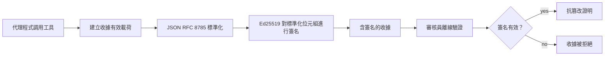
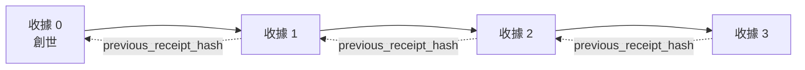

[觀看課程影片：使用加密收據確保 AI 代理安全](https://youtu.be/PLACEHOLDER_VIDEO_ID)

> _(課程影片與縮圖將由 Microsoft 內容團隊於合併後補上，符合第 14 / 15 課程的樣式。)_

# 使用加密收據確保 AI 代理安全

## 介紹

本課程涵蓋：

- 為什麼 AI 代理的審計追蹤對合規、除錯和信任很重要。
- 什麼是加密收據，及其與未簽署日誌行的不同。
- 如何用純 Python 為代理的工具呼叫產生簽署收據。
- 如何離線驗證收據及偵測竄改。
- 如何串接收據，使刪除或重排其中之一會破壞整個鏈條。
- 收據能證明什麼，以及明確無法證明什麼。

## 學習目標

完成本課程後，你將能：

- 辨識推動代理動作加密來源追蹤的失效模式。
- 產生基於標準 JSON 的 Ed25519 簽署收據。
- 僅用簽署者的公鑰獨立驗證收據。
- 重跑驗證以偵測篡改。
- 建立哈希鏈接的收據序列並解釋鏈的意義。
- 辨別收據證明範圍（歸屬、完整性、排序）與不證明的部分（動作正確性、政策合理性）。

## 問題：你的代理審計追蹤

想像你部署了一個 Contoso Travel 的 AI 代理。該代理讀取顧客請求，呼叫航班 API 查詢選項，並代表顧客訂位。上季該代理處理了 50,000 筆預訂。

今天一位稽核人員來了，他問一個簡單的問題：「給我看你的代理做了什麼。」

你交出日誌檔。稽核人員接著問更艱難的問題：「我怎麼知道這些日誌沒有被編輯過？」

這就是審計追蹤問題。現今多數代理部署依賴於：

- <strong>應用程式日誌</strong>：由代理自己寫入，任何擁有檔案系統存取的人可編輯。
- <strong>雲端記錄服務</strong>：在平台層級具防篡改性，但前提是稽核人員信任平台營運者。
- <strong>資料庫交易日誌</strong>：適合資料庫變更，但不適用於任意工具呼叫。

以上皆無法回答稽核人的問題而不需要他信任某人（你、你的雲端供應商、資料庫廠商）。對內部使用而言，這種信任通常可接受；但對受規範的工作負載（金融、醫療、或受歐盟 AI 法案管制者）則不然。

加密收據透過讓每個代理動作可獨立驗證來解決此問題。稽核人員不需信任你，只需要你的公鑰及收據本身。

## 什麼是加密收據？

收據是一個 JSON 物件，紀錄代理所進行的動作，並以數位簽章簽署。


```mermaid
flowchart LR
    A[代理程式調用工具] --> B[建立收據有效載荷]
    B --> C[JSON RFC 8785 標準化]
    C --> E[Ed25519 對標準化位元組進行簽名]
    E --> F[含簽名的收據]
    F --> G[審核員離線驗證]
    G --> H{簽名有效？}
    H -- yes --> I[抗篡改證明]
    H -- no --> J[收據被拒絕]
```

最簡單的收據看起來像這樣：

```json
{
  "type": "agent.tool_call.v1",
  "agent_id": "contoso-travel-bot",
  "tool_name": "lookup_flights",
  "tool_args_hash": "sha256:a3f9c1...",
  "result_hash": "sha256:7b2e1d...",
  "policy_id": "contoso-travel-policy-v3",
  "timestamp": "2026-04-25T14:30:00Z",
  "sequence": 47,
  "previous_receipt_hash": "sha256:9d4e6a...",
  "signature": {
    "alg": "EdDSA",
    "sig": "c5af83...",
    "public_key": "8f3b2c..."
  }
}
```

有三個特性在發揮作用：

1. <strong>簽章</strong>。收據由代理的閘道使用 Ed25519 私鑰簽署。任何擁有對應公鑰者都能離線驗證簽章。竄改任何欄位會使簽章失效。

2. <strong>標準化編碼</strong>。簽署前收據以 JSON 正規化方案（JCS，RFC 8785）序列化。確保兩個實作只要結果相同，輸出位元組完全一致。若無正規化，不同的 JSON 序列化器會為相同內容產生不同簽章。

3. <strong>哈希鍊接</strong>。`previous_receipt_hash` 欄位將每個收據與前一張收據連接。刪除或重排其中一張會破壞後續所有收據鏈。即使個別簽章被繞過，鍊狀結構仍能顯示竄改跡象。

這三項特性共同提供三重保證：

- <strong>歸屬</strong>：這組金鑰簽署了此內容。
- <strong>完整性</strong>：內容自簽署後未被更改。
- <strong>排序</strong>：此收據在鍊條中位於那張收據之後。

## 在 Python 裡產生收據

你不需要特殊函式庫就能產生收據。密碼學原語廣泛可用，而邏輯只需數十行 Python。

`code_samples/18-signed-receipts.ipynb` 的動手練習帶你逐步完成整個流程。摘要版本：

```python
import json
import hashlib
import base64
from nacl import signing
from jcs import canonicalize  # RFC 8785 規範的 JSON

def b64url_nopad(data: bytes) -> str:
    return base64.urlsafe_b64encode(data).decode("ascii").rstrip("=")

def sha256_canonical(obj) -> str:
    """SHA-256 of a Python object's JCS-canonical JSON form."""
    return f"sha256:{hashlib.sha256(canonicalize(obj)).hexdigest()}"

# 生成或載入簽名金鑰（於生產環境中，儲存在金鑰庫內）
signing_key = signing.SigningKey.generate()
verify_key = signing_key.verify_key

# 建立收據負載（尚未簽章）
tool_args = {"origin": "SYD", "destination": "LAX"}
tool_result = [{"flight": "QF11", "price": 1850, "stops": 0}]

payload = {
    "type": "agent.tool_call.v1",
    "agent_id": "contoso-travel-bot",
    "tool_name": "lookup_flights",
    "tool_args_hash": sha256_canonical(tool_args),
    "result_hash": sha256_canonical(tool_result),
    "policy_id": "contoso-travel-policy-v3",
    "timestamp": "2026-04-25T14:30:00Z",
    "sequence": 0,
    "previous_receipt_hash": None,
}

# 直接將 JCS 位元組標準化並簽名。PureEdDSA 會在內部進行雜湊。
canonical_bytes = canonicalize(payload)
signature_bytes = signing_key.sign(canonical_bytes).signature

# 附加結構化簽名物件。
receipt = {
    **payload,
    "signature": {
        "alg": "EdDSA",
        "sig": b64url_nopad(signature_bytes),
        "public_key": b64url_nopad(bytes(verify_key)),
    },
}
```

這就是整個簽署管線。筆記本中有逐步教學。

## 驗證收據及偵測竄改

驗證是逆向操作：

```python
import base64
import hashlib
from nacl import signing
from nacl.exceptions import BadSignatureError
from jcs import canonicalize

def b64url_decode(s: str) -> bytes:
    padding = "=" * ((4 - len(s) % 4) % 4)
    return base64.urlsafe_b64decode(s + padding)

def verify_receipt(receipt: dict) -> bool:
    # 簽名是一個結構化的物件：{"alg", "sig", "public_key"}。
    sig_obj = receipt.get("signature")
    if not sig_obj or sig_obj.get("alg") != "EdDSA":
        return False

    # 重建實際被簽署的負載（除了簽名之外的所有部分）。
    payload = {k: v for k, v in receipt.items() if k != "signature"}

    canonical_bytes = canonicalize(payload)

    try:
        verify_key = signing.VerifyKey(b64url_decode(sig_obj["public_key"]))
        verify_key.verify(canonical_bytes, b64url_decode(sig_obj["sig"]))
        return True
    except BadSignatureError:
        return False
```

該函式接收收據，如簽章有效則回傳 `True`，否則回傳 `False`。無網路呼叫、無服務依賴，也不需信任第三方。

要看到篡改偵測的實際運作，筆記本展示：

1. 產生有效收據並證實驗證成功。
2. 修改 `tool_args_hash` 欄位中一個位元組。
3. 重新驗證並看到失敗。

這是收據具篡改顯示性的實務示範：任何修改，不論多小，都會破壞簽章。

## 串接多步驟代理的收據

單一簽署收據保護一個動作，收據鏈則保護一連串動作。


```mermaid
flowchart LR
    R0[收據 0<br/>創世] --> R1[收據 1]
    R1 --> R2[收據 2]
    R2 --> R3[收據 3]
    R1 -. previous_receipt_hash .-> R0
    R2 -. previous_receipt_hash .-> R1
    R3 -. previous_receipt_hash .-> R2
```

每張收據記錄前一張收據的哈希。要悄悄刪掉第 2 張收據，攻擊者必須：

- 改變第 3 張收據的 `previous_receipt_hash` 欄位（將破壞第 3 張收據簽章），或
- 偽造修改後的第 3 張收據簽章（需持有代理私鑰）。

若私鑰存於硬體金鑰庫且公鑰隨各收據公開，以上攻擊均難以不被察覺。

筆記本演示：

1. 建立三張收據的鏈條。
2. 驗證每張收據的 `previous_receipt_hash` 均與前張收據真實哈希匹配。
3. 篡改中間一張收據，導致鏈條恰好在該處斷裂。

這就是如何產生一個外部稽核人可驗證且不用信任你的審計追蹤。

## 收據證明什麼（以及不證明什麼）

這是本課程最重要的章節。收據功能強大，但其能力有限。

**收據證明三件事：**

1. <strong>歸屬</strong>：特定金鑰簽署了特定負載。
2. <strong>完整性</strong>：負載自簽署後未被改變。
3. <strong>排序</strong>：此收據在哈希鏈中位於那收據之後。

**收據不證明：**

1. <strong>正確性</strong>：代理的動作是否正確。一張簽過收據可同樣簽署錯誤答案與正確答案。
2. <strong>政策遵循</strong>：`policy_id` 指定的政策是否實際被評估，或若評估是否會許可這個動作。收據記錄的是主張的內容，而非強制的結果。
3. <strong>金鑰以外的身份認證</strong>：收據說「這把金鑰簽署了這內容」，並非「某人類批准此事」。要把金鑰連結至人或組織，需另有身份基礎設施（如目錄或公鑰註冊）。
4. <strong>輸入真實性</strong>：若代理收到偽造提示並對其採取行動，收據忠實記錄該動作。收據在輸入驗證之後，而非驗證的替代品。

這個界限重要有兩個原因：

- 它告訴你收據的用途：使代理行為可審計且防竄改，即使跨組織界線。
- 它告訴你還需要哪些額外層級：輸入驗證（第 6 課）、政策執行（稍後簡介）、與身份基礎設施（本課程未涵蓋）。

常見誤解是認為「有了收據」就代表「被治理」。事實非然。收據是基礎，治理是你建立在其上的系統。

## 證明人類批准了確切行動

上述第 3 點值得單獨說明：動作收據表示「此金鑰簽署此內容」，但不表示「此人類批准此事」。對於高風險動作（退款、刪除、匯款），治理框架日益要求缺少的此類聲明，且可用本課程已有的原語產出。

後續筆記本 `code_samples/human-authorization-receipts.ipynb` 新增第二種類收據 `human.approval.v1`，與本課程收據同樣封套形態（用 Ed25519 標準簽署標準 JCS 負載，簽章物件在簽署的位元組外）。命名的批准者會在執行前簽署<strong>完整標準動作及其摘要</strong>；代理的動作收據攜帶<strong>同一行動摘要</strong>與一個 `parent_approval_ref`，即批准收據的 `receipt_hash`，類似你上面建立鏈中 `previous_receipt_hash` 的慣例。一次 `verify_chain` 能在<strong>不同已釘住的金鑰登錄檔</strong>（批准者金鑰 vs 代理金鑰）下同時驗證兩者，代理程式碼路徑共用但許可權完全分離。

謹慎陳述該特性：*人類批准了這個精確行動，且代理正執行該經批准的行動。* 筆記本裡的拒絕測試確認該屬性非口頭宣稱而是真實存在：

- 經典範疇：竄改、混淆代理、重播、雙方偽造金鑰、格式錯誤輸入；
- <strong>過期權限</strong>：簽章仍能驗證，但因政策版本更新、批准者金鑰從登錄中移除、或批准在執行前過期而拒絕；
- <strong>摘要替換</strong>：一張有效簽署的動作收據指向一個綁定<strong>不同標準動作</strong>的<em>真實</em>批准。

每個失敗都會以不同理由拒絕，稽核人員可藉此判斷權限是否過期或執行動作是否改變。筆記本教的規則是：簽署的批准本身不構成許可權。若兩張收據在執行時仍指向同一標準動作，許可權才存在。人類批准收據是本課程定義的教育組合，非 `draft-farley-acta-signed-receipts` 標準收據類型。

## 產品參考

本課程的 Python 程式碼刻意寫得簡潔，以便你閱讀每一行並清楚了解發生的事。正式環境有兩個選擇：

1. **直接基於密碼學原語開發。** 上面示範約 50 行，對多數用例已足夠。PyNaCl（Ed25519）和 `jcs` 套件（標準 JSON）皆為維護良好且經審計的函式庫。

2. **使用正式收據函式庫。** 多個開源專案實作相同模式且提供額外功能（金鑰輪替、批次驗證、JWK 集合散發、與政策引擎整合）：
   - 簽署流程採用一份獨立 IETF 網際網路草案（[`draft-farley-acta-signed-receipts`](https://datatracker.ietf.org/doc/draft-farley-acta-signed-receipts/)，第 02 版）的 JCS 和簽章範圍約定。本課程使用的扁平教育性收據與草案的 `{payload, signature}` 封套不同，且不宣稱符合該實作標準。草案發布共同符合度測試套件（[agent-governance-testvectors](https://github.com/ScopeBlind/agent-governance-testvectors)）供實作標的參照。
   - Microsoft Agent Governance Toolkit 將收據與 Cedar 基政策決策組合；該專案的教程 33 提供端對端範例。
   - `protect-mcp`（npm）與 `@veritasacta/verify`（npm）套件提供基於 Node 的收據簽署和離線驗證實作，能包裹任何 MCP 伺服器成防篡改審計追蹤，含擱置共簽流程，在該流程中暫停動作發出綁定行動摘要的批准收據（桌面流程中以 WebAuthn 支援），採用與上述人類授權筆記本相同批准收據模式。
   - **[nobulex](https://github.com/arian-gogani/nobulex)** Python SDK（`pip install nobulex`）在 Python 裡提供相同 Ed25519 + JCS 簽署模式，整合 LangChain 和 CrewAI，包含發布的交叉驗證測試向量及透過 [OWASP PR #2210](https://github.com/OWASP/CheatSheetSeries/pull/2210) 貢獻的合規映射。

自行實作與使用函式庫間的選擇，就如同自己寫 JWT 函式庫或用現有成熟函式庫一樣：兩者都合理；函式庫節省時間並減少審計範圍；自行寫則讓你了解每個原語。本課程教授自行寫法，讓你打好基礎，二擇其一。

## 知識測驗

在進入練習前測試你的理解。

**1. 收據用代理私鑰 Ed25519 簽署。稽核人員只有公鑰。稽核人員能離線驗證收據嗎？**

<details>
<summary>答案</summary>

可以。Ed25519 驗證只需公鑰與簽章位元組。無需網路呼叫或服務依賴。此特性使收據在隔離的多組織或低信任稽核場景中極具價值。
</details>

**2. 攻擊者修改收據的 `policy_id` 欄位，聲稱受到更寬鬆政策管轄。簽章是對原始負載簽署。驗證時會怎樣？**

<details>
<summary>答案</summary>


驗證失敗。簽名是針對原始負載的標準字節計算的；任何欄位的修改都會改變這些字節，使簽名無效。攻擊者需要私鑰才能產生新的有效簽名，但他們並沒有。
</details>

**3. 為什麼收據包含 `tool_args_hash` 和 `result_hash`，而不是原始參數和結果？**

<details>
<summary>答案</summary>

有兩個原因。首先，收據可能需要在洩漏原始內容（PII、商業資料）成為問題的環境中存檔或傳輸。雜湊保持收據大小小且內容私密；審核者會驗證雜湊是否與另行存放的實際內容相符。其次，雜湊大小固定；不論輸入輸出多大，帶雜湊的收據大小都有上限。
</details>

**4. `previous_receipt_hash` 欄位將每個收據與前一個收據串連。如果攻擊者從鏈中間靜默刪除一張收據，什麼會失效？**

<details>
<summary>答案</summary>

從被刪除收據之後的每張收據都會失效。它們的 `previous_receipt_hash` 欄位不再與實際鏈條相符（因為它們參考的收據不存在了，或鏈條改指不同前一個收據）。為了隱藏刪除，攻擊者必須重新簽署所有後續收據，這需要私鑰。
</details>

**5. 收據驗證通過。這是否證明代理的行為正確、合理，或符合政策？**

<details>
<summary>答案</summary>

不會。有效收據證明三件事：歸屬（此金鑰簽署此內容）、完整性（內容未被更改）與順序（此收據在另一收據之後）。它不證明行為正確，`policy_id` 指定的政策確實被評估，或代理遵守了所有規則。收據讓代理行為可審計，但不保證正確。這是本課最重要的界線。
</details>

## 練習題

打開 `code_samples/18-signed-receipts.ipynb` 並完成所有四個部分：

1. <strong>第一部分</strong>：簽署你的第一張收據並驗證它。
2. <strong>第二部分</strong>：篡改收據並觀察驗證失敗。
3. <strong>第三部分</strong>：建立三張收據串鏈並驗證鏈條完整性。
4. <strong>第四部分</strong>：將此模式應用於使用 Microsoft Agent Framework 建立的代理：用收據簽署包裝工具調用，然後獨立驗證收據。

**擴充挑戰 1：** 使用你自訂欄位擴展收據結構（例如用於追蹤的請求 ID），更新簽署的標準邏輯納入此欄位，並確認收據依然能通過驗證。然後在簽署後修改該欄位並確認驗證失敗。這迫使你理解標準編碼中每個字節如何影響簽名。

**擴充挑戰 2：** 將任兩張收據的標準字節串在一起取 SHA-256 雜湊，然後將結果摘要作為第三張收據中的新欄位，在簽署前嵌入其中。驗證三張收據依然能通過輪轉。你剛建立了一步包含證明：持有第三張收據者可證明前兩張收據在簽署時存在，且無需揭露其內容。這是選擇性揭露收據在大規模使用時的模式（Merkle 承諾，RFC 6962）。

## 結論

密碼學收據為 AI 代理提供了：

- <strong>獨立驗證</strong>：任何擁有公鑰者都可驗證，不依賴任何服務。
- <strong>防篡改</strong>：任何修改都使簽名無效。
- <strong>可攜帶</strong>：收據是小型 JSON 檔，可存檔、傳輸並在任何地方驗證。
- <strong>標準對齊</strong>：基於 Ed25519 (RFC 8032)、JCS (RFC 8785) 和 SHA-256，均為廣泛部署的原語。

它們不是輸入驗證、政策執行或身份基礎設施的替代品，而是這些層的基礎。當你將代理部署於受管制工作負載、多組織工作流或任何未來審計者不可假定信任你的場景時，收據讓審計軌跡誠實可靠。

最重要的要點：收據證明誰何時說了什麼，但不證明所說是正確或真實。要牢牢記住這一點。它是誠實來源系統與誤導系統的區別。

## 產線檢查清單

當你準備從此課程畢業，真正部署簽署收據的代理時：

- [ ] **不要將簽署金鑰存放在開發者筆電。** 使用 Azure Key Vault、AWS KMS 或硬體安全模組。用來簽署收據的私鑰絕不可出現在原始碼管控或明文存於應用機器中。
- [ ] **公開驗證用公鑰。** 審核者需離線驗證。標準作法是在 URL 標準位置發佈 JWK 集 (RFC 7517)，例如 `https://your-org.example.com/.well-known/agent-keys.json`。
- [ ] **外部錨定鏈條。** 定期將最新鏈頭雜湊寫入透明度日誌（Sigstore Rekor、RFC 3161 時戳授權或另一內部系統），以利外部方確認「此鏈當時存在」。
- [ ] **不可變存放收據。** 附加式 Blob 儲存（Azure Storage 不可變政策、AWS S3 物件鎖定）能防止內部人士於儲存層重寫歷史。
- [ ] **決定保存期限。** 多數合規制度要求多年留存。規劃收據體積成長（每張約 500 字節；代理每天 1 萬次呼叫約產生每年 1.8GB）。
- [ ] **文件化收據未涵蓋範圍。** 收據證明歸屬、完整性與順序。你的運行手冊應列明伴隨收據治理的其他控管（輸入驗證、政策執行、速率限制、身份基礎架構）。

### 還有關於保障 AI 代理的問題？

加入 [Microsoft Foundry Discord](https://aka.ms/ai-agents/discord) ，與學習者交流、參加辦公時間並獲得 AI 代理相關問題解答。

## 課程之後

本課涵蓋單張收據簽署與雜湊鏈序列。同樣原語可組成以下進階模式，隨治理成熟你或許會遇到：

- **選擇性揭露。** 當收據欄位獨立承諾時（RFC 6962 式 Merkle 樹），你可對指定審核者揭露特定欄位，同時證明其他欄位未改變但不揭露。適用於同張收據既需滿足完整審核，又需符合例如 GDPR 這類最小資料原則。
- **收據撤銷。** 若簽署金鑰外洩，需有機制將該金鑰簽署的收據標記為自某時間點起不可信。標準模式：短命簽署金鑰加發佈撤銷清單，或伴隨撤銷條目之透明日誌。
- **雙邊／分割簽署收據。** 某些實作將簽署負載分為執行前（`authorization_*`）與執行後（`result_*`）半部，分別簽署，適用於授權決策與結果由不同主體或在不同時刻產出者。可疊加於本課教的收據格式。
- **負載組合。** 收據封存你放入 `result_hash` 的所有字節。實務中負載往往比單純工具呼叫結果更豐富：決策前推理（模型預測、考慮選項、證據及完整性、風險態勢、問責鍊、控管結果）皆可放入負載，由單一收據封存。保持格式簡潔同時讓負載架構依領域演進。
- **跨實作相容。** 多種獨立實作（Python、TypeScript、Rust、Go）根據共用測試向量互驗。若你自行開發實作，驗證公開向量能確認線路相容。
- **後量子遷移。** Ed25519 廣泛部署，非量子抗性。收據格式算法靈活：`signature.alg` 欄位可帶 `ML-DSA-65`（NIST 後量子簽名標準），以利遷移。規劃雙重簽章過渡期。

## 額外資源

- <a href="https://datatracker.ietf.org/doc/draft-farley-acta-signed-receipts/" target="_blank">IETF 網際網路草案：機器對機器存取控制的簽署決定收據</a>
- <a href="https://learn.microsoft.com/azure/ai-studio/responsible-use-of-ai-overview" target="_blank">負責任 AI 概覽 (Azure AI)</a>
- <a href="https://datatracker.ietf.org/doc/html/rfc8032" target="_blank">RFC 8032: Edwards 曲線數位簽章演算法 (EdDSA)</a>
- <a href="https://datatracker.ietf.org/doc/html/rfc8785" target="_blank">RFC 8785: JSON 標準化方案 (JCS)</a>
- <a href="https://datatracker.ietf.org/doc/html/rfc6962" target="_blank">RFC 6962: 證書透明性</a>（選擇性揭露收據所用的 Merkle 樹結構）
- <a href="https://github.com/microsoft/agent-governance-toolkit/blob/main/docs/tutorials/33-offline-verifiable-receipts.md" target="_blank">Microsoft Agent Governance Toolkit 教學 33：離線可驗證決定收據</a>
- <a href="https://github.com/ScopeBlind/agent-governance-testvectors" target="_blank">本課程所用收據格式跨實作合規測試向量</a>（Apache-2.0）
- <a href="https://pynacl.readthedocs.io/" target="_blank">PyNaCl 文件</a>（Python 中的 Ed25519）

## 前一課

[建立本地 AI 代理](../17-creating-local-ai-agents/README.md)

---

<!-- CO-OP TRANSLATOR DISCLAIMER START -->
**免責聲明**：
此文件已使用 AI 翻譯服務 [Co-op Translator](https://github.com/Azure/co-op-translator) 進行翻譯。雖然我們努力追求準確性，但請注意自動翻譯可能包含錯誤或不準確之處。原始文件的母語版本應視為權威來源。對於關鍵資訊，建議採用專業人工翻譯。我們不對因使用此翻譯所產生的任何誤解或誤譯承擔責任。
<!-- CO-OP TRANSLATOR DISCLAIMER END -->