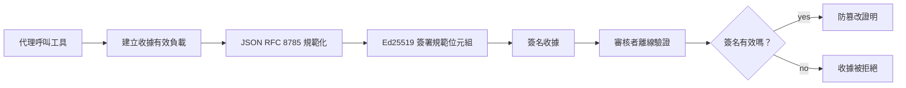
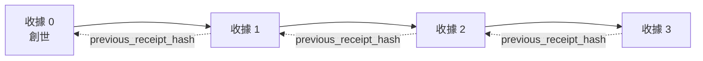

[觀看課程影片：使用密碼學收據保護 AI 代理](https://youtu.be/PLACEHOLDER_VIDEO_ID)

> _(課程影片和縮圖將由 Microsoft 內容團隊在合併後新增，符合第 14 / 15 課的樣式。)_

# 使用密碼學收據保護 AI 代理

## 介紹

本課程將涵蓋：

- 為什麼 AI 代理的審核軌跡對於合規、除錯和信任很重要。
- 什麼是密碼學收據，以及它與未簽署日誌行的差異。
- 如何使用純 Python 為代理的工具呼叫產生簽署的收據。
- 如何離線驗證收據並檢測竄改。
- 如何串連收據，使得刪除或重新排列其中一個會破壞鏈條。
- 收據能證明什麼，以及它們明確不證明什麼。

## 學習目標

完成本課程後，您將知道如何：

- 識別促使代理動作使用密碼學溯源的失效模式。
- 針對規範 JSON 有效負載，產生 Ed25519 簽署的收據。
- 僅使用簽署者的公鑰獨立驗證收據。
- 透過修改收據並重新驗證，檢測竄改。
- 建立收據的雜湊鏈序列，並解釋鏈條的重要性。
- 辨認收據證明的界限（歸屬、完整性、排序）及未證明的部分（動作的正確性、政策的合理性）。

## 問題：您代理的審計軌跡

假設您已部署一個 AI 代理給 Contoso 旅遊。該代理讀取客戶請求，呼叫航班 API 查詢選項，並代表客戶訂票。上季度，代理處理了 50,000 筆訂票。

今天一位審計員到場，提出一個簡單問題：「請展示您的代理做了什麼。」

您交出您的日誌檔案。審計員看過後，提出更難的問題：「我怎麼知道這些日誌沒有被編輯過？」

這就是審核軌跡問題。當前多數代理部署依賴於：

- <strong>應用程式日誌</strong>：由代理本身撰寫，任何有檔案系統存取權限者皆可編輯。
- <strong>雲端記錄服務</strong>：在平台層級防止竄改，但只有在審計者信任平台營運者的情況下有效。
- <strong>資料庫交易日誌</strong>：適合資料庫變更，但不適用於任意工具呼叫。

這些都無法在不要求審計者信任某人（您、您的雲服務提供者、您的資料庫供應商）的前提下回答問題。對於內部使用，這種信任通常是可接受的。但對受規範約束的工作負載（金融、醫療、受歐盟 AI 法案規範者），則不行。

密碼學收據透過使每個代理動作可獨立驗證來解決此問題。審計者不需信任您，只需您的公鑰與收據本身。

## 什麼是密碼學收據？

收據是記錄代理所做動作的 JSON 物件，並帶有數位簽章。


```mermaid
flowchart LR
    A[代理呼叫工具] --> B[建立收據有效負載]
    B --> C[JSON RFC 8785 規範化]
    C --> E[Ed25519 簽署規範位元組]
    E --> F[簽名收據]
    F --> G[審核者離線驗證]
    G --> H{簽名有效嗎？}
    H -- yes --> I[防篡改證明]
    H -- no --> J[收據被拒絕]
```

一個最簡單的收據看起來像這樣：

```json
{
  "type": "agent.tool_call.v1",
  "agent_id": "contoso-travel-bot",
  "tool_name": "lookup_flights",
  "tool_args_hash": "sha256:a3f9c1...",
  "result_hash": "sha256:7b2e1d...",
  "policy_id": "contoso-travel-policy-v3",
  "timestamp": "2026-04-25T14:30:00Z",
  "sequence": 47,
  "previous_receipt_hash": "sha256:9d4e6a...",
  "signature": {
    "alg": "EdDSA",
    "sig": "c5af83...",
    "public_key": "8f3b2c..."
  }
}
```

有三個屬性負責核心工作：

1. <strong>簽章</strong>。收據由代理網關使用 Ed25519 私鑰簽署。任何持有對應公鑰的人都可以離線驗證簽章。任一欄位竄改會使簽章無效。

2. <strong>規範編碼</strong>。簽署前，收據使用 JSON 規範化方案 (JCS, RFC 8785) 序列化。這確保兩個實現產生相同邏輯收據時，輸出字節相同。若無規範化，不同 JSON 序列化器會造成相同內容產生不同簽章。

3. <strong>雜湊鏈</strong>。`previous_receipt_hash` 欄位鏈接每個收據至前一個。刪除或調整某收據會破壞後面所有收據的有效性。即使略過個別簽章，竄改也能在鏈層面明顯顯現。

這些屬性共同提供三項保證：

- <strong>歸屬</strong>：此金鑰簽署了此內容。
- <strong>完整性</strong>：內容自簽署後未變更。
- <strong>排序</strong>：此收據在鏈中於該收據之後。

## 使用 Python 產生收據

產生收據不需特殊函式庫。密碼學原語廣泛存在，邏輯約幾十行 Python。

`code_samples/18-signed-receipts.ipynb` 的實作練習講解完整流程。簡要版本：

```python
import json
import hashlib
import base64
from nacl import signing
from jcs import canonicalize  # RFC 8785 規範的 JSON

def b64url_nopad(data: bytes) -> str:
    return base64.urlsafe_b64encode(data).decode("ascii").rstrip("=")

def sha256_canonical(obj) -> str:
    """SHA-256 of a Python object's JCS-canonical JSON form."""
    return f"sha256:{hashlib.sha256(canonicalize(obj)).hexdigest()}"

# 產生或載入簽章金鑰（生產環境中，應存放於金鑰保管庫）
signing_key = signing.SigningKey.generate()
verify_key = signing_key.verify_key

# 建立收據負載（尚未簽章）
tool_args = {"origin": "SYD", "destination": "LAX"}
tool_result = [{"flight": "QF11", "price": 1850, "stops": 0}]

payload = {
    "type": "agent.tool_call.v1",
    "agent_id": "contoso-travel-bot",
    "tool_name": "lookup_flights",
    "tool_args_hash": sha256_canonical(tool_args),
    "result_hash": sha256_canonical(tool_result),
    "policy_id": "contoso-travel-policy-v3",
    "timestamp": "2026-04-25T14:30:00Z",
    "sequence": 0,
    "previous_receipt_hash": None,
}

# 直接對 JCS 位元組進行規範化與簽章。PureEdDSA 會內部進行雜湊。
canonical_bytes = canonicalize(payload)
signature_bytes = signing_key.sign(canonical_bytes).signature

# 附加結構化的簽章物件。
receipt = {
    **payload,
    "signature": {
        "alg": "EdDSA",
        "sig": b64url_nopad(signature_bytes),
        "public_key": b64url_nopad(bytes(verify_key)),
    },
}
```

這就是整個簽署流程。筆記中練習將演示每步驟。

## 驗證收據與檢測竄改

驗證是反向操作：

```python
import base64
import hashlib
from nacl import signing
from nacl.exceptions import BadSignatureError
from jcs import canonicalize

def b64url_decode(s: str) -> bytes:
    padding = "=" * ((4 - len(s) % 4) % 4)
    return base64.urlsafe_b64decode(s + padding)

def verify_receipt(receipt: dict) -> bool:
    # 簽名是一個結構化物件：{"alg", "sig", "public_key"}。
    sig_obj = receipt.get("signature")
    if not sig_obj or sig_obj.get("alg") != "EdDSA":
        return False

    # 重建實際被簽署的有效載荷（除簽名之外的所有部分）。
    payload = {k: v for k, v in receipt.items() if k != "signature"}

    canonical_bytes = canonicalize(payload)

    try:
        verify_key = signing.VerifyKey(b64url_decode(sig_obj["public_key"]))
        verify_key.verify(canonical_bytes, b64url_decode(sig_obj["sig"]))
        return True
    except BadSignatureError:
        return False
```

此函數接受收據並在簽章有效時回傳 `True`，否則回傳 `False`。無需網路呼叫、無服務依賴、無須信任第三方。

筆記示範如何檢測竄改：

1. 產生有效收據與確認能驗證。
2. 修改 `tool_args_hash` 欄位的一個位元組。
3. 重新驗證並看到失敗。

這是收據防篡改的實務展示：任何修改，不論大小，均破壞簽章。

## 為多步驟代理串接收據

單一簽署收據保護一個動作，一串收據保護一序列。


```mermaid
flowchart LR
    R0[收據 0<br/>創世] --> R1[收據 1]
    R1 --> R2[收據 2]
    R2 --> R3[收據 3]
    R1 -. previous_receipt_hash .-> R0
    R2 -. previous_receipt_hash .-> R1
    R3 -. previous_receipt_hash .-> R2
```

每個收據記錄前一個收據的雜湊。攻擊者若想悄悄刪除收據 2，必須：

- 修改收據 3 的 `previous_receipt_hash` 欄位（破壞收據 3 的簽章），或
- 偽造修改後收據 3 的新簽章（需取得代理私鑰）。

若私鑰存放於硬體密鑰保管庫，且您隨每張收據公布公鑰，這兩種攻擊均無法不被偵測。

筆記將示範：

1. 建立三張收據鏈。
2. 驗證每張收據的 `previous_receipt_hash` 是否與前一收據的實際雜湊相符。
3. 在中間竄改一張收據，並看到鏈條準確在該點斷裂。

這是產生外部審計者可驗證且無需信任您的審計軌跡的方法。

## 收據能證明（及無法證明）什麼

這是本課最重要章節。收據強大，但其能力有限。

**收據證明三件事：**

1. <strong>歸屬</strong>：特定金鑰簽署特定有效負載。
2. <strong>完整性</strong>：有效負載自簽署後未變更。
3. <strong>排序</strong>：此收據在雜湊鏈中於該收據之後。

**收據不證明：**

1. <strong>正確性</strong>：代理動作是否正確。收據可用於錯誤答案簽署，效果和正確答案一樣乾淨。
2. <strong>政策合規</strong>：`policy_id` 中的政策是否真的評估過，或若檢查會否允許此動作。收據紀錄所宣稱內容，不是執行內容。
3. <strong>鑰匙以外的身份</strong>：收據只說「此金鑰簽署此內容」，不代表「此人授權」。連結金鑰到人或組織需另建身分基礎設施（目錄、公鑰註冊等）。
4. <strong>輸入真實性</strong>：若代理收到已竄改的提示並據此行動，收據真實記錄該行動。收據屬於輸入驗證後端，不是取代方案。

這個界限重要有兩原因：

- 它告訴您收據用途：使代理行為可審核且篡改可見，即使跨組織邊界。
- 它告訴您還需哪些額外層級：輸入驗證（第 6 課）、政策執行（下文簡述）與身分基礎架構（本課不涵蓋）。

常見誤解是以為「我們有收據」=「我們有治理」。其實不然。收據是基礎。治理是您建立在它之上的系統。

## 證明人類批准了具體動作

前述第 3 點值得獨立章節：一個動作收據說「此金鑰簽署此內容」，從不說「一個人授權了」。對高風險動作（退款、刪除、電匯），治理架構越來越要求正是這種缺失的陳述，且可用本課已建構的相同原語產生。

後續筆記 `code_samples/human-authorization-receipts.ipynb` 增加第二種收據，`human.approval.v1`，與本課收據同形（帶型別的有效負載，用 Ed25519 針對其規範 JCS 位元組簽署，簽章物件 `signature` 位於被簽署位元組外）。指定簽署者在執行前簽署<strong>完整規範動作及其摘要</strong>；代理動作收據攜帶<strong>相同動作摘要</strong>與 `parent_approval_ref`，為該批准的 `receipt_hash`，使用與你在鏈中建構的 `previous_receipt_hash` 同樣慣例。`verify_chain` 一次走訪兩者，在<strong>分別固定的金鑰目錄</strong>下（批准者金鑰與代理金鑰），共用程式路徑但權限各異。

精心表述這個屬性：*人類批准了此精確動作，代理確實執行該被批准動作。* 筆記的拒絕執行用例確保此屬性為真而非單純主張：

- 經典問題集：竄改、混淆授權、重播、雙方偽造金鑰、格式錯誤輸入；
- <strong>過期權限</strong>：簽章仍可驗證，但因政策版本遷移、批准者金鑰從固定目錄中移除，或批准過期導致被拒絕；
- <strong>摘要替換</strong>：針對<em>真實</em>批准指向<em>不同</em>規範動作的有效簽署動作收據。

每種失效都伴有獨特拒絕理由，讓審計者得知權限是否過期或執行動作是否被更改。筆記教授的規則是：簽署的批准本身不是權限。權限存在是當兩張收據仍於執行時綁定同一規範動作。人類批准收據為本課定義的教學組合，不是 `draft-farley-acta-signed-receipts` 定義的收據類型。

## 生產參考

本課 Python 程式碼故意簡潔，讓您閱讀每一行，精確理解運作。生產環境有兩種選擇：

1. **直接建立於密碼學原語之上。** 上方約 50 行足以滿足多數用途。PyNaCl (Ed25519) 與 `jcs` 套件（規範 JSON）均為維護良好且經過審計的函式庫。

2. **使用生產級收據函式庫。** 多個開源專案實作相同模式，附加其他功能（密鑰輪替、批次驗證、JWK 集分發、與政策引擎整合）：
   - 簽署流程採用獨立 IETF 草案 ([`draft-farley-acta-signed-receipts`](https://datatracker.ietf.org/doc/draft-farley-acta-signed-receipts/)，修訂版 02) 的 JCS 與簽章範圍慣例。本課教育用途的扁平收據與草案的 `{payload, signature}` 信封不同，非合規實作。該草案發布共享合規測試套件([agent-governance-testvectors](https://github.com/ScopeBlind/agent-governance-testvectors))，供實作其線格式使用。
   - Microsoft Agent Governance Toolkit 用 Cedar-based 政策決策組合收據；該儲存庫的教學 33 展示端到端範例。
   - `protect-mcp` (npm) 與 `@veritasacta/verify` (npm) 套件提供基於 Node 的收據簽署與離線驗證實作，目標在包裝任何 MCP 伺服器以產生防篡改稽核軌跡，包括中止共簽流程，該流程中暫停動作發出綁定於動作摘要的批准收據（桌面流程中透過 WebAuthn 保障），與上方人類授權筆記同樣的批准收據模式。
   - **[nobulex](https://github.com/arian-gogani/nobulex)** Python SDK（`pip install nobulex`）提供相同 Ed25519 + JCS 簽署模式及 LangChain 與 CrewAI 整合，含發佈交叉驗證測試向量及透過 [OWASP PR #2210](https://github.com/OWASP/CheatSheetSeries/pull/2210) 貢獻的合規映射。

自行實作與使用函式庫的抉擇，類似寫自己 JWT 函式庫或使用現成的決定：兩者合理；函式庫節省時間並降低審計範圍；從零開始逼你理解每個原始操作。這課教授從零開始路徑，為您建立任選其一的基礎。

## 知識檢測

請在進入實作練習前測試您的理解。

**1. 收據由代理的 Ed25519 私鑰簽署。審計者僅有公鑰。審計者能否離線驗證收據？**

<details>
<summary>答案</summary>

能。Ed25519 驗證僅需公鑰與簽署位元組。無需網路呼叫，無服務依賴。此特性使收據在隔離網路、多組織或低信任審計環境中仍能發揮效用。
</details>

**2. 攻擊者修改收據的 `policy_id` 欄位，聲稱受較寬鬆政策管控。簽章卻是原始有效負載的。驗證時會發生什麼？**

<details>
<summary>答案</summary>


驗證失敗。簽名是對原始有效負載的標準字節計算出來的；修改任一欄位都會改變這些字節，導致簽名失效。攻擊者需要私鑰才能生成有效的新簽名，但他們並不擁有私鑰。
</details>

**3. 為什麼收據包含 `tool_args_hash` 和 `result_hash`，而不是原始參數和結果？**

<details>
<summary>回答</summary>

有兩個原因。首先，收據可能需要存檔或在某些環境中傳輸，此時洩露原始內容（個人識別資訊、商業資料）會有問題。透過雜湊可以保持收據尺寸小且內容隱私；審核者可驗證雜湊是否與其他儲存的實際內容副本匹配。其次，雜湊大小固定；即使輸入和輸出很大，收據仍有大小上限。
</details>

**4. `previous_receipt_hash` 欄位將每張收據與前一張串連。若攻擊者在鏈中間靜默刪除一張收據，會導致什麼無效？**

<details>
<summary>回答</summary>

刪除後，之後的每張收據都會失效。它們的 `previous_receipt_hash` 不再符合實際鏈結（因為被引用的收據不存在了，或鏈指向了不同的前身）。要隱藏刪除行為，攻擊者必須重新簽署之後的每張收據，這需要私鑰。
</details>

**5. 收據驗證成功，是否證明代理的行動是正確、合理或符合法規？**

<details>
<summary>回答</summary>

不。有效收據證明三件事：歸屬（此金鑰簽署此內容）、完整性（內容未被更動）、順序（此收據排在另一收據之後）。它不證明行動正確、`policy_id` 指定的政策被評估，或代理遵守所有規則。收據使代理行為可審核，不代表其必然正確。這是本課最重要的界限。
</details>

## 練習練習題

打開 `code_samples/18-signed-receipts.ipynb` 並完成以下四節：

1. <strong>第一節</strong>：簽署你的第一張收據並驗證它。
2. <strong>第二節</strong>：篡改收據並觀察驗證失敗。
3. <strong>第三節</strong>：建立三張收據組成的鏈，並驗證鏈的完整性。
4. <strong>第四節</strong>：將此模式應用至使用 Microsoft Agent Framework 建立的代理：在工具調用時簽署收據，然後獨立驗證該收據。

**進階挑戰 1：** 在收據結構中新增你自訂的欄位（例如，用於追蹤的請求 ID），更新標準簽署邏輯包含此欄位，並確認收據仍能順利通驗。接著在簽署後修改欄位並確認驗證失敗。這強迫你理解標準編碼的每一個位元如何影響簽名。

**進階挑戰 2：** 將你的兩張收據的標準字節串串連後經 SHA-256 雜湊，將所得雜湊當作第三張收據新欄位並簽署。驗證三張收據仍能順利通驗。你剛剛製作了一個一步包含證明：任何持有第三張收據的人都能證明第一、二張收據在第三張簽署時存在，無需洩露它們內容。這是選擇性揭露收據在大規模環境的運用模式（Merkle 承諾，RFC 6962）。

## 結語

加密收據為 AI 代理提供一條可供審核的記錄，特點如下：

- <strong>可獨立驗證</strong>：任何擁有公鑰者都能驗證，無需服務依賴。
- <strong>篡改可察覺</strong>：任何修改都將使簽名無效。
- <strong>便攜</strong>：收據是小型 JSON 檔；可存檔、傳輸並隨處驗證。
- <strong>標準對齊</strong>：基於 Ed25519 (RFC 8032)、JCS (RFC 8785) 和 SHA-256，皆為廣泛部署的基元。

它們不可替代輸入驗證、政策執行或身份基礎設施，但為這些層提供基礎。當你在受管控工作負載、多組織工作流，或任何未必能被未來稽核者信任的環境部署代理時，收據即是你保持審核軌跡誠實的手段。

最重要的結論是：收據證明了誰在何時說了什麼，它們不證明所言為真或正確。務必緊握這個差異，它是區分誠實可信的溯源系統與誤導性系統的關鍵。

## 生產部署清單

當你準備從本課進階至真實環境部署簽收據的代理時：

- [ ] **將簽名私鑰移出開發者筆電。** 使用 Azure 金鑰保管庫、AWS KMS，或硬體安全模組。用於簽署收據的私鑰不得出現在原始碼管理或明文出現在應用伺服器。
- [ ] **公開驗證公鑰。** 審核者需離線驗證。標準做法是於已知 URL（RFC 7517）發佈 JWK 集，例如 `https://your-org.example.com/.well-known/agent-keys.json`。
- [ ] **外部錨定鏈結。** 週期性將最新鏈頭雜湊寫入透明日志（Sigstore Rekor、RFC 3161 時間戳權威或第二套內部系統），讓外部方可確認「此鏈在此時間存在」。
- [ ] **不可變存儲收據。** 使用僅附加型 Blob 儲存（Azure Storage 的不可變策略、AWS S3 Object Lock）防止內部人於存儲層重寫歷史。
- [ ] **決定保存期限。** 多數合規機制要求多年保存。規劃收據成長（每張約 500 位元組；一個代理每天執行 10K 次呼叫約產生 1.8 GB/年）。
- [ ] **記錄收據無涵蓋範圍。** 收據證明歸屬、完整性與順序。你的運行手冊中應明確列出輸入驗證、政策執行、頻率限制、身份基礎設施等管控與收據並存的治理態勢。

### 你還想知道更多關於保障 AI 代理安全的事嗎？

加入 [Microsoft Foundry Discord](https://aka.ms/ai-agents/discord) 與其他學習者互動，參加辦公時間，並獲得 AI 代理相關問題的解答。

## 課程之外

本課涵蓋單張收據簽署與雜湊鏈序列。這些基元組合形成你治理態勢成熟後可能遇到的幾個進階模式：

- **選擇性揭露。** 當收據欄位獨立承諾（RFC 6962 風格的 Merkle 樹）時，你可以向特定審核方揭露部分欄位並證明其他欄位未變，而不露出內容。適用於同一張收據必須滿足全面審核（要求完整性）與資料最小化法規如 GDPR（審核員只看必要部分）。
- **收據撤銷。** 若簽名金鑰被竊，需要在一個時間點起標示該金鑰簽署的收據皆不可信。標準模式為短期簽名金鑰與公開撤銷清單，或透明日志載有撤銷條目。
- **雙向／分拆簽名收據。** 有些實作將簽署的有效負載拆成執行前 (`authorization_*`) 和執行後 (`result_*`) 兩半，各自獨立簽名，適用於授權決策與觀察結果由不同角色或時間產生。此模式可與本課教的收據格式加成。
- **有效負載組合。** 收據封印你放入 `result_hash` 的字節。實際負載往往比單一工具呼叫結果更豐富：決策前推理（模型預測、考慮選項、證據及其完整度、風險狀態、問責鏈、關卡結果）均可封入有效負載並由單一收據保證。此法使收據格式保持簡潔同時讓負載模式隨領域進化。
- **跨實作一致性。** 多種獨立實作使用相同收據格式（Python、TypeScript、Rust、Go）對共享測試向量互相驗證。自行開發時對照公開向量確認協定兼容性。
- **後量子遷移。** Ed25519 目前廣泛部署但非量子抗性。收據格式支援算法機動性：`signature.alg` 欄位可攜帶 `ML-DSA-65`（NIST 後量子簽名標準）以便遷移。規劃一段收據雙簽期。

## 額外資源

- <a href="https://datatracker.ietf.org/doc/draft-farley-acta-signed-receipts/" target="_blank">IETF 網際網路草案：機器對機器存取控制的簽名決策收據</a>
- <a href="https://learn.microsoft.com/azure/ai-studio/responsible-use-of-ai-overview" target="_blank">負責任的 AI 概覽（Azure AI）</a>
- <a href="https://datatracker.ietf.org/doc/html/rfc8032" target="_blank">RFC 8032：Edwards 曲線數位簽名算法 (EdDSA)</a>
- <a href="https://datatracker.ietf.org/doc/html/rfc8785" target="_blank">RFC 8785：JSON 標準化方案 (JCS)</a>
- <a href="https://datatracker.ietf.org/doc/html/rfc6962" target="_blank">RFC 6962：憑證透明度</a>（選擇性揭露收據使用的 Merkle 樹構造）
- <a href="https://github.com/microsoft/agent-governance-toolkit/blob/main/docs/tutorials/33-offline-verifiable-receipts.md" target="_blank">Microsoft Agent Governance Toolkit，教學 33：離線可驗決策收據</a>
- <a href="https://github.com/ScopeBlind/agent-governance-testvectors" target="_blank">本課程使用的收據格式跨實作一致性測試向量（Apache-2.0）</a>
- <a href="https://pynacl.readthedocs.io/" target="_blank">PyNaCl 文件（Python 中的 Ed25519）</a>

## 上一課

[建立本地 AI 代理](../17-creating-local-ai-agents/README.md)

---

<!-- CO-OP TRANSLATOR DISCLAIMER START -->
**免責聲明**：
此文件已使用 AI 翻譯服務 [Co-op Translator](https://github.com/Azure/co-op-translator) 進行翻譯。雖然我們努力追求準確性，但請注意自動翻譯可能包含錯誤或不準確之處。原始文件的母語版本應視為權威來源。對於關鍵資訊，建議採用專業人工翻譯。我們不對因使用此翻譯所產生的任何誤解或誤譯承擔責任。
<!-- CO-OP TRANSLATOR DISCLAIMER END -->