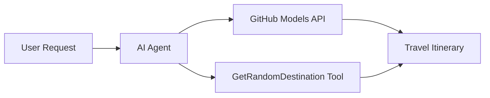

<!--
CO_OP_TRANSLATOR_METADATA:
{
  "original_hash": "23afd9be7b6ba5b69a44c3b6a78e07f6",
  "translation_date": "2025-11-06T10:02:00+00:00",
  "source_file": "01-intro-to-ai-agents/code_samples/01-dotnet-agent-framework.md",
  "language_code": "zh"
}
-->
# 🌍 使用 Microsoft Agent Framework (.NET) 的 AI旅行助手

## 📋 场景概述

本笔记展示了如何使用 Microsoft Agent Framework for .NET 构建一个智能旅行规划助手。该助手可以自动为全球随机目的地生成个性化的一日游行程。

**主要功能：**
- 🎲 **随机目的地选择**：使用自定义工具选择度假地点
- 🗺️ **智能旅行规划**：创建详细的每日行程
- 🔄 **实时流式响应**：支持即时和流式响应
- 🛠️ **自定义工具集成**：展示如何扩展助手功能

## 🔧 技术架构

### 核心技术
- **Microsoft Agent Framework**：用于开发 AI 助手的最新 .NET 实现
- **GitHub 模型集成**：使用 GitHub 的 AI 模型推理服务
- **OpenAI API 兼容性**：利用 OpenAI 客户端库和自定义端点
- **安全配置**：基于环境的 API 密钥管理

### 关键组件
1. **AIAgent**：主要的助手协调器，负责对话流程
2. **自定义工具**：提供给助手的 `GetRandomDestination()` 函数
3. **聊天客户端**：基于 GitHub 模型的对话界面
4. **流式支持**：实时响应生成功能

### 集成模式


## 🚀 快速开始

**前提条件：**
- .NET 10.0 或更高版本
- GitHub Models API 访问令牌
- 在 `.env` 文件中配置环境变量

**所需环境变量：**
```env
GITHUB_TOKEN=your_github_token
GITHUB_ENDPOINT=https://models.inference.ai.azure.com
GITHUB_MODEL_ID=gpt-4o-mini
```

按顺序运行以下代码示例，查看旅行助手的实际效果！

---

## .NET 单文件应用：AI旅行助手示例

查看 `01-dotnet-agent-framework.cs` 获取完整的可运行代码示例。

```bash
dotnet run 01-dotnet-agent-framework.cs
```

### 示例代码

```csharp
static string GetRandomDestination()
{
    var destinations = new List<string>
    {
        "Paris, France",
        "Tokyo, Japan",
        "New York City, USA",
        "Sydney, Australia",
        "Rome, Italy",
        "Barcelona, Spain",
        "Cape Town, South Africa",
        "Rio de Janeiro, Brazil",
        "Bangkok, Thailand",
        "Vancouver, Canada"
    };
    var random = new Random();
    int index = random.Next(destinations.Count);
    return destinations[index];
}

// Extract configuration from environment variables
var github_endpoint = Environment.GetEnvironmentVariable("GITHUB_ENDPOINT") ?? throw new InvalidOperationException("GITHUB_ENDPOINT is not set.");
var github_model_id = Environment.GetEnvironmentVariable("GITHUB_MODEL_ID") ?? "gpt-4o-mini";
var github_token = Environment.GetEnvironmentVariable("GITHUB_TOKEN") ?? throw new InvalidOperationException("GITHUB_TOKEN is not set.");

// Configure OpenAI Client Options
var openAIOptions = new OpenAIClientOptions()
{
    Endpoint = new Uri(github_endpoint)
};

// Initialize OpenAI Client with GitHub Models Configuration
var openAIClient = new OpenAIClient(new ApiKeyCredential(github_token), openAIOptions);

// Create AI Agent with Travel Planning Capabilities
AIAgent agent = openAIClient
    .GetChatClient(github_model_id)
    .CreateAIAgent(
        instructions: "You are a helpful AI Agent that can help plan vacations for customers at random destinations",
        tools: [AIFunctionFactory.Create(GetRandomDestination)]
    );

// Execute Agent: Plan a Day Trip (Non-Streaming)
Console.WriteLine(await agent.RunAsync("Plan me a day trip"));

// Execute Agent: Plan a Day Trip (Streaming Response)
await foreach (var update in agent.RunStreamingAsync("Plan me a day trip"))
{
    Console.Write(update);
}
```

---

**免责声明**：  
本文档使用AI翻译服务[Co-op Translator](https://github.com/Azure/co-op-translator)进行翻译。尽管我们努力确保翻译的准确性，但请注意，自动翻译可能包含错误或不准确之处。原始语言的文档应被视为权威来源。对于关键信息，建议使用专业人工翻译。我们对因使用此翻译而产生的任何误解或误读不承担责任。