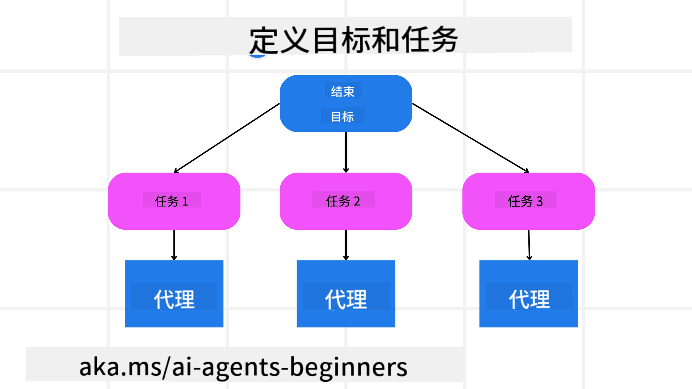

<!--
CO_OP_TRANSLATOR_METADATA:
{
  "original_hash": "43069833a0412210ad5c3cc93d9c2146",
  "translation_date": "2025-09-18T14:18:06+00:00",
  "source_file": "07-planning-design/README.md",
  "language_code": "zh"
}
-->
[](https://youtu.be/kPfJ2BrBCMY?si=9pYpPXp0sSbK91Dr)

> _(点击上方图片观看本课视频)_

# 规划设计

## 介绍

本课将涵盖以下内容：

* 定义清晰的总体目标，并将复杂任务分解为可管理的任务。
* 利用结构化输出以获得更可靠且机器可读的响应。
* 应用事件驱动的方法来处理动态任务和意外输入。

## 学习目标

完成本课后，您将了解以下内容：

* 为 AI 代理设定并明确总体目标，确保其清楚需要完成的任务。
* 将复杂任务分解为可管理的子任务，并将其组织成逻辑顺序。
* 为代理配备合适的工具（如搜索工具或数据分析工具），决定何时以及如何使用这些工具，并处理可能出现的意外情况。
* 评估子任务的结果、衡量性能，并迭代行动以改进最终输出。

## 定义总体目标并分解任务



大多数现实世界的任务过于复杂，无法一步完成。AI 代理需要一个简明的目标来指导其规划和行动。例如，考虑以下目标：

    "生成一个为期三天的旅行行程。"

虽然目标表述简单，但仍需进一步细化。目标越清晰，代理（以及任何人类协作者）就越能专注于实现正确的结果，例如创建一个包含航班选项、酒店推荐和活动建议的全面行程。

### 任务分解

将大型或复杂任务分解为更小、更具目标导向的子任务，可以使任务更易管理。
以旅行行程为例，您可以将目标分解为以下子任务：

* 航班预订
* 酒店预订
* 租车服务
* 个性化定制

每个子任务可以由专门的代理或流程来完成。例如，一个代理可能专注于搜索最佳航班优惠，另一个代理专注于酒店预订，等等。一个协调或“下游”代理可以将这些结果整合成一个连贯的行程提供给最终用户。

这种模块化方法还允许逐步改进。例如，您可以添加专门的代理来提供餐饮推荐或本地活动建议，并随着时间推移不断优化行程。

### 结构化输出

大型语言模型（LLMs）可以生成结构化输出（例如 JSON），这更便于下游代理或服务解析和处理。这在多代理环境中特别有用，因为我们可以在收到规划输出后执行这些任务。以下是一个快速概览：

以下 Python 代码片段展示了一个简单的规划代理如何将目标分解为子任务并生成结构化计划：

```python
from pydantic import BaseModel
from enum import Enum
from typing import List, Optional, Union
import json
import os
from typing import Optional
from pprint import pprint
from autogen_core.models import UserMessage, SystemMessage, AssistantMessage
from autogen_ext.models.azure import AzureAIChatCompletionClient
from azure.core.credentials import AzureKeyCredential

class AgentEnum(str, Enum):
    FlightBooking = "flight_booking"
    HotelBooking = "hotel_booking"
    CarRental = "car_rental"
    ActivitiesBooking = "activities_booking"
    DestinationInfo = "destination_info"
    DefaultAgent = "default_agent"
    GroupChatManager = "group_chat_manager"

# Travel SubTask Model
class TravelSubTask(BaseModel):
    task_details: str
    assigned_agent: AgentEnum  # we want to assign the task to the agent

class TravelPlan(BaseModel):
    main_task: str
    subtasks: List[TravelSubTask]
    is_greeting: bool

client = AzureAIChatCompletionClient(
    model="gpt-4o-mini",
    endpoint="https://models.inference.ai.azure.com",
    # To authenticate with the model you will need to generate a personal access token (PAT) in your GitHub settings.
    # Create your PAT token by following instructions here: https://docs.github.com/en/authentication/keeping-your-account-and-data-secure/managing-your-personal-access-tokens
    credential=AzureKeyCredential(os.environ["GITHUB_TOKEN"]),
    model_info={
        "json_output": False,
        "function_calling": True,
        "vision": True,
        "family": "unknown",
    },
)

# Define the user message
messages = [
    SystemMessage(content="""You are an planner agent.
    Your job is to decide which agents to run based on the user's request.
                      Provide your response in JSON format with the following structure:
{'main_task': 'Plan a family trip from Singapore to Melbourne.',
 'subtasks': [{'assigned_agent': 'flight_booking',
               'task_details': 'Book round-trip flights from Singapore to '
                               'Melbourne.'}
    Below are the available agents specialised in different tasks:
    - FlightBooking: For booking flights and providing flight information
    - HotelBooking: For booking hotels and providing hotel information
    - CarRental: For booking cars and providing car rental information
    - ActivitiesBooking: For booking activities and providing activity information
    - DestinationInfo: For providing information about destinations
    - DefaultAgent: For handling general requests""", source="system"),
    UserMessage(
        content="Create a travel plan for a family of 2 kids from Singapore to Melboune", source="user"),
]

response = await client.create(messages=messages, extra_create_args={"response_format": 'json_object'})

response_content: Optional[str] = response.content if isinstance(
    response.content, str) else None
if response_content is None:
    raise ValueError("Response content is not a valid JSON string" )

pprint(json.loads(response_content))

# # Ensure the response content is a valid JSON string before loading it
# response_content: Optional[str] = response.content if isinstance(
#     response.content, str) else None
# if response_content is None:
#     raise ValueError("Response content is not a valid JSON string")

# # Print the response content after loading it as JSON
# pprint(json.loads(response_content))

# Validate the response content with the MathReasoning model
# TravelPlan.model_validate(json.loads(response_content))
```

### 具有多代理编排的规划代理

在此示例中，一个语义路由代理接收到用户请求（例如，“我需要一个旅行的酒店计划。”）。

规划器的工作流程如下：

* 接收酒店计划：规划器接收用户的消息，并基于系统提示（包括可用代理的详细信息）生成一个结构化的旅行计划。
* 列出代理及其工具：代理注册表包含代理列表（例如航班、酒店、租车和活动代理）以及它们提供的功能或工具。
* 将计划路由到相应的代理：根据子任务的数量，规划器要么将消息直接发送给专门的代理（用于单任务场景），要么通过群聊管理器协调多代理协作。
* 总结结果：最后，规划器总结生成的计划以便于理解。
以下 Python 代码示例展示了这些步骤：

```python

from pydantic import BaseModel

from enum import Enum
from typing import List, Optional, Union

class AgentEnum(str, Enum):
    FlightBooking = "flight_booking"
    HotelBooking = "hotel_booking"
    CarRental = "car_rental"
    ActivitiesBooking = "activities_booking"
    DestinationInfo = "destination_info"
    DefaultAgent = "default_agent"
    GroupChatManager = "group_chat_manager"

# Travel SubTask Model

class TravelSubTask(BaseModel):
    task_details: str
    assigned_agent: AgentEnum # we want to assign the task to the agent

class TravelPlan(BaseModel):
    main_task: str
    subtasks: List[TravelSubTask]
    is_greeting: bool
import json
import os
from typing import Optional

from autogen_core.models import UserMessage, SystemMessage, AssistantMessage
from autogen_ext.models.openai import AzureOpenAIChatCompletionClient

# Create the client with type-checked environment variables

client = AzureOpenAIChatCompletionClient(
    azure_deployment=os.getenv("AZURE_OPENAI_DEPLOYMENT_NAME"),
    model=os.getenv("AZURE_OPENAI_DEPLOYMENT_NAME"),
    api_version=os.getenv("AZURE_OPENAI_API_VERSION"),
    azure_endpoint=os.getenv("AZURE_OPENAI_ENDPOINT"),
    api_key=os.getenv("AZURE_OPENAI_API_KEY"),
)

from pprint import pprint

# Define the user message

messages = [
    SystemMessage(content="""You are an planner agent.
    Your job is to decide which agents to run based on the user's request.
    Below are the available agents specialized in different tasks:
    - FlightBooking: For booking flights and providing flight information
    - HotelBooking: For booking hotels and providing hotel information
    - CarRental: For booking cars and providing car rental information
    - ActivitiesBooking: For booking activities and providing activity information
    - DestinationInfo: For providing information about destinations
    - DefaultAgent: For handling general requests""", source="system"),
    UserMessage(content="Create a travel plan for a family of 2 kids from Singapore to Melbourne", source="user"),
]

response = await client.create(messages=messages, extra_create_args={"response_format": TravelPlan})

# Ensure the response content is a valid JSON string before loading it

response_content: Optional[str] = response.content if isinstance(response.content, str) else None
if response_content is None:
    raise ValueError("Response content is not a valid JSON string")

# Print the response content after loading it as JSON

pprint(json.loads(response_content))
```

上面代码的输出如下，您可以使用此结构化输出路由到 `assigned_agent` 并将旅行计划总结给最终用户。

```json
{
    "is_greeting": "False",
    "main_task": "Plan a family trip from Singapore to Melbourne.",
    "subtasks": [
        {
            "assigned_agent": "flight_booking",
            "task_details": "Book round-trip flights from Singapore to Melbourne."
        },
        {
            "assigned_agent": "hotel_booking",
            "task_details": "Find family-friendly hotels in Melbourne."
        },
        {
            "assigned_agent": "car_rental",
            "task_details": "Arrange a car rental suitable for a family of four in Melbourne."
        },
        {
            "assigned_agent": "activities_booking",
            "task_details": "List family-friendly activities in Melbourne."
        },
        {
            "assigned_agent": "destination_info",
            "task_details": "Provide information about Melbourne as a travel destination."
        }
    ]
}
```

包含上述代码示例的示例笔记本可在[此处](07-autogen.ipynb)找到。

### 迭代规划

某些任务需要反复调整或重新规划，其中一个子任务的结果可能会影响下一个子任务。例如，如果代理在预订航班时发现了意外的数据格式，它可能需要在继续酒店预订之前调整策略。

此外，用户反馈（例如用户决定更喜欢早一点的航班）也可能触发部分重新规划。这种动态的迭代方法确保最终解决方案符合现实世界的约束条件和不断变化的用户偏好。

例如，以下是示例代码：

```python
from autogen_core.models import UserMessage, SystemMessage, AssistantMessage
#.. same as previous code and pass on the user history, current plan
messages = [
    SystemMessage(content="""You are a planner agent to optimize the
    Your job is to decide which agents to run based on the user's request.
    Below are the available agents specialized in different tasks:
    - FlightBooking: For booking flights and providing flight information
    - HotelBooking: For booking hotels and providing hotel information
    - CarRental: For booking cars and providing car rental information
    - ActivitiesBooking: For booking activities and providing activity information
    - DestinationInfo: For providing information about destinations
    - DefaultAgent: For handling general requests""", source="system"),
    UserMessage(content="Create a travel plan for a family of 2 kids from Singapore to Melbourne", source="user"),
    AssistantMessage(content=f"Previous travel plan - {TravelPlan}", source="assistant")
]
# .. re-plan and send the tasks to respective agents
```

有关更全面的规划，请查看 Magnetic One，用于解决复杂任务。

## 总结

在本文中，我们展示了如何创建一个规划器，该规划器可以动态选择定义的可用代理。规划器的输出将任务分解并分配给代理以执行。假设代理可以访问完成任务所需的功能/工具。除了代理之外，您还可以包括其他模式，例如反思、总结器和轮询聊天，以进一步定制。

## 附加资源

AutoGen Magnetic One - 一个通用的多代理系统，用于解决复杂任务，并在多个具有挑战性的代理基准测试中取得了令人印象深刻的成果。参考：

在此实现中，编排器创建特定任务的计划并将这些任务委派给可用代理。除了规划之外，编排器还采用跟踪机制来监控任务进度并根据需要重新规划。

### 对规划设计模式还有疑问？

加入 [Azure AI Foundry Discord](https://aka.ms/ai-agents/discord)，与其他学习者交流，参加答疑时间，并获取您的 AI 代理相关问题的解答。

## 上一课

[构建可信的 AI 代理](../06-building-trustworthy-agents/README.md)

## 下一课

[多代理设计模式](../08-multi-agent/README.md)

---

**免责声明**：  
本文档使用AI翻译服务[Co-op Translator](https://github.com/Azure/co-op-translator)进行翻译。尽管我们努力确保翻译的准确性，但请注意，自动翻译可能包含错误或不准确之处。原始语言的文档应被视为权威来源。对于关键信息，建议使用专业人工翻译。我们对因使用此翻译而产生的任何误解或误读不承担责任。