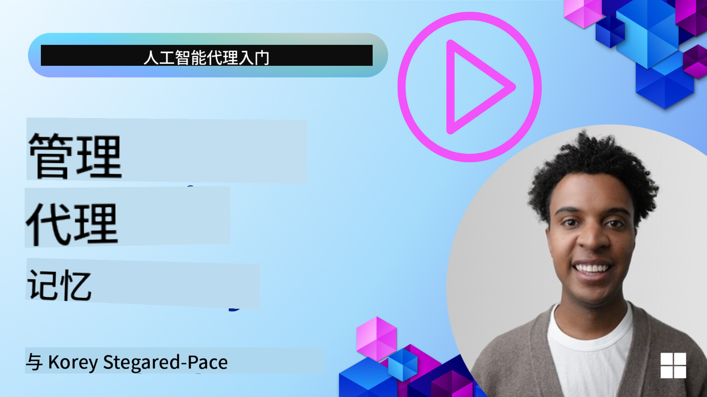

<!--
CO_OP_TRANSLATOR_METADATA:
{
  "original_hash": "d2c9703548140bafa2d6a77406552542",
  "translation_date": "2025-10-03T14:15:55+00:00",
  "source_file": "13-agent-memory/README.md",
  "language_code": "zh"
}
-->
# AI代理的记忆

在讨论创建AI代理的独特优势时，主要涉及两个方面：调用工具完成任务的能力以及随着时间推移不断改进的能力。记忆是创建能够自我改进的代理的基础，这种代理可以为用户提供更好的体验。

在本课程中，我们将探讨AI代理的记忆是什么，以及如何管理和利用它来提升应用程序的效果。

## 课程简介

本课程将涵盖以下内容：

- **理解AI代理的记忆**：什么是记忆以及为什么它对代理至关重要。
- **实现和存储记忆**：为AI代理添加记忆功能的实用方法，重点关注短期记忆和长期记忆。
- **让AI代理自我改进**：记忆如何使代理能够从过去的交互中学习并随着时间推移不断优化。

## 学习目标

完成本课程后，您将能够：

- **区分AI代理的不同类型记忆**，包括工作记忆、短期记忆、长期记忆，以及诸如角色记忆和情节记忆等特殊形式。
- **使用Semantic Kernel框架实现和管理AI代理的短期记忆和长期记忆**，利用工具如Mem0和Whiteboard记忆，并与Azure AI Search集成。
- **理解自我改进AI代理的基本原理**，以及强大的记忆管理系统如何促进持续学习和适应。

## 理解AI代理的记忆

从本质上讲，**AI代理的记忆指的是使其能够保留和回忆信息的机制**。这些信息可以是关于对话的具体细节、用户偏好、过去的操作，甚至是学习到的模式。

没有记忆的AI应用通常是无状态的，这意味着每次交互都从头开始。这会导致重复且令人沮丧的用户体验，因为代理会“忘记”之前的上下文或偏好。

### 为什么记忆很重要？

代理的智能与其回忆和利用过去信息的能力密切相关。记忆使代理能够：

- **反思**：从过去的行为和结果中学习。
- **互动**：在持续的对话中保持上下文。
- **主动和被动**：根据历史数据预测需求或做出适当反应。
- **自主**：通过调用存储的知识更独立地运行。

实现记忆的目标是让代理变得更加**可靠和有能力**。

### 记忆的类型

#### 工作记忆

可以将其视为代理在单个任务或思考过程中使用的一张便签纸。它保存完成下一步所需的即时信息。

对于AI代理，工作记忆通常捕捉对话中最相关的信息，即使完整的聊天记录很长或被截断。它专注于提取关键元素，如需求、提议、决策和行动。

**工作记忆示例**

在一个旅行预订代理中，工作记忆可能会捕捉用户当前的请求，例如“我想预订去巴黎的旅行”。这一具体需求会保存在代理的即时上下文中，以指导当前的交互。

#### 短期记忆

这种记忆在单次对话或会话期间保留信息。它是当前聊天的上下文，使代理能够回顾对话中的前几轮内容。

**短期记忆示例**

如果用户问“去巴黎的航班多少钱？”然后接着问“那里的住宿怎么样？”，短期记忆确保代理知道“那里”指的是“巴黎”，并保持对话的连贯性。

#### 长期记忆

这种记忆在多个对话或会话中持续存在。它使代理能够记住用户偏好、历史交互或长期的通用知识。这对于个性化非常重要。

**长期记忆示例**

长期记忆可能存储“Ben喜欢滑雪和户外活动，喜欢带有山景的咖啡，并因过去的受伤而避免高级滑雪道”。这些信息从之前的交互中学习而来，在未来的旅行规划中提供高度个性化的推荐。

#### 角色记忆

这种特殊的记忆类型帮助代理形成一致的“个性”或“角色”。它使代理能够记住关于自身或其预期角色的细节，从而使交互更加流畅和专注。

**角色记忆示例**

如果旅行代理被设计为“滑雪规划专家”，角色记忆可能会强化这一角色，使其响应更符合专家的语气和知识。

#### 工作流/情节记忆

这种记忆存储代理在执行复杂任务时采取的步骤，包括成功和失败。它类似于记住特定的“情节”或过去的经验，以便从中学习。

**情节记忆示例**

如果代理尝试预订某个航班但因不可用而失败，情节记忆可以记录这一失败，使代理在后续尝试中选择替代航班或更有针对性地告知用户问题。

#### 实体记忆

这种记忆涉及从对话中提取并记住特定的实体（如人物、地点或事物）和事件。它使代理能够构建对讨论的关键元素的结构化理解。

**实体记忆示例**

从关于过去旅行的对话中，代理可能提取“巴黎”、“埃菲尔铁塔”和“在Le Chat Noir餐厅的晚餐”作为实体。在未来的交互中，代理可以回忆起“Le Chat Noir”，并提供新的预订建议。

#### 结构化RAG（检索增强生成）

虽然RAG是一种更广泛的技术，“结构化RAG”被强调为一种强大的记忆技术。它从各种来源（对话、电子邮件、图像）中提取密集的结构化信息，并用来提高响应的精确性、召回率和速度。与仅依赖语义相似性的经典RAG不同，结构化RAG利用信息的内在结构。

**结构化RAG示例**

与仅匹配关键词不同，结构化RAG可以解析电子邮件中的航班详情（目的地、日期、时间、航空公司）并以结构化方式存储。这使得查询“我周二预订的去巴黎的航班是什么？”变得更加精确。

## 实现和存储记忆

为AI代理实现记忆涉及**记忆管理**的系统化过程，包括生成、存储、检索、整合、更新，甚至“遗忘”（或删除）信息。检索是其中一个特别关键的方面。

### 专用记忆工具

存储和管理代理记忆的一种方法是使用专用工具，如Mem0。Mem0作为一个持久记忆层，使代理能够回忆相关交互、存储用户偏好和事实上下文，并随着时间推移从成功和失败中学习。其核心理念是将无状态代理转变为有状态代理。

它通过**两阶段记忆管道：提取和更新**来工作。首先，添加到代理线程的消息会发送到Mem0服务，该服务使用大型语言模型（LLM）总结对话历史并提取新的记忆。随后，LLM驱动的更新阶段决定是否添加、修改或删除这些记忆，并将其存储在混合数据存储中，包括向量、图形和键值数据库。该系统还支持各种记忆类型，并可以结合图形记忆来管理实体之间的关系。

### 使用RAG存储记忆

除了像Mem0这样的专用记忆工具，您还可以利用强大的搜索服务，如**Azure AI Search**，作为存储和检索记忆的后端，特别是用于结构化RAG。

这使您能够用自己的数据为代理的响应提供依据，确保更相关和准确的答案。Azure AI Search可以用于存储用户特定的旅行记忆、产品目录或任何其他领域的知识。

Azure AI Search支持诸如**结构化RAG**的功能，它擅长从大型数据集（如对话历史、电子邮件或图像）中提取和检索密集的结构化信息。与传统的文本分块和嵌入方法相比，这提供了“超人级的精确性和召回率”。

## 让AI代理自我改进

一种常见的自我改进代理模式是引入一个**“知识代理”**。这个独立的代理观察用户与主代理之间的主要对话。其角色包括：

1. **识别有价值的信息**：确定对话中的哪些部分值得保存为通用知识或特定用户偏好。
2. **提取和总结**：从对话中提炼出关键的学习或偏好。
3. **存储到知识库**：将提取的信息持久化，通常存储在向量数据库中，以便后续检索。
4. **增强未来查询**：当用户发起新查询时，知识代理检索相关的存储信息并将其附加到用户的提示中，为主代理提供关键上下文（类似于RAG）。

### 记忆优化

- **延迟管理**：为了避免降低用户交互速度，可以初步使用更便宜、更快的模型快速检查信息是否值得存储或检索，仅在必要时调用更复杂的提取/检索过程。
- **知识库维护**：对于不断增长的知识库，较少使用的信息可以移至“冷存储”以管理成本。

## 关于代理记忆还有疑问？

加入[Azure AI Foundry Discord](https://aka.ms/ai-agents/discord)，与其他学习者交流，参加办公时间并解答您的AI代理相关问题。

---

**免责声明**：  
本文档使用AI翻译服务 [Co-op Translator](https://github.com/Azure/co-op-translator) 进行翻译。尽管我们努力确保翻译的准确性，但请注意，自动翻译可能包含错误或不准确之处。原始语言的文档应被视为权威来源。对于关键信息，建议使用专业人工翻译。我们对因使用此翻译而产生的任何误解或误读不承担责任。