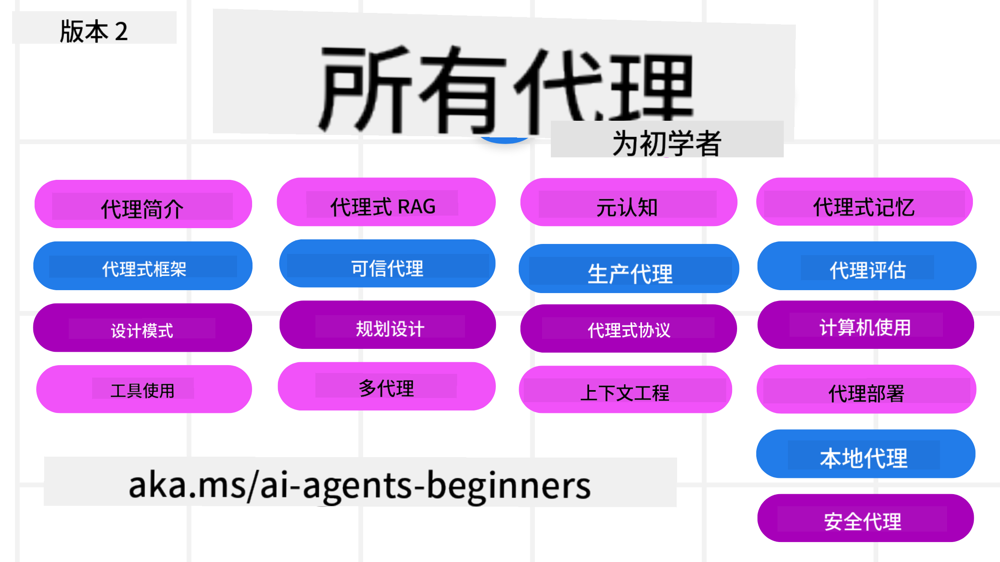

<!--
CO_OP_TRANSLATOR_METADATA:
{
  "original_hash": "f0ebcc244c445360bbb05d23e11630d3",
  "translation_date": "2025-12-17T13:49:43+00:00",
  "source_file": "README.md",
  "language_code": "zh"
}
-->
# AI 代理初学者课程

## 一门教授构建 AI 代理所需知识的课程

### 🌐 多语言支持

#### 通过 GitHub Action 支持（自动且始终保持最新）

<!-- CO-OP TRANSLATOR LANGUAGES TABLE START -->
[阿拉伯语](../ar/README.md) | [孟加拉语](../bn/README.md) | [保加利亚语](../bg/README.md) | [缅甸语 (Myanmar)](../my/README.md) | [中文（简体）](./README.md) | [中文（繁体，香港）](../hk/README.md) | [中文（繁体，澳门）](../mo/README.md) | [中文（繁体，台湾）](../tw/README.md) | [克罗地亚语](../hr/README.md) | [捷克语](../cs/README.md) | [丹麦语](../da/README.md) | [荷兰语](../nl/README.md) | [爱沙尼亚语](../et/README.md) | [芬兰语](../fi/README.md) | [法语](../fr/README.md) | [德语](../de/README.md) | [希腊语](../el/README.md) | [希伯来语](../he/README.md) | [印地语](../hi/README.md) | [匈牙利语](../hu/README.md) | [印度尼西亚语](../id/README.md) | [意大利语](../it/README.md) | [日语](../ja/README.md) | [卡纳达语](../kn/README.md) | [韩语](../ko/README.md) | [立陶宛语](../lt/README.md) | [马来语](../ms/README.md) | [马拉雅拉姆语](../ml/README.md) | [马拉地语](../mr/README.md) | [尼泊尔语](../ne/README.md) | [尼日利亚皮钦语](../pcm/README.md) | [挪威语](../no/README.md) | [波斯语 (法尔西语)](../fa/README.md) | [波兰语](../pl/README.md) | [葡萄牙语（巴西）](../br/README.md) | [葡萄牙语（葡萄牙）](../pt/README.md) | [旁遮普语 (古鲁穆奇文)](../pa/README.md) | [罗马尼亚语](../ro/README.md) | [俄语](../ru/README.md) | [塞尔维亚语（西里尔文）](../sr/README.md) | [斯洛伐克语](../sk/README.md) | [斯洛文尼亚语](../sl/README.md) | [西班牙语](../es/README.md) | [斯瓦希里语](../sw/README.md) | [瑞典语](../sv/README.md) | [他加禄语（菲律宾语）](../tl/README.md) | [泰米尔语](../ta/README.md) | [泰卢固语](../te/README.md) | [泰语](../th/README.md) | [土耳其语](../tr/README.md) | [乌克兰语](../uk/README.md) | [乌尔都语](../ur/README.md) | [越南语](../vi/README.md)
<!-- CO-OP TRANSLATOR LANGUAGES TABLE END -->

**如果您希望支持更多翻译语言，请查看[此处](https://github.com/Azure/co-op-translator/blob/main/getting_started/supported-languages.md)**

## 🌱 入门指南

本课程涵盖构建 AI 代理的基础知识。每节课涵盖一个主题，您可以从任何地方开始学习！

本课程支持多语言。请查看我们的[可用语言列表](../..)。

如果您是第一次使用生成式 AI 模型构建应用，请查看我们的[面向初学者的生成式 AI](https://aka.ms/genai-beginners)课程，其中包含 21 节关于生成式 AI 构建的课程。

别忘了[给本仓库点星 (🌟)](https://docs.github.com/en/get-started/exploring-projects-on-github/saving-repositories-with-stars?WT.mc_id=academic-105485-koreyst)并[分叉本仓库](https://github.com/microsoft/ai-agents-for-beginners/fork)以运行代码。

### 结识其他学习者，获得问题解答

如果您遇到困难或有任何关于构建 AI 代理的问题，请加入我们在[Microsoft Foundry Discord](https://aka.ms/ai-agents/discord)中的专属 Discord 频道。

### 您需要准备的内容

本课程的每节课都包含代码示例，代码示例位于 code_samples 文件夹中。您可以[分叉本仓库](https://github.com/microsoft/ai-agents-for-beginners/fork)来创建自己的副本。

这些练习中的代码示例使用 Azure AI Foundry 和 GitHub 模型目录与语言模型交互：

- [Github 模型](https://aka.ms/ai-agents-beginners/github-models) - 免费 / 有限
- [Azure AI Foundry](https://aka.ms/ai-agents-beginners/ai-foundry) - 需要 Azure 账户

本课程还使用微软的以下 AI 代理框架和服务：

- [Microsoft Agent Framework (MAF) - 新！](https://aka.ms/ai-agents-beginners/agent-framewrok)
- [Azure AI Agent Service](https://aka.ms/ai-agents-beginners/ai-agent-service)
- [Semantic Kernel](https://aka.ms/ai-agents-beginners/semantic-kernel)
- [AutoGen](https://aka.ms/ai-agents/autogen)

有关运行本课程代码的更多信息，请参见[课程设置](./00-course-setup/README.md)。

## 🙏 想要帮助吗？

您有建议或发现拼写或代码错误吗？请[提出问题](https://github.com/microsoft/ai-agents-for-beginners/issues?WT.mc_id=academic-105485-koreyst)或[创建拉取请求](https://github.com/microsoft/ai-agents-for-beginners/pulls?WT.mc_id=academic-105485-koreyst)

## 📂 每节课包含

- 位于 README 中的书面课程和简短视频
- 支持 Azure AI Foundry 和 Github 模型（免费）的 Python 代码示例
- 继续学习的额外资源链接

## 🗃️ 课程列表

| **课程**                                   | **文本与代码**                                    | **视频**                                                  | **额外学习**                                                                     |
|----------------------------------------------|----------------------------------------------------|------------------------------------------------------------|----------------------------------------------------------------------------------------|
| AI 代理简介及代理用例                        | [链接](./01-intro-to-ai-agents/README.md)          | [视频](https://youtu.be/3zgm60bXmQk?si=z8QygFvYQv-9WtO1)  | [链接](https://aka.ms/ai-agents-beginners/collection?WT.mc_id=academic-105485-koreyst) |
| 探索 AI 代理框架                            | [链接](./02-explore-agentic-frameworks/README.md)  | [视频](https://youtu.be/ODwF-EZo_O8?si=Vawth4hzVaHv-u0H)  | [链接](https://aka.ms/ai-agents-beginners/collection?WT.mc_id=academic-105485-koreyst) |
| 理解 AI 代理设计模式                        | [链接](./03-agentic-design-patterns/README.md)     | [视频](https://youtu.be/m9lM8qqoOEA?si=BIzHwzstTPL8o9GF)  | [链接](https://aka.ms/ai-agents-beginners/collection?WT.mc_id=academic-105485-koreyst) |
| 工具使用设计模式                            | [链接](./04-tool-use/README.md)                    | [视频](https://youtu.be/vieRiPRx-gI?si=2z6O2Xu2cu_Jz46N)  | [链接](https://aka.ms/ai-agents-beginners/collection?WT.mc_id=academic-105485-koreyst) |
| 代理式 RAG                                 | [链接](./05-agentic-rag/README.md)                 | [视频](https://youtu.be/WcjAARvdL7I?si=gKPWsQpKiIlDH9A3)  | [链接](https://aka.ms/ai-agents-beginners/collection?WT.mc_id=academic-105485-koreyst) |
| 构建可信赖的 AI 代理                       | [链接](./06-building-trustworthy-agents/README.md) | [视频](https://youtu.be/iZKkMEGBCUQ?si=jZjpiMnGFOE9L8OK ) | [链接](https://aka.ms/ai-agents-beginners/collection?WT.mc_id=academic-105485-koreyst) |
| 规划设计模式                               | [链接](./07-planning-design/README.md)             | [视频](https://youtu.be/kPfJ2BrBCMY?si=6SC_iv_E5-mzucnC)  | [链接](https://aka.ms/ai-agents-beginners/collection?WT.mc_id=academic-105485-koreyst) |
| 多代理设计模式                             | [链接](./08-multi-agent/README.md)                 | [视频](https://youtu.be/V6HpE9hZEx0?si=rMgDhEu7wXo2uo6g)  | [链接](https://aka.ms/ai-agents-beginners/collection?WT.mc_id=academic-105485-koreyst) |
| 元认知设计模式                             | [链接](./09-metacognition/README.md)               | [视频](https://youtu.be/His9R6gw6Ec?si=8gck6vvdSNCt6OcF)  | [链接](https://aka.ms/ai-agents-beginners/collection?WT.mc_id=academic-105485-koreyst) |
| 生产中的 AI 代理                      | [Link](./10-ai-agents-production/README.md)        | [Video](https://youtu.be/l4TP6IyJxmQ?si=31dnhexRo6yLRJDl)  | [Link](https://aka.ms/ai-agents-beginners/collection?WT.mc_id=academic-105485-koreyst) |
| 使用代理协议（MCP、A2A 和 NLWeb） | [Link](./11-agentic-protocols/README.md)           | [Video](https://youtu.be/X-Dh9R3Opn8)                                 | [Link](https://aka.ms/ai-agents-beginners/collection?WT.mc_id=academic-105485-koreyst) |
| AI 代理的上下文工程            | [Link](./12-context-engineering/README.md)         | [Video](https://youtu.be/F5zqRV7gEag)                                 | [Link](https://aka.ms/ai-agents-beginners/collection?WT.mc_id=academic-105485-koreyst) |
| 管理代理记忆                      | [Link](./13-agent-memory/README.md)     |      [Video](https://youtu.be/QrYbHesIxpw?si=vZkVwKrQ4ieCcIPx)                                                      |                                                                                        |
| 探索微软代理框架                         | [Link](./14-microsoft-agent-framework/README.md)                            |                                                            |                                                                                        |
| 构建计算机使用代理（CUA）           | 即将推出                            |                                                            |                                                                                        |
| 部署可扩展代理                    | 即将推出                            |                                                            |                                                                                        |
| 创建本地 AI 代理                     | 即将推出                               |                                                            |                                                                                        |
| 保护 AI 代理                           | 即将推出                               |                                                            |                                                                                        |

## 🎒 其他课程

我们的团队还制作了其他课程！查看：

<!-- CO-OP TRANSLATOR OTHER COURSES START -->
### LangChain

---

### Azure / Edge / MCP / 代理

---
 
### 生成式 AI 系列

[-9333EA?style=for-the-badge&labelColor=E5E7EB&color=9333EA)](https://github.com/microsoft/Generative-AI-for-beginners-dotnet?WT.mc_id=academic-105485-koreyst)
[-C084FC?style=for-the-badge&labelColor=E5E7EB&color=C084FC)](https://github.com/microsoft/generative-ai-for-beginners-java?WT.mc_id=academic-105485-koreyst)
[-E879F9?style=for-the-badge&labelColor=E5E7EB&color=E879F9)](https://github.com/microsoft/generative-ai-with-javascript?WT.mc_id=academic-105485-koreyst)

---
 
### 核心学习

---
 
### Copilot 系列

<!-- CO-OP TRANSLATOR OTHER COURSES END -->

## 🌟 社区感谢

感谢 [Shivam Goyal](https://www.linkedin.com/in/shivam2003/) 贡献了展示 Agentic RAG 的重要代码示例。

## 贡献

欢迎对本项目进行贡献和提出建议。大多数贡献需要您同意一份贡献者许可协议（CLA），声明您有权利且确实授予我们使用您贡献的权利。详情请访问 <https://cla.opensource.microsoft.com>。

当您提交拉取请求时，CLA 机器人会自动判断您是否需要提供 CLA 并相应地标注 PR（例如状态检查、评论）。只需按照机器人提供的指示操作。您在所有使用我们 CLA 的仓库中只需执行一次此操作。

本项目已采用 [微软开源行为准则](https://opensource.microsoft.com/codeofconduct/)。
更多信息请参见 [行为准则常见问题](https://opensource.microsoft.com/codeofconduct/faq/) 或
通过 [opencode@microsoft.com](mailto:opencode@microsoft.com) 联系我们，提出任何额外问题或意见。

## 商标

本项目可能包含项目、产品或服务的商标或标识。微软商标或标识的授权使用须遵守并遵循
[微软商标和品牌指南](https://www.microsoft.com/legal/intellectualproperty/trademarks/usage/general)。
在本项目的修改版本中使用微软商标或标识不得引起混淆或暗示微软赞助。
任何第三方商标或标识的使用均须遵守相关第三方的政策。

## 获取帮助

如果您遇到困难或对构建 AI 应用有任何疑问，请加入：

如果您在构建过程中有产品反馈或遇到错误，请访问：

---

<!-- CO-OP TRANSLATOR DISCLAIMER START -->
**免责声明**：  
本文件由人工智能翻译服务 [Co-op Translator](https://github.com/Azure/co-op-translator) 翻译。虽然我们力求准确，但请注意自动翻译可能存在错误或不准确之处。原始文件的母语版本应被视为权威来源。对于重要信息，建议使用专业人工翻译。因使用本翻译而产生的任何误解或误释，我们概不负责。
<!-- CO-OP TRANSLATOR DISCLAIMER END -->